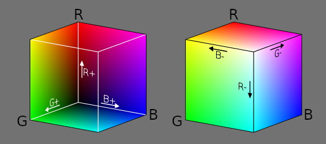
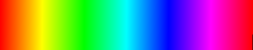
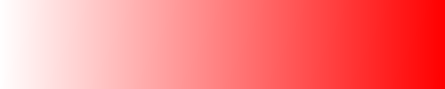
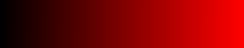
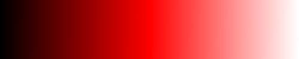
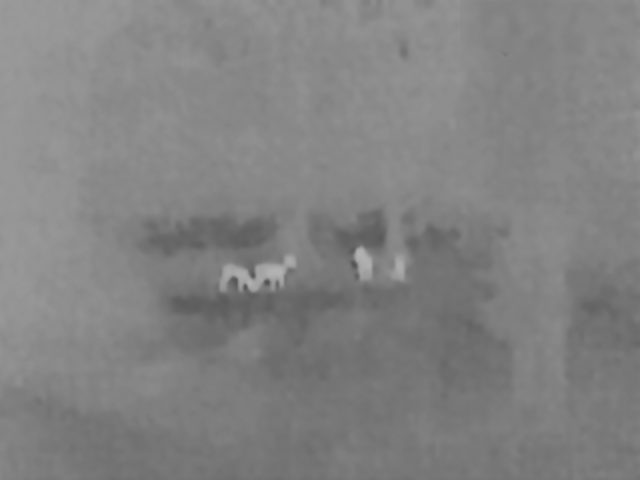
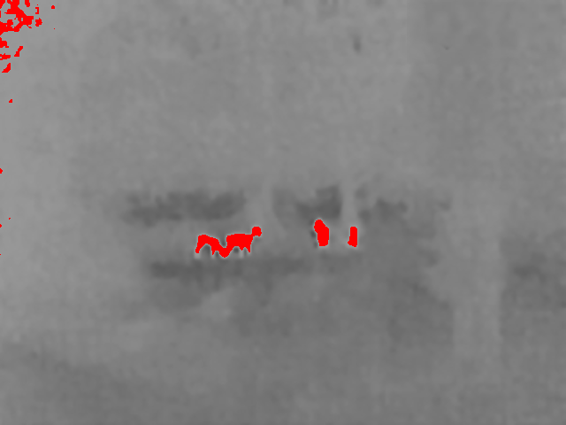
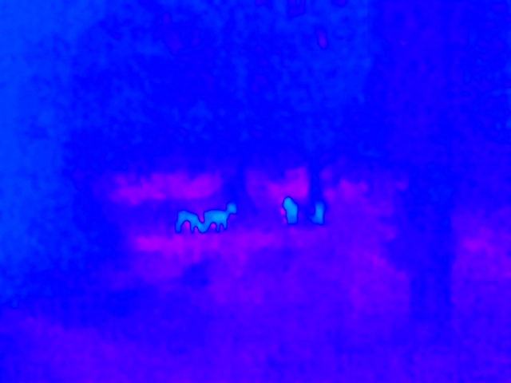

# Color

## Table of Contents

1. [Introduction](#1-introduction)
2. [RGB](#2-rgb)
3. [GrayScale](#3-grayscale)
4. [HSV](#4-hsv)
5. [HSL](#5-hsl)
6. [In Summary](#6-in-summary)
7. [Pseudo Color](#7-)

## 1. Introduction
While it's nice to simplify things by using binary or grayscale images (most) humans see in color and thus colors are a central part of many of ``crisp``s features. 

A color in crisp is a implementation of ``crisp::ColorRepresentation`` which is a templated pure virtual class with the following functions:

```cpp
template<size_t N>
struct ColorRepresentation : public Vector<float, N>
{
    virtual RGB to_rgb() const = 0;
    virtual HSV to_hsv() const = 0;
    virtual HSL to_hsl() const = 0;
    virtual GrayScale to_grayscale const = 0;
}
```
We note that any color in crisp is a vector of 32-bit floats. All values of the components of any color representations are assumed to be in [0, 1]. We see that each color must furthermore provide four converion operators to ``crisp::RGB``, ``crisp::HSV``, ``crisp::HSL`` and ``crisp::GrayScale`` respectively. These are the four representations native to crisp and we will look at them in detail now

## 2. RGB
Colors in RGB representation have 3 components: red, green and blue. Each component represents a fraction of red, green and blue light respectively where if all components are 0 the color becomes black, if all components are 1 it becomes white. ``crisp::ColorImage`` pixels are in RGB and most people are familiar with it. 


(source: wikipedia)

Other than functions inherited from ``crisp::ColorRepresentation<3>`` RGB offers the following functions:

```cpp
// ctors
RGB(float red, float green, float blue);
RGB(float all);
RGB(Vector<float, 3>);

// expose components
float& red();
float red() const;

float& green();
float green() const;

float& blue();
float blue() const;
```

To access and modify any of the components we can either use ``red()``, ``green()``, ``blue()`` or ``x()``, ``y()`` ``z()`` or ``at(size_t)`` as provided by inheriting from ``crisp::Vector``

# 3. GrayScale
GrayScale is a color representation where there's only one values called intensity. ``crisp::GrayScaleImage`` uses this representation and it can be more simply thought of as just a float (though all functions from both ``crisp::Vector<float, 1>`` and ``ColorRepresentation<1>`` are of course available)

Other than the inheritd functions ``GrayScale`` provides the following methods:

```cpp
// ctors
GrayScale() = default;
GrayScale(float);
GrayScale(Vector<float, 1>);

// assignment and cast from/to just float
GrayScale& operator=(float);
GrayScale& operator=(Vector<float, 1>);
operator float() const;
        
// expose component
float& intensity();
float intensity() const;
```

We note that grayscale offers both construction from and assignment to float making it easy to cast it to and from when dealing with raw numbers.

We can visualize the effect of varrying intensity as such:

```cpp
#include <image.hpp>
#include <color.hpp>

using namespace crisp;

// in main.cpp
GrayScale intensity = 0.f;

// create an image and fill it with grayscale values [0, 1]
GrayScaleImage grayscale_spectrum;
grayscale_spectrum.create(300, 50);

float step = 1.f / (grayscale_spectrum.get_size().x() * grayscale_spectrum.get_size().y());

for (size_t x = 0; x < grayscale_spectrum.get_size().x(); ++x)
for (size_t y = 0; y < grayscale_spectrum.get_size().y(); ++y)
{
    grayscale_spectrum.at(x, y) = intensity;
    intensity += step;
}
```


GrayScale is attractive for it's computational simplicity and because it's easy to convert other color representations into it. For RGB we simply average all color components and for HSV and HSL the GrayScale intensity is equivalent to the value and lightness component respectively.

## 4. HSV

HSV stands for "hue, saturation, value" and is an attempt to represent colors in a way humans understand them. When we describe the color of a car to someone we don't name the fractions of red, green and blue paint we call it "light red" or "a dark blue". The hue component is what many would call color tone along the spectrum of visible light. We can visualize it as such:

```cpp
auto color = HSV{0, 1, 1};
auto spectrum = ColorImage(/*...*/);

for (size_t x = 0; x < spectrum.get_size().x(); ++x)
for (size_t y = 0; y < specturm.get_size().y(); ++y)
{
    spectrum.at(x, y) = color.to_rgb();
    color.hue() += step;
}
```

Remember that ``crisp::ColorImage`` assumes values are in RGB so we need to convert HSV to RGB before assigning it to the image data.



We note the typical rainbow. The second component of HSV is "saturation" and it stands for how much of a pigment is a in mixture of paint that uses white as it's base. So lets say we are mixing red paint, a saturation of 1 would mean there is only red paint, no white paint, a saturation of 0 would mean there is only white paint, no red paint and a saturation of 0.5 would mean equal parts of red and white paint. We again visualize it:

```cpp
auto color = HSV{0, 0, 1};
auto spectrum = ColorImage(/*...*/);

for (size_t x = 0; x < spectrum.get_size().x(); ++x)
for (size_t y = 0; y < specturm.get_size().y(); ++y)
{
    spectrum.at(x, y) = color.to_rgb();
    color.saturation() += step;
}
```



Lastly we have value, sometimes also called brightness. This component can be conceptualized similarly to saturation but now we are mixing black paint and colored paint. Let's again assume we're mixing red a value of 0 means 100% black paint, no red paint. A value of 1 is all red, no black and a value of 0.5 is equal parts red and black. We again visualize it in the way outlined above:



Now that we know what each dimensions means, ``crisp::HSV`` supplies these methdos in addition to inherited functions from ``crisp::ColorRepresentation`` and ``crisp::Vector``

```cpp
// ctors
HSV(float hue, float saturation, float value);
HSV(float all);
HSV(Vector<float, 3>);

// assignment from vector
HSV& operator=(Vector<float, 3>);

// expose components
float& hue();
float hue() const;

float& saturation();
float saturation() const;

float& value();
float value() const;
```

## 5. HSL

Lastly we have HSL which stands for hue, saturation, *lightness* (not to be confused with HSVs *brightness* which is partly why crisp and many others call it "value" instead). Comparing HSL to HSV we note that both the hue and saturation dimensions are identical and traveling along their spectra shows that there is no difference visually:

```cpp
auto color = HSL{0, 1, 1}
auto spectrum = ColorImage(/*...*/);

for (size_t x = 0; x < spectrum.get_size().x(); ++x)
for (size_t y = 0; y < specturm.get_size().y(); ++y)
{
    spectrum.at(x, y) = color.to_rgb();
    color.hue() += step;
}
```


```cpp
auto color = HSL{0, 0, 1}
auto spectrum = ColorImage(/*...*/);

for (size_t x = 0; x < spectrum.get_size().x(); ++x)
for (size_t y = 0; y < specturm.get_size().y(); ++y)
{
    spectrum.at(x, y) = color.to_rgb();
    color.saturation() += step;
}
```


Lightness however behaves differently, a lightness value of 0 corresponds to black, a lightness value of 1 corresponds to 1 and a lightness value of 0.5 corrseponds to what would be in our HSV example no black paint, not white pain, only red paint:

```cpp
auto color = HSL{0, 1, 0}
auto spectrum = ColorImage(/*...*/);

for (size_t x = 0; x < spectrum.get_size().x(); ++x)
for (size_t y = 0; y < specturm.get_size().y(); ++y)
{
    spectrum.at(x, y) = color.to_rgb();
    color.lightness() += step;
}
```



## 6. In Summary

Differentiation between some color representations can be difficult and especially HSV and HSL have enough similarities to get hung up but hopefully this has cleared up what exactly each component of each representation means. Always remember that in crisp converting from any color representation to any color representation is easy and quick, simply call ``.to_xyz()`` and you're done.

## 7. Pseudo Color

"PseudoColor" is a term to describe a transform function that maps grayscale values onto a different color representation often to aid humans in visually understanding images. Let's consider an example first:


(source: texasoutdoors)

Here we have a noisy, low-resolution infrared image of deer. Infrared cameras only have one component so to visualize it in human-perceptile ranges equipment will often render it as a grayscale image like this. To aid in human confirmation we can use *pseudocolor* to highlight the deer as such:


No segmentation algorithm was performed here, all we did was map higher (lighter)
 intensity values to a range of color values. Because the deer are much warmer than their surrounding, the infrared response to their bodies will be higher. With the new color image it's much easier to identify the deer from surrounding foliage. 

Pseudocolor has many applications in medicine and any field where single-intensity valued images are meant for human inspections.

## 7.1 PseudoColorMapping

In ``crisp`` pseudocolor transformations are handled by [``crisp::PseudoColorMapping``](../include/pseudocolor_mapping.hpp). To setup a transform we first need to construct the object:

```cpp
auto mapping = PseudoColorMapping();
``` 

We now need to specify a type of transform via ```PseudoColorMapping::set_function```. This function takes a lambda of which several are available as static functions. Let's first talk about what exactly a transform does.

The transform has to take a range of gray values gi = {g1, g2, ...} and map them onto a range of hue values hi = {h1, h2, ...}. Because we are working with hues we will be talking about color in HSV format where both saturation and value are set to 1. The following transforms are available:

+ ``identity()`` maps all gray values onto themself resulting in no visual change in the image
  
+ ``value_to_hue(float g, flat h)`` maps a single gray value onto a single hue values, that is {g} -> {h}
+ ``value_range_to_hue(float gmin, float gmax, float h)`` maps a range of gray values onto a single hue, that is the set [gmin, gmax] -> {h} and 

+ ``value_range_to_hue_range(float gmin, float gmax, float hmin, float hmax)`` maps a range of gray values onto a range of hue values, that is [gmin, gmax] -> [hmin, hmax]

+ ``value_range_to_inverse_hue_range(float gmin, float gmax, float hmin, float hmax)`` maps a range of gray values onto an *inverted* range of hue values, that is [gmin, gmay] -> [hmax, hmin]

  
To summarize, to get the picture mentioned at the start of this section we do the following (after noting that all objects with an intensity > 0.6 are likely to be warmblooded):

```cpp
auto deer = load_grayscale_image(/*...*/ + "/crips/docs/color/infrared_deer.png");

auto mapping = PseudoColorMapping();
mapping.set_function(PseudoColorMapping::value_range_to_hue_range(0.6, 1, 0, 1);

ColorImage as_color = mapping.transform(deer)

// save to disk or render here
```


## 7.2 Multi Range Mapping

crisp offers an even more flexible way of mapping intensities to colors. Let's say we want to map the deer onto an easily recognizable solid color while mapping all other foliage and such onto a darker hue range. Humans do a lot better at differentiating color from color than color from grey. As it is currently this is not possible but this is why crisp offers 
``PseudoColorMapping::RangeMapping``. This object basically stores multiple ranges and takes the same functions ``PseudoColorMapping`` does:

```cpp
void add_value_to_hue(float g, float h);
void add_value_range_to_hue(float gmin, float gmax, float h);
void add_value_range_to_hue_range(float gmin, float gmax, float hmin, float hmax);
void add_value_range_to_inverse_hue_range(float gmin, float gmax, float hmin, float hmax);
```

We can then bind the ``RangeMapping`` via ``PseudoColorMapping::value_ranges_to_hue_ranges(RangeMapping&)``.

If the user specifies ranges that are overlapping, only one of them will be applied but which is undefined. To illustrate the functionality of ``RangeMapping`` let's try to implement our example from earlier in this section: We want to map the deer (intensity > 0.6) onto a solid color, let's say red and we want to map the foliage (intensity < 0.6) onto a range of colors, let's say blue to green:

```cpp
auto deer = load_grayscale_image(/*...*/ + "/crips/docs/color/infrared_deer.png");

auto ranges = PseudoColorMapping::RangeMapping();
ranges.add_value_range_to_hue(0.6, 1, 0);
ranges.add_value_range_to_hue_range(0, 0.6, 0.5, 0.9);
pseudocolor.value_ranges_to_hue_ranges(ranges);
color_deer = std::move(pseudocolor.transform(deer));

// save to disk or render
``` 


As we can see the deer are even easier to spot now.

