[[<< Back to Index]](../index.md)

---
# Color

Colors in RGB, HSV, HSL and GrayScale Representation, Converting between Representations, Pseudocolor Transform

```cpp
#include <color.hpp>
#include <pseudocolor_mapping.hpp>
```

## Table of Contents

1. [Introduction](#1-introduction)<br>
2. [RGB](#2-rgb)<br>
3. [HSV](#3-hsv)<br>
4. [HSL](#4-hsl)<br>
5. [GrayScale](#5-grayscale)<br>
6. [In Summary](#6-in-summary)<br>
7. [Pseudo Color](#7-pseudo-color)<br>
    7.1 [crisp::PseudoColor](#71-crisppseudocolor)<br>
    7.2 [Multi Range Mapping](#72-multi-range-mapping)<br>

## 1. Introduction
While it's nice to simplify things by using binary or grayscale images, (most) humans see in color and thus colors are a central part of many of ``crisp``s image-related features. 

A color in crisp is a implementation of ``crisp::ColorRepresentation`` which is a templated pure virtual class with the following functions:

```cpp
template<size_t N>
struct ColorRepresentation : public Vector<float, N>
{
    virtual RGB to_rgb() const = 0;
    virtual HSV to_hsv() const = 0;
    virtual HSL to_hsl() const = 0;
    virtual GrayScale to_grayscale const = 0;
}
```
We note that any color in crisp is a vector of 32-bit floats. All values of the components of any color representation are assumed to be in [0, 1]`. We see that each color must furthermore provide four conversion operators to ``crisp::RGB``, ``crisp::HSV``, ``crisp::HSL`` and ``crisp::GrayScale`` respectively. These are the four representations native to crisp and we'll look at them in detail now.

## 2. RGB
Colors in RGB representation have 3 components: red, green and blue. Each component represents a fraction of red, green and blue light respectively where if all components are 0 the color becomes black, if all components are 1 it becomes white. ``crisp::ColorImage``s pixels are in RGB as most people are familiar with this format. 

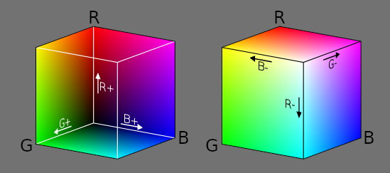<br>
(source: wikipedia)

Other than functions inherited from ``crisp::ColorRepresentation<3>``, ``RGB`` offers the following functions:

```cpp
// ctors
RGB(float red, float green, float blue);
RGB(float all);
RGB(Vector<float, 3>);

// expose components
float& red();
float red() const;

float& green();
float green() const;

float& blue();
float blue() const;
```

To access and modify any of the components we can either use ``red()``, ``green()``, ``blue()`` or (as provided by inheriting from ``crisp::Vector``) ``x()``, ``y()`` ``z()``, ``at(size_t)`` and `operator[](size_t)`.

## 3. HSV

HSV stands for "hue, saturation, value" and is an attempt to represent colors in a way humans understand them. When we describe the color of a car to someone we don't name the fractions of red, green and blue paint we call it "light red" or "a dark blue". The hue component is what many would call color *tone*, which can be quantified as a frequency value along the spectrum of visible light. We can visualize what this means:

```cpp
auto color = HSV{0, 1, 1};
auto spectrum = ColorImage(/*...*/);

float step = 1.f / (spectrum.get_size().x() * spectrum.get_size().y());

for (size_t x = 0; x < spectrum.get_size().x(); ++x)
for (size_t y = 0; y < specturm.get_size().y(); ++y)
{
    spectrum.at(x, y) = color.to_rgb();
    color.hue() += step;
}
```

(Recall that ``crisp::ColorImage`` assumes values are in RGB so we need to convert HSV to RGB before assigning it to the image data)

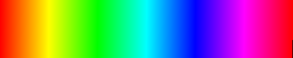

We note the typical rainbow. 

The second component of HSV is "saturation", it can be conceptualizes as the amount of a pigment in a in mixture of paint that uses white as it's base. So lets say we are mixing red paint, a saturation of 1 would mean there is only red paint, no white paint, a saturation of 0 would mean there is only white paint, no red paint and a saturation of 0.5 would mean equal parts of red and white paint, resulting in what many would call "light red". We again visualize it like so:

```cpp
auto color = HSV{0, 0, 1};
auto spectrum = ColorImage(/*...*/);

float step = 1.f / (spectrum.get_size().x() * spectrum.get_size().y());

for (size_t x = 0; x < spectrum.get_size().x(); ++x)
for (size_t y = 0; y < specturm.get_size().y(); ++y)
{
    spectrum.at(x, y) = color.to_rgb();
    color.saturation() += step;
}
```

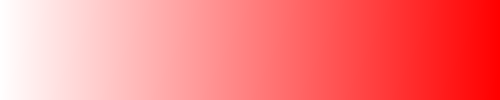

Lastly we have *value*, sometimes also called *brightness* in the literature. This component can be conceptualized similarly to saturation but instead of white we are now mixing black paint with a colored pigment. Let's again assume we're mixing red, a value of 0 means 100% black paint, no red paint. A value of 1 means all red, no black and a value of 0.5 is equal parts red and black. We again visualize it in the way outlined above:

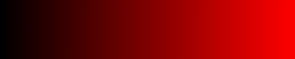

Hopefully this made clearer what each component of HSV represents.

``crisp::HSV`` supplies the follow methods (again in addition to inherited functions from ``crisp::ColorRepresentation`` and ``crisp::Vector``):

```cpp
// ctors
HSV(float hue, float saturation, float value);
HSV(float all);
HSV(Vector<float, 3>);

// assignment from vector
HSV& operator=(Vector<float, 3>);

// expose components
float& hue();
float hue() const;

float& saturation();
float saturation() const;

float& value();
float value() const;
```

## 4. HSL

HSL stands for hue, saturation, *lightness* (not to be confused with HSVs *brightness* which is partly why crisp and many others call it "*value*" instead). Comparing HSL to HSV, both the hue and saturation components are identical and traveling along their spectra shows that there is no difference in terms of the resulting color:

```cpp
auto color = HSL{0, 1, 1}
auto spectrum = ColorImage(/*...*/);

float step = 1.f / (spectrum.get_size().x() * spectrum.get_size().y());

for (size_t x = 0; x < spectrum.get_size().x(); ++x)
for (size_t y = 0; y < specturm.get_size().y(); ++y)
{
    spectrum.at(x, y) = color.to_rgb();
    color.hue() += step;
}
```


```cpp
auto color = HSL{0, 0, 1}
auto spectrum = ColorImage(/*...*/);

float step = 1.f / (spectrum.get_size().x() * spectrum.get_size().y());

for (size_t x = 0; x < spectrum.get_size().x(); ++x)
for (size_t y = 0; y < specturm.get_size().y(); ++y)
{
    spectrum.at(x, y) = color.to_rgb();
    color.saturation() += step;
}
```


Lightness however behaves differently, a lightness value of 0 corresponds to black, a lightness value of 1 corresponds to white and a lightness value of 0.5 corresponds to what would've been in our HSV example no black paint, not white pain, only red paint:

```cpp
auto color = HSL{0, 1, 0}
auto spectrum = ColorImage(/*...*/);

for (size_t x = 0; x < spectrum.get_size().x(); ++x)
for (size_t y = 0; y < specturm.get_size().y(); ++y)
{
    spectrum.at(x, y) = color.to_rgb();
    color.lightness() += step;
}
```

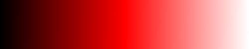

# 5. GrayScale
GrayScale is a color representation with only a single value called *intensity*. ``crisp::GrayScaleImage`` uses this representation and while it can be thought of as just a `float` it can be helpful to keep in mind that all functions from both ``crisp::Vector<float, 1>`` and ``ColorRepresentation<1>`` are of course available.

Other than these inherited functions ``GrayScale`` provides the following methods:

```cpp
// ctors
GrayScale() = default;
GrayScale(float);
GrayScale(Vector<float, 1>);

// assignment and cast from/to float
GrayScale& operator=(float);
GrayScale& operator=(Vector<float, 1>);
operator float() const;
        
// expose component
float& intensity();
float intensity() const;
```

We note that grayscale offers both construction from and assignment to float making it easy to operate on this color representation as if it were a raw number.

We can create a visualization of the effect of varying intensity like so:

```cpp
#include <image.hpp>
#include <color.hpp>

using namespace crisp;

// in main.cpp
// create an image and fill it with grayscale values [0, 1]
GrayScaleImage grayscale_spectrum;
grayscale_spectrum.create(300, 50);

GrayScale intensity = 0.f;
float step = 1.f / (grayscale_spectrum.get_size().x() * grayscale_spectrum.get_size().y());

for (size_t x = 0; x < grayscale_spectrum.get_size().x(); ++x)
for (size_t y = 0; y < grayscale_spectrum.get_size().y(); ++y)
{
    grayscale_spectrum.at(x, y) = intensity;
    intensity += step;
}
```


GrayScale is attractive for it's computational simplicity and the fact it's easy to convert to and from other color representations. For RGB, we would simply average all color components while HSV and HSL the GrayScale intensity is equivalent to the `value` and `lightness` component respectively.

## 6. In Summary

Differentiating between some color representations can be difficult and especially HSV and HSL have enough similarities to get hung up on, but hopefully this has cleared up what exactly each component of each representation represents. It's important to keep in mind that in ``crisp`` converting from any color representation to any other color representation is easy and quick, we simply call ``.to_xyz()`` and we're done.

## 7. Pseudo Color

"Pseudo Color" is a term describing a transform function that maps grayscale values onto a different color representation, often to aid humans in visually parsing images easier. Let's consider an example first:

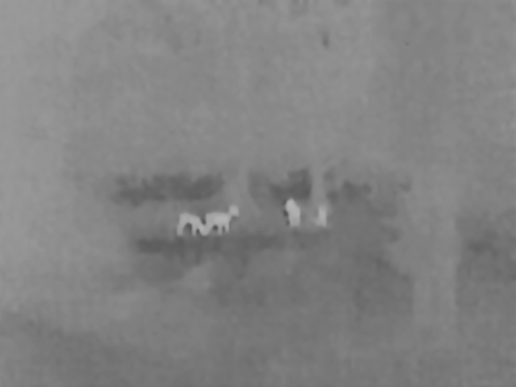<br>
(source: texasoutdoors)

Here we have a noisy, low-resolution infrared image of deer. Infrared cameras only record light in a spectrum band not visible to humans, thus it is customary to translate the equipments response into grayscale instead. Human brains don't do very well at parsing different shades of gray so to aid in visual confirmation we can do the following:


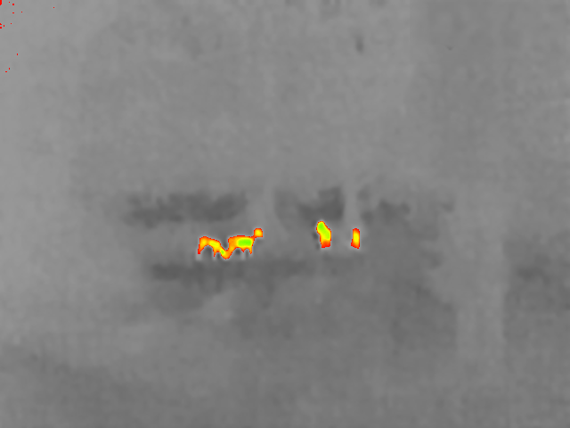

No segmentation algorithm was performed here, all we did was map higher (lighter)
 intensity values to a range of color values. Because the deer are much warmer than their surrounding, the infrared response to their bodies will be higher. With the new color image it's much easier to differentiate the deer from surrounding foliage. 

Pseudocolor has many applications in medicine and any field where single-intensity valued images are meant for human inspections. This is why ``crisp`` offer a comprehensive, flexible interface for transforming images in this way.

## 7.1 ``crisp::PseudoColor``

In ``crisp`` pseudocolor transformations are handled by functions of [``crisp::PseudoColor``](../../include/pseudocolor_mapping.hpp). This is a class with only static members so it behaves exactly like a namespace. For each function (or *linear map*, in more exact terms) we want to specify a range of floating point intensity values ``[g_min, g_max]`` that is mapped onto a range of hue values ``[h_min, h_max]`` in a way that is unambigous. The following functions for this are provided:

+ ``identity()`` maps all gray values onto themself resulting in a color image that is visually identical to the grayscale image<br>
  <br><br>
  
+ ``value_to_hue(float g, flat h)`` maps a single gray value onto a single hue values, that is ``{g} -> {h}``<br>
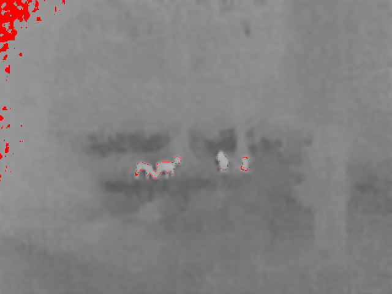<br><br>
  
+ ``value_range_to_hue(float g_min, float g_max, float h)`` maps a range of gray values onto a single hue, that is ``[g_min, g_max] -> {h}``<br>
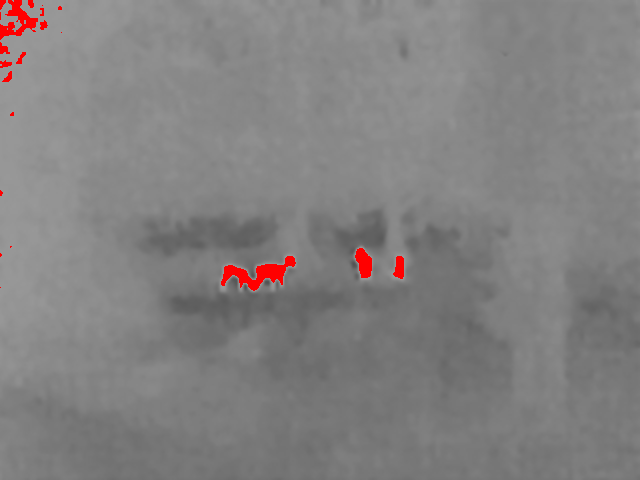<br><br>
  
+ ``value_range_to_hue_range(float g_min, float g_max, float h_min, float h_max)`` maps a range of gray values onto a range of hue values, that is ``[g_min, g_max] -> [h_min, h_max]``<br>
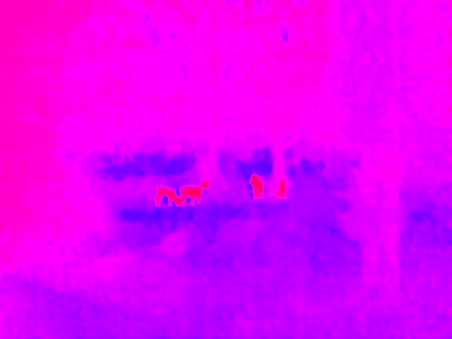<br><br>
  
+ ``value_range_to_inverse_hue_range(float g_min, float g_max, float h_min, float h_max)`` maps a range of gray values onto an *inverted* range of hue values, that is ``[g_min, g_max] -> [h_max, h_min]``<br>
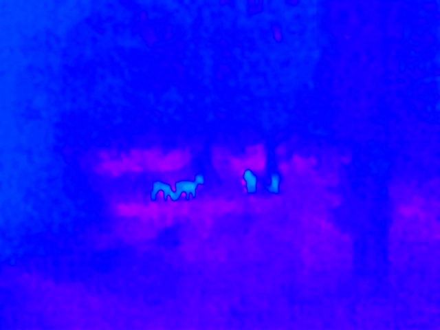<br><br>
  
To illustrate the usage in actual code we try to recreate the image shown at the start of this chapter (after noting that all objects with an intensity > 0.6 are likely to be warmblooded):

```cpp
using namespace crisp;
auto deer = load_grayscale_image(/*...*/ + "/crips/docs/color/infrared_deer.png");

ColorImage as_color = PseudoColor::value_range_to_hue_range(0.6, 1, 0, 1, deer);

// save to disk or render here
```


## 7.2 Multi Range Mapping

crisp offers an even more flexible way of mapping intensities to colors. Let's say we want to map the deer onto an easily recognizable solid color while mapping all other foliage and such onto a darker hue range because humans tend to do a lot better at differentiating color from color than color from gray. With the functions mentioned so far, this is currently not possible. To ameliorate this, ``crisp`` offers
``PseudoColor::RangeMapping``. This object stores multiple ranges which are initialized similarly to the functions in ``PseudoColor`` itself:

```cpp
// members of PseudoColor::Mapping
void add_value_to_hue(float g, float h);
void add_value_range_to_hue(float g_min, float g_max, float h);
void add_value_range_to_hue_range(float g_min, float g_max, float h_min, float h_max);
void add_value_range_to_inverse_hue_range(float g_min, float g_max, float h_min, float h_max);
```

We can then use the ``RangeMapping`` with ``PseudoColor::value_ranges_to_hue_ranges(RangeMapping&)``.

If the user specifies ranges that are overlapping, only one of them will be applied. Which is undefined.

To illustrate the functionality of ``RangeMapping`` we want to implement our goal from earlier: We want to map the deer (intensity > 0.6) onto a solid color, let's say red and we want to map the foliage (intensity < 0.6) onto a range of darker (in terms of perceived luminosity) colors, let's say blue to purple:

```cpp
auto deer = load_grayscale_image(/*...*/ + "/crips/docs/color/infrared_deer.png");

auto ranges = PseudoColor::RangeMapping();
ranges.add_value_range_to_hue(0.601, 1, 0);
ranges.add_value_range_to_hue_range(0, 0.6, 0.2, 0.75);
color_deer = PseudoColor::value_ranges_to_hue_ranges(ranges, deer);

// save to disk or render
``` 
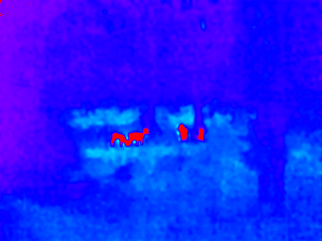

As we can see the deer are even easier to spot now while the tree ands grass can be made out much better than with just a gray image.

We note some artifacting in the top right of the corner. This is due to a low dynamic range so pre-processing the image could result in even clearer results, however this step has been ommitted here.

---
[[<< Back to Index]](../index.md)
