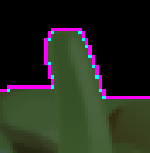
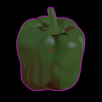
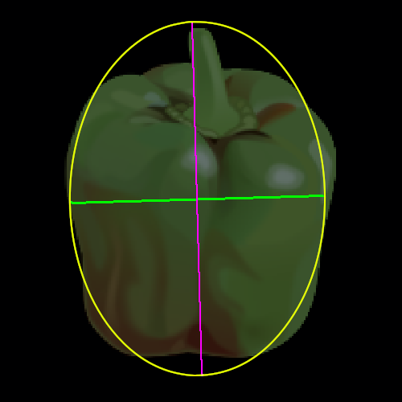

[[<< Back to Index]](../index.md)

---
# Feature Extraction

Image Regions, Region Descriptors, Boundary Tracing, Signatures, Pattern Descriptors

```cpp
#include <image_region.hpp>
```

## Table of Contents

1. [Introduction](#1-introduction)<br>
    1.1 [Extracting a Region](#11-an-example)<br>
2. [Region Boundary](#2-region-boundary)<br>
    2.1 [Definition](#21-8-connectivity-and-minimal-cardinality)<br>
   2.2 [Boundary Polygon](#22-boundary-polygon)<br>
3. [Boundary Signature](#3-boundary-signatures)<br>
    3.1 [Vertex Polygon](#31-vertex-polygon)<br>
    3.2 [Slope Chain Code Signature](#32-slope-chain-code-signature)<br>
    3.3 [Radial Distance Signature](#33-radial-distance-signature)<br>
    3.4 [Complex Coordinate Signature](#34-complex-coordinate-signature)<br>
    3.5 [Farthest Point Signature](#35-farthest-point-signature)<br>
4. [Whole Region Descriptors](#4-whole-region-descriptors)<br>
    4.1 [Area, Perimeter, Compactness](#41-area--perimeter-compactness)<br>
    4.2 [Centroid](#42-centroid)<br>
    4.3 [Axis Aligned Bounding Box](#43-aabb)<br>
    4.4 [Major and Minor Axis](#44-major--minor-axis)<br>
   4.5 [Eccentricity](#45-eccentricity)<br>
   4.6 [Circularity](#46-circularity)<br>
   4.7 [Holes](#47-holes)<br>
   4.8 [N-ths Moment Invariant](#48-moment-invariants)<br>
5. [Texture Descriptors](#5-texture-descriptors)<br>
    5.1 [](#51-intensity-histogram)<br>
    5.2 [](#52-maximum-response)<br>
    5.3 [](#53-mean-variance)<br>
    5.4 [](#54-n-ths-pearson-standardized-moment-around-the-mean)<br>
    5.5 [](#55-average-entropy)<br>
    5.6 [](#56-co-occurrence-matrix)<br>
   5.7 [](#57-intensity-correlation)<br>
   5.8 [](#58-homogeneity)<br>
   5.9 [](#59-entropy)<br>
   5.10 [](#510-contrast)<br>
## 1. Introduction

In the [tutorial on segmentation](../segmentation/segmentation.md) we discussed how to extract part of an image, now we will find out what to actually do with them. Recall that, in `crisp`, an image *segment* is a set of pixel coordinates ``Vector2ui``:

```cpp
using ImageSegment = std::set<Vector2ui, /*...*/>;
```

`crisp::ImageSegment` holds no information about anything other than the pixels coordinates. While this allows for a certain degree of generally as we can use a segment as part of many images. The only restraint on those images is that they have to be at least the size of the segment in terms of dimensions. We can apply any function only to a segment of an image, like so:

```cpp
auto lambda_operator = []<typename Image_t>(size_t x, size_t y, const Image_t& image) -> typename Image_t::Value_t
{
    auto& value = image(x, y);
    // some transformation
    return value;
};

ImageSegment segment = /*...*/;
auto image = /*...*/;

for (const auto position : segment)
    image(position.x(), position.y()) = lambda_operator(position.x(), position.y(), image);
```

Here we first define a templated lambda, this functions takes the pixel coordinate and the corresponding image, reads the pixel's value, transform it in some way then assigns it back to the image. 

While this works well when the entire image is available, sometimes we don't need the rest of the image, just the values of the pixels inside the segments. For just this purpose, `crisp` defines `crisp::ImageRegion`:

```cpp
template<typename Image_t>
class ImageRegion
{   
    using Value_t = Image_t::Value_t;
    
    public:
        /* ... */
        
    private:
        struct Element 
        {
            Vector2ui _position;
            Value_t _value;
            float _intensity
        }
            
        std::set<Element, /*...*/> _elements;
}
```

We see that instead of just pixel coordinates, `ImageSegment` holds a set of `ÌmageSegment::Elements`. Each element has 3 members, the original pixel coordinate, the original value of the corresponding pixel in the image and `_intensity` which is the mean of all planes of `_value`. We will use `_intensity` extensively in the texture descriptor chapter but for now it's enough to remember that `ImageSegment` holds only pixel coordinates while `ImageRegion` holds coordinates as well as deep-copies of the pixels values.

We construct an ``ImageRegion`` from an image and an `ImageSegment` like so:

```cpp
// in main
auto image = /*...*/;   // crisp::Image<T, N> for any T, N
auto segment = // some segmentation algorithm that returns crisp::ImageSegment

auto region = ImageRegion();
region.create_from(segment, image);

// or equivalently:
auto region = ImageRegion(segment, image);
``` 

Once ``create_from`` is called, all pixel intensities are copied, so we are free to deallocate the original image or change it without the values in the image region being affected. If we were to change the pixel values in the region while the original image is still in memory, it would be unaffected. 

## 1.1 An Example
To better illustrate the entire process of loading an image, segmenting it and then extracting a region, consider this image of the "pepper brush" as provided by [gimp](https://www.gimp.org/) <br>


Wanting to extract the region that has the pepper, we observe the background to be very dark, so a simple manual thresholding operation is guaranteed to extract the correct region. We first load the image as color, then convert it to grayscale using ``Image::get_value_plane(size_t)`` (remember that the HSV "value" component is equal to the mean of all RGB color components):

```cpp
#include <system/image_io.hpp>
#include <image/grayscale_image.hpp>
#include <segmentation.hpp>
using namespace crisp;

// in main.cpp
auto as_color = load_color_image(/*...*/ + "/crisp/docs/feature_extraction/pepper.png");
auto as_grayscale = as_color.get_value_plane();
auto thresholded = Segmentation::manual_threshold(as_grayscale, 0.01f);
```


We then want to decompose the binary image into connected segments. After decomposition the segments will be ordered according to the respective left-most, top-most pixels coordinate, the pixel at (0, 0) is black and there are only two segments (the pepper in white and the background in black) thus we expect the pepper to be the second segment extracted:

```cpp
auto segments = decomponse_into_connected_segments(thresholded);
auto pepper_segment = segments.at(1);
```
We can now construct our resulting region using the pepper segment and the original **color images** values:

```cpp
auto pepper = ImageRegion(pepper_segment, image);
```

This is why we loaded the image as color but thresholded the grayscale image. Constructing the region with the colored pixel values makes it, so no information is lost.

## 2. Region Boundary

Mathematically, ``crisp``s regions are *closed, simply connected regions*. This basically means:
+ its boundary elements are part of the region 
+ all elements are 4-connected

``ImageRegion`` will throw an exception if the segment handed to it is not 4-connected. We can assure it is either by using ``decompose_into_connected_segments`` (for more information about this, visit the [segmentation tutorial](../segmentation/segmentation.md)) or we can use ``decompose_into_regions(const ImageSegment&, const Image_t&) -> std::vector<ImageRegion>`` which is provided to automatically split a segment into 4-connected sub-segments and then constructs a region from each. 

Now that we assured that our region is indeed 4-connected, we can concern ourselves with, in terms of feature recognition, one of the most important properties of a region: it's boundary. In ``crisp`` boundaries have the following properties:<br> 

*(a visual, less math-y exploration of these concepts will follow)*

Let ``B = {b_0, b_1, b_2, ..., b_m}`` be the set of boundary points, then:
+ i) for each ``b_i`` there exists a ``b_i-1``, ``b_i+1`` in ``B`` such that ``b_i-1`` is 8-connected to ``b_i``, ``b_i+1`` is 8-connected to ``b_i`` and ``b_i-1`` is not 8-connected to ``b_i+1``
+ ii) `b_0` is 8-connected to `b_m`
+ iii) the set ``B`` is minimal in terms of cardinality, that is if we were to remove any ``b_i`` in ``B``, property i) or ii) would be violated

Because definitions can be hard to conceptualize, let's consider a purely visual example to illustrate these concepts:

### 2.1 8-Connectivity and Minimal Cardinality

Property i) and ii) mean the boundary is an unbroken chain of 8-connected pixels and that the boundary forms a path such that one can jump from ``b_0`` to ``b_1``, ``b_1`` to ``b_2``, etc. up to ``b_m-1`` to ``b_m`` (the last point) and then, crucially, from ``b_m`` back to ``b_0`` completing the circle. 

Let's again consider the region of our pepper:<br>


A simple way of tracing it's boundary would be to highlight all pixels that have at least one neighbor that is not in the region (black, in our case).


This is a boundary that fulfills condition i) and ii), however inspecting the boundary closely we notice many redundant points:


If we were to ask a human to remove as many points as possible without compromising conditions i), ii), we would get the following boundary (where necessary pixels are highlighted in magenta, redundant pixels in cyan)



This is what condition iii)s minimality represents, we want all pixels to be non-redundant. This vastly increases performance as for our pepper example we go from 3854 pixels for our trivial boundary to only 472 pixels using a minimal boundary:


``crisp``s proprietary boundary tracing algorithm assures that the computed boundary is always minimal. After creating the region, we can access it at any point (with no performance overhead) using `get_boundary()`. The pixels are ordered according to condition i) where the first pixel `b_0` is the left-most, top-most pixel and any following pixels `b_i : i > 0` are enumerated in *counter clock-wise direction*.

### 2.2 Boundary Polygon

We can even further reduce the number of elements in the boundary by treating it as a polygon that has vertices and straight, non-intersecting lines connecting exactly two of the vertices. Consider this part of our pepper boundary:


We note multiple straight lines, each of these lines can be respresented by just two pixels at the start and beginning of the line, shown in green ``rgb(0, 1, 0)`` here:


Using this approach we reduce the number of boundary points from 472 to only 193, without loosing any information. The information is retained by the fact that the polygon vertices are ordered in counter-clockwise direction, this way we know exactly where to draw the straight line to the next point if we wanted to reconstruct the full boundary.

Now that we reduced the entire information contained in the region in the shape of a pepper to just 193 pixels some may think we are done but thanks to more math we can reduce it even further while increase the representations it's generality.

## 3. Boundary Signatures

A signature is a mathematical transform of the boundary points of a shape that aims to, in some way, make the description of the boundary more widely applicable. When referring to the signature in this section, we are referring to the transform of the boundary polygons vertex points, as these are the smallest set of points that still represent the region boundary with no loss of information.

One of the ways to make a signature applicable to more than just one image is making it *independent of rotation*, a signature that accomplishes this describes not only our upright pepper but all possible rotation of it at the same time. Another form of generality is *scale invariance*, meaning that the signature describes our pepper at scale 1 and the same pepper scaled by any factor > 0. Lastly, *independence of translation* means that it does not matter if we were to translate all points of the signature by a constant (x, y), the signature represents all of those peppers just the same. ``crisp`` offers a multitude of signatures that may or may not be invariant in multiple of the aspects described above.

## 3.1 Vertex Polygon

|               |               | 
|---------------|---------------|
| scale         | not invariant |
| rotation      | not invariant |
| translation   | not invariant |

This is the simplest signature, as already mentioned it reduces the boundary to the vertices of it's polygon. It is neither scale nor rotationally invariant, it is however the basis for all other signatures. We can access it using:

```cpp
auto polygon_signature = pepper.get_boundary_polygon();
```

## 3.2 Slope Chain Code Signature

|               |               | 
|---------------|---------------|
| scale         | invariant     |
| rotation      | not invariant |
| translation   | invariant     |


We can generate the slope-chain-signature by iterating through all boundary polygon vertices and storing the *angle* of the line that connects our current polygon vertex to the next (recall that the vertices are ordered counter-clockwise). This makes it invariant to both translation and scale, however rotation would alter all the angles values, so it is not invariant. One way to make it invariant is to instead save the delta of successive angles, however `crisp`s `slope_chain_code_signature()` does not do this automatically. The angles are stored in radians in the same order as their vertices, so compute the local differences is a trivial operation.

## 3.3 Radial Distance Signature

|               |               | 
|---------------|---------------|
| scale         | not invariant |
| rotation      | invariant     |
| translation   | invariant     |

The radial distance signature is the distance of each vertex from the regions centroid. The centroid of a region in ``crisp`` is defined as the mean of all boundary coordinates and can be intuitively thought of as the center of mass of a hole-less region if all pixels have the same weight. Beause we are measuring the absolute distance, this signature is not invariant to scale. We can generate it using `std::vector<float> ImageRegin::radial_distance_signature() const`.

## 3.4 Complex Coordinate Signature

|               |               | 
|---------------|---------------|
| scale         | invariant     |
| rotation      | invariant     |
| translation   | invariant     |

(as proposed by [El-Ghazal, Basir, Belkasim (2007)](https://ieeexplore.ieee.org/abstract/document/4378916))

This signature transforms each point in the boundary polygon into a complex number, for a point (x, y) the signature of the point is the complex number x + i*y where i is the imaginare constant, so the x-coordinate is treated as the real part and the y-coordinate is treated as the imaginary part. While this signature itself is neither invariant to scale or rotation, we can now fourier-transform the complex number and store the corresponding coefficients achieving scale, rotational and translational invariance.

We can access the raw complex coordinates using ``ImageRegion::complex_coordinate_signature()``. To then transform them into it's fourier descriptors we can use the fourier transform functions provided by ``crisp::FourierTransform``.

## 3.5 Farthest Point Signature

|               |               | 
|---------------|---------------|
| scale         | not invariant |
| rotation      | invariant     |
| translation   | invariant     |


(as proposed also by [El-Ghazal, Basir, Belkasim (2009)](https://www.sciencedirect.com/science/article/abs/pii/S0923596509000393))

This signature computes, for each boundary point, the maximum distance to any other boundary point. It performs betters when used for fourier descriptors than other boundaries metnioned here [1] and achieves translational and rotational invariance before fourier transformation.
We can generate it using ``ImageRegion::farther_point_signature``. 

[1] (Y. Hu, Z. Li, (2013): [available here](http://www.jsoftware.us/vol8/jsw0811-31.pdf)

## 4. Whole Region Descriptors

Signatures are a transform of a regions boundary points (the vertices of its polygon to be precise). This is useful in unique representing a regions' boundary, but it doesn't quantify the shape of it in any way. To compare to boundaries we would have to come up with a distance measure that compares the signatures, which can be quite hard. Instead, we can rely on the field of mathematical topology to give us many, much simpler to compute properties of a boundary. While only a single of these will not unique identify a boundary, using multiple along with a signature [can lead to great results](https://peerj.com/articles/563/). 

## 4.1 Area & Perimeter, Compactness

One of the easiest descriptors are *area*, the number of pixels in a region and *perimeter*, the length of the regions boundary. Perimeter only takes into account the outermost boundary, increasing the number of holes in a region will decrease its area but leave its perimeter unchanged.

Area and perimeter usually are not very useful unless they are normalized, for example by quantifying the areas *compactness*, which is equal to the square of the perimeter divided by the area. A region that has no holes will have maximum compactness, while a region with the same boundary that but many or very big holes has a lower compactness. We can access area, perimeter and compactness using:

```
float get_perimeter() const;
float get_area() const;
float get_compactness() const;
```

The values for compactness are usually in [0, 2], this is not garuanteed for edge cases however.

## 4.2 Centroid

A regions *centroid* in ``crisp`` is defined as the mean of the coordinate values of it's boundary points (note that all boundary points are weighted here, not just the boundary polygons vertices). In the literature, the centroid is sometimes defined as the average of *all* points in a region, so it is important to remember that ``crisp`` only uses the boundary: Adding holes to a region while leaving it's boundary unchanged does not alter the position of the regions centroid.

We can access a regions centroid at any time using `get_centroid()`



Where the centroid is highligted using a red rgb(1, 0, 0) cross in the above picture.

## 4.3 AABB

The *axis aligned bounding box* (AABB) of a region is the smallest rectangle whos sides align with the x- and y-axis that completely encloses the region. We can access it like so:

```cpp
std::vector<Vector2ui, 4> aabb = pepper.get_axis_aligned_bounding_box(); 
```

Where the vertices are in the following order: top-left, top-right, bottom-right, bottom-left.

The value of the vertices of the rectangle are relative to the top-left corner of the image the region is from, translating them to the origin is a trivial operation.


Where the AABB is shown in white. Note that the boundary intersects with the AABB, this is because it is regions in `crisp` are closed regions.

## 4.4 Major & Minor Axis

The major and minor axis of a region are formally defined as the major- and minor axis of the ellipses described by the eigenvectors multiplied with their respective eigenvalues of the positional covariance matrix of the boundary of the region. It's not important to understand what this means, we can think of the major and minor axis as the "orientation" of the dataspread of a region, where the major axis is along the highest variance (in terms of spacial position), the minor axis is perpendicular to it and and both axis' intersect with the centroid. We access the minor and major access using:

```cpp
const std::pair<Vector2f, Vector2f>& get_major_axis() const;

const std::pair<Vector2f, Vector2f>& get_minor_axis() const;
```

Each of the axis is given as two point. Visualizing the axis properly is difficult as they represented with sub-pixel precision. By scaling the image of the pepper we can get an idea of what they look like:



Where magenta is the major, green the minor axis and the ellipses modeled shown in yellow. Using the *hoteling transform* we can translate the ellipses so it's axis' align with the coordinate systems axis'. The ratio of the resulting axis gives us another scale-invariant, rotationally-invariant and translationally-invariant region descriptor. 

The major- and minor axis are useful for many other things such as aligning regions for registration.

## 4.5 Eccentricity
Using the minor and major axis we can compute the regions *eccentricity* which quantifies how "conical" the region is. If the eccentricity is 0 the shape modeled by the major and minor axis is a perfect circle, the closer to 1 the eccentricity is, the more elliptical the region.

We can access the eccentricity using ``ImageRegion::get_eccentricity()``.

## 4.6 Circularity

While eccentricity measures how closely the shape of a region approximates a non-circular ellipses, *circularity* quantifies how closely the shape approximates a perfect circle. Regions with tend to have smooth features and not many sharp edges tend to have high circularity towards 1 while angular shapes or shapes with a high eccentricity tend to have a circularity closer to 0.

We can access circularity using ``ImageRegion::get_circularity()``.

## 4.7 Holes

While already mentioned, it may be instrutional to define what a hole is formally. A hole is an area of pixels who are *not* part of the region whose boundary is entirely enclosed by the region. Intuitively this means if you image the region as land and everything else as water, a hole would be a lake inside the region with no connection to the "ocean" that is surrounding the region.

When boundary tracing, ``crisp`` implicitely computes the boundaries of each hole and thus also the number of holes. We can access either with no overhead using:

```cpp
size_t get_n_holes() const;
const std::vector<std::vector<Vector2ui>> get_hole_boundaries() const;
```
## 4.8 Moment Invariants

We've seen earlier that somehow respresenting a regions unique shape in a way that is invariant to scale, translation and rotation is highly valuable. A very powerful way to do this is using the *nths moment invariant*. While some of them have a conceptual meaning, for beginners it is best to just think of them as properties that may not be useful to humans but do represent the shape of a region uniquely. ``crisp`` offers the first 7 moment invariants, also known as Hu Moment Invariant (Hu, 1962), accessed using ``ImageRegion::get_nths_moment_invariant(size_t n)`` where n in {1, 2, 3, ..., 7}.

The following table summarizes the response of a moment invariant to translation, scale, rotation and mirroring. "Unchanged" means the value of the moment does not change when recomputed after the operation.


N    |   translation  |   scale       |  rotation      |  mirroring
-----|----------------|---------------|----------------|-----------------
1    |   unchanged    |   unchanged   |  unchanged     |  unchanged
2    |   unchanged    |   unchanged   |  unchanged     |  unchanged
3    |   unchanged    |   unchanged   |  unchanged     |  unchanged
4    |   unchanged    |   unchanged   |  unchanged     |  unchanged
5    |   unchanged    |   **does change** |  unchanged     |  unchanged
6    |   unchanged    |   **does change** |  unchanged     |  **does change**
7    |   unchanged    |   **does change** |  **slight change** |  **changes sign**

We note that all first 4 moment invariants are completely independent of translation, scale, rotation and mirroring of the region and are thus highly valuable in representing a region.

## 5. Texture Descriptors

So far our descriptors dealt with the regions boundary, shape or the values taken directly from the original image. In this section we will instead deal with the regions *texture*. This construct has no agreed on definition, in `crisp` *texture* refers to the distribution of intensity values in the region. Where "intensity" is the mean over all planes of a pixel (stores as `_intensitiy` in `ImageRegion::Element` if you recall). 
An easier way to express quantifying texture in `crisp` is that we're converting our region to grayscale, construct a histogram using those grayscale value and use statistical techniques to describe the histograms distribution.

### 5.1 Intensity Histogram

To get a rough idea of what the distribution of a regions intensity looks like, `ImageRegion` offers `get_intensity_histogram()`. Note that internally the intensity values are not quantized while in this histogram they are quantized into 256 intensities so the loss of deatil in the histogram is not representative of the values computed for texture descriptors.

```cpp
auto hist = pepper.get_intensity_histogram();
auto hist_img = hist.as_image();
```

<br>

We note that the histogram has many blank spots, which means that not all intensities where represented. The histogram exhibits multiple large spikes around the 0.5 region, these correspond to many of the constant-colored regions of the pepper. Lastly we note that a lot of intensities were seemingly only represented once as this would account for the long tail of the distribution, the left tail extends all the way to 0 while the right tail stops at about 0.6.

### 5.2 Maximum Response

The maximum response is the probability of intensity with the highest number of observations occurrs. The closer to 1 this value is the more likely is it that the region has only very few shades in intensity.

We access it using `get_maximum_intensity_probability()` which for the pepper region returns `0.57`. This is relatively high which makes sense because most of the pepper is the same shade of green and it represents the huge spike in the histogram.

### 5.3 Mean, Variance

Two of the most basic descriptors of a data set (a set of intensities in our case) are *mean* and *variance*. We can access these using:

```cpp
auto mean = pepper.get_mean();
auto stddev = sqrt(pepper.get_variance());
```

Our pepper regions texture has a mean of 0.45 which corresponds to the red line in the histogram and a variance of 0.015 which is very low. This is expected as, again most of the pepper is shades of green that do not vary greatly.

### 5.4 n-ths Pearson Standardized Moment around the Mean

In statistics, a distribution of random variables can be quantified using [statistical moments](https://en.wikipedia.org/wiki/Standardized_moment). Each moment has an order called `n`. The first four moments have a human interpretable meaning:

+ the 0ths standardized moment is always 1
+ the 1st standardized moment is the difference between the mean and itself which is always 0
+ the 2nd standardized moment is the ratio of the variance to itself which is always 1
+ the 3rd standardized moment is called *skewness* which is a measure of how much a distribution leans to one side
+ the 4th standardized moment is called *kurtosis* which is a measure of how long which tail of the distribution is.

Higher order moments may not have immediate use in human interpretation but can be very useful for machine-learning application. We can access the n-ths moment using ``get_nths_moment(size_t n)``.

The 3rd and 4th moment can furthermore be accessed using `get_skewness()` and `get_kurtosis()`. To put these values into context, let's again inspect our intensity histogram:


Because of the large number of singleton intensity occurrences towards 0 the distribution overall leans to the left. This is reflected in the skewness which is `-2.20965`. Negative values generally mean the distribution leans left, right for positive values.
The kurtosis of the pepper is `8.74199` which is very high. This again was expected because both tails are very long and thin resulting from the singletons.

### 5.5 Average Entropy

The average entropy is a measure of how ordered the set of intensities is. We can compute it's value using `get_average_entropy()` which returns `0.769` for the pepper region. `crisp` normalizes the values into [0, 1] so `~0.77` is relatively high. This is again expected, the pepper is mostly green and has large regions of constant intensity.

## 5.6 Co-Occurrence Matrix

To quantify texture in a specified direction we need to construct the *co-occurrence matrix*. The co-occurrence matrix is a matrix of size 256x256. It counts for each intensity pair `i_a`, `i_b` the number of times two pixels `a`, `b` that are *next to each other in a specified direction* have the corresponding intensities `i_a`, `i_b`.
A short example: if the co-occurrence matrix for the "right" direction has a value of 6 in the row 120 and column 98 then in the image there are 6 pairs of pixels `a`, `b` such that a has intensity 120 and `b` who is **directly right** of `a` has intensity 98. To keep the size of the co-occurrence matrix managable, intensities are quantized into 8-bit.  

When constructing the co-occurrence matrix we need to supply a direction. Let `a = (x, y)` and `b = (x + i, y + j)` then the values of the `CoOccurrenceDirection` enum have the following meaning:

```cpp
Direction           a           b
-------------------------------------
PLUS_MINUS_ZERO    (x,y)        (x,   y-1)
PLUS_45            (x,y)        (x+1, y-1)
PLUS_90            (x,y)        (x+1, y)
PLUS_125           (x,y)        (x+1, y+1)
PLUS_MINUS_180     (x,y)        (x,   y+1)
MINUS_125          (x,y)        (x-1, y+1)
MINUS_90           (x,y)        (x-1, y)
MINUS_45           (x,y)        (x-1, y-1)
```

In `crisp` we can render the matrix like so:

```cpp
auto co_occurrence_matrix = pepper.get_co_occurrence_matrix(CoOccurrenceDirection::PLUS_90);

auto as_image = GrayScaleImage(co_occurrence_matrix);
// bind or save to disk
```

<br>

The above image was log-scaled for clarity. First we note that most of the cells are left black, this points to the peppers texture only having a relative small amount of pair-wise different intensity pairs, which, looking at the original image, is indeed the case. Secondly we note that most of the high-occurrence pairs (those with a light intensity in the above image) are clustered around the matrix' trace. This is evidence of high uniformity as an occurrence along the trace means that the intensity pair `{i_a, i_b}` that occurred had identical values `i_a == i_b`. Recall that these observations only make sense in respect to the direction of the co-occurrence matrix which in our case is +90° (from left to right).

We can numerically quantify the distribution of intensity value pair occurrences using the following descriptors:

## 5.7 Intensity Correlation

*Intensity Correlation* measures how correlated the intensities in each intensity value pair are. Similar to the [pearson correlation coefficient](https://en.wikipedia.org/wiki/Pearson_correlation_coefficient) it has a value in [-1, 1] where -1 means a a strong negative correlation, +1 means a strong positive correlation (either of which usually mean there is a regularity to the pattern) and 0 means no correlation. A pattern that has 0 correlation could be random noise.

We can compute the mean intensity correlation using ``get_intensity_correlation(CoOccurrenceDirection)``. In our example for the left-to-right direction, this returns `0.4868`. This means the texture exhibits above average positive correlation in the left-to-right direction. Looking at the image of the pepper closely we note that the lighter spots coming from lighting are more present on the right side while the left side is more in shadow. This explains the positive (increasing) intensity correlation when computing it right to left.

## 5.8 Homogeneity

In the co-occurrence matrix, the diagonal represents occurrences of intensity pair `i_a`, `i_b` where `i_a = i_b`, so occurrences where two pixels in the specified direction have the same intensity. Homogenity quantifies how many of the intensity pairs are located near the diagonal. The higher the homogeneity, the less transitions between different intensities there are in that direction.

We can access the value which is in [0, 1] using ``get_homogeneity(CoOccurrenceDirection)``. The pepper region exhibits a homogeneity of `0.625`. This may be slightly lower than expected considering the pepper is all green, however remember that we are quantifying texture, not color. The intensity (lightness) of the shades of green do vary quite a bit even though the hue does not. Nontheless `0.625` would be considered far above average so we would call the pepper a fairly homogenically textured region.

## 5.9 Entropy

Similar to the average entropy we can also compute the entropy of the co-occurrence matrix. This is a descriptor of how ordered the occurrence-pair distribution in that direction is. 
Using ``get_entropy(CoOccurrenceDirection)`` we compute a value of `0.36` (again normalized into [0, 1]).

## 5.10 Contrast

Contrast measures the difference in value between co-occurring pixels. A white pixel next to a black pixel (or vice-versa) would have maximum contrast while two pixels of identical color would have 0 contrast. We can compute the mean contrast in the specified direction using
`get_contrast(CoOccurrenceDirection)`, as already mentioned it's values are in [0, 1].

Out pepper has a contrast of `0.0002` which is extremely low, again this is expected, the shades of green transition into each other smoothly as there are no big jumps in intensity and large parts of the pepper have regions where neighboring pixels have the same intensity.

---
[[<< Back to Index]](../index.md)
