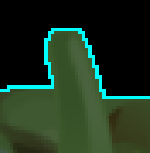

# Feature Extraction

Image Regions, Boundary Tracing, Region Signature & other Descriptors

## Table of Contents

## 1. Introduction

In the [tutorial on segmentation](../segmentation/segmentation.md) we discussed how to extract part of an image, now we find out what to do with them. Recall that an image region is a set of pixel coordinates ``Vector2ui``:

```cpp
using ImageSegment = std::set<Vector2ui, /*...*/>;
```

In ``crisp`` image segments hold now information about the pixels and indeed one image segment could be part of multiple images as long as the maximum and minimum boundaries of the pixel coordinates are small than the size of the two images. To apply a certain operation to only a segment of an image, we can do the following:

```cpp
auto lambda_operator = []<typename Image_t>(size_t x, size_t y, const Image_t& image) -> typename Image_t::Value_t
{
    auto value = image(x, y);
    // some transformation
    return value;
};

ImageSegment segment = /*...*/;
auto image = /*...*/;

for (const auto position : segment)
    image(position.x(), position.y()) = lambda_operator(position.x(), position.y(), image);
```

Here we're first defining a templated lambda that asks for 3 arguments: the x- and y-coordinate of a pixel and an image. It accesses the pixels value, does something to it and returns it. To then apply this transformation only to part of an image we can simply iterate through the segment and selective only alter pixels that are part of the segment in the original image.

It would be cumbersome and limiting to always carry a reference to the original image so instead ``crisp::ImageRegion`` copies all of that information on construction: while not a ``typedef`` like ``ImageSegment`` it can be helpful be aware that internally, ``crisp::ImageRegion`` uses a set of ``crisp::ImageRegion::Element``s like so:

```cpp
template<typename Image_t>
class ImageRegion
{   
    using Value_t = Image_t::Value_t;
    
    public:

    private:
        struct Element 
        {
            Vector2ui position;
            Value_t value;
        }
            
        std::set<Element, /*...*/> _elements;
}
```

We see that each element has the pixel ``position`` and the pixels original ``value``, which of course depends on the type of image the region is part of. Just like with ``ImageSegment`` the elements are sorted left-to-right, top-to-bottom. 

We construct an ``ImageRegion`` from an image and a ``crisp::ImageSegment``:

```cpp
#include <image_region.hpp>
using namespace crisp;

// in main
auto image = /*...*/;
auto segment = // some segmentation algorithm that returns crisp::ImageSegment

auto region = ImageRegion();
region.create_from(segment, image);

// or equivalently:
auto region = ImageRegion(segment, image);
``` 

Once ``create_from`` is called we are free to deallocate the original image and segment as ``ImageRegion`` already copied all relevent values.

## 1.1 An Example

Consider this image of the "pepper brush" as provided by [gimp](https://www.gimp.org/) :<br>


We want to extract the region that has the pepper. We observe the background to by very dark so a simple manual thresholding operation is guruanteed to extract the correct region. We first load the image as color, then convert it to grayscale using ``get_value_plane`` (remember that the HSV value component has the same value as the mean of all color components):

```cpp
#include <system/image_io.hpp>
#include <image/grayscale_image.hpp>
#include <segmentation.hpp>
using namespace crisp;

// in main.cpp

auto pepper_path = /*...*/ + "/crisp/docs/feature_extraction/pepper.png";

auto image = load_color_image(/*...*/ + "/crisp/docs/feature_extraction/pepper.png");
auto as_grayscale = image.get_value_plane();
auto thresholded = manual_threshold(as_grayscale, 0.01f);
```


We then want to decompose the grayscale iamge into segments. After decomposition the segments will be ordered according to the respective left-most, top-most pixels coordinate, (0, 0) is black and there are only two segments, we expect the pepper to be the second segment extracted:

```cpp
auto segments = decomponse_into_connected_segments(thresholded);
auto pepper_segment = segments.at(1);
```

We can now construct our resulting region using the pepper segment and the original color images values:

```cpp
auto pepper = ImageRegion(pepper_segment, image);
```

We will be using this region for rest of the tutorial.

## 2. A Regions Boundary

Mathematically, ``crisp``s regions are *closed, simply connected regions*. This basically means a) its boundary is part of the set of elements and b) all elements are 4-connected. Regarding 4-connectivty, ``ImageRegion`` will throw an excpetion if the segment handed to it is not 4-connected. We can assure it is either by using ``decompose_into_connected_segments`` (as outline in the [segmentation tutorial](../segmentation/segmentation.md) or we can use ``decompose_into_regions(const ImageSegment&, const Image_t&) -> std::vector<ImageRegion>`` which automatically splits the segment into 4-connected sub-segments and then constructs a region from each. 

Now that we assured that our region is indeed handed a 4-connected segment we can concern ourselfs with the second and (in terms of feature recognition) most important property: it's boundary. In ``crisp`` boundaries have the following properties:

Let ``B = {b_0, b_1, b_2, ..., bm}`` be the set of boundary points, then:
+ i) for each ``b_i`` there exists a ``b_i-1``, ``b_i+1`` in ``B`` such that ``b_i-1`` is 8-connected to ``b_i``, ``b_i+1`` is 8-connected to ``b_i`` and ``b_i-1`` is not 8-connected to ``b_i+1``
+ ii) the set ``B`` is minimal in terms of cardinality under i), meaning if we were to remove any ``b_i`` in ``B``, property i) would be violated

``crisp`` prides itself on being somewhat easy to understand to people less proficient in math so lets explore each of these property visually:

### 2.1 8-Connectivity and Minimal Cardinality

Property i) means the region is an unbroken chain of 8-connected pixels and that the boundary forms an unbroken path such that one can jump from ``b_0`` to ``b_1``, ``b_1`` to ``b_2``, etc. up to ``b_m-1`` to ``b_m`` (the last point) and then, crucially, from ``b_m`` back to ``b_0`` completing the circle. 

Let's again consider the region of our pepper:<br>


A simple way of tracing it's boundary would be to highlight all pixels that have at least one neighbor that is not in the region (black, in our case).


This is a boundary that fullfills condition i), however inspecting the boundary closely we notice many redundant points:



If we were to ask a human to remove as many points as possible without compromising condition i) we would get the following boundary, where necessary pixels are highlighted in magenta, redundant pixels in cyan:


This is what condition ii) represents, we want all pixels to be non-redundant. This vastly increases performance as for our pepper example we go from 3854 pixels for our trivial boundary to only 472 pixels using a minimal boundary:


``crisp``s proprietary boundary tracing algorithm assures that the computed boundary is always minimal. We can access it using: ``std::vector<Vector2ui> ImageRegion::get_boundary() const``.

### 2.2 Boundary Polygon

We can even further reduce the number of points by treating the boundary as a polygon that has vertices and straight, non-intersecting lines connecting exactly two of the vertices. Consider this part of our pepper boundary:


We note multiple straight lines, each of these lines can be respresented by just two pixels at the start and beginning of the line, shown in green ``rgb(0, 1, 0)`` here:


Using this approach we reduce the number of boundary points from 472 to only 193, again without loosing any information. The information is retained by the fact that the polygon vertices are ordered in counter-clockwise direction, this way we know exactly where to draw the straight line to the next point. 

Now that we reduced the entire information contained in the region in the shape of a pepper to just 193 pixels some may think we are done but thanks to more math we can reduce it even further and/or increase it's generality.

## 

