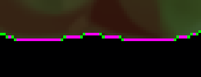

[<< Back to Index](../index.md)

---
# Feature Extraction

Image Regions, Region Descriptors, Boundary Tracing, Signatures, Pattern Descriptors

```cpp
#include <image_region.hpp>
```

## Table of Contents

1. [Introduction](#1-introduction)<br>
    1.1 [Extracting a Region](#11-an-example)<br>
2. [Region Boundary](#2-region-boundary)<br>
    2.1 [Definition](#21-8-connectivity-and-minimal-cardinality)<br>
   2.2 [Boundary Polygon](#22-boundary-polygon)<br>
3. [Boundary Signature](#3-boundary-signatures)<br>
    3.1 [Vertex Polygon](#31-vertex-polygon)<br>
    3.2 [Slope Chain Code Signature](#32-slope-chain-code-signature)<br>
    3.3 [Radial Distance Signature](#33-radial-distance-signature)<br>
    3.4 [Complex Coordinate Signature](#34-complex-coordinate-signature)<br>
    3.5 [Farthest Point Signature](#35-farthest-point-signature)<br>
4. [Whole Region Descriptors](#4-whole-region-descriptors)<br>
    4.1 [Area, Perimeter, Compactness](#41-area--perimeter-compactness)<br>
    4.2 [Centroid](#42-centroid)<br>
    4.3 [Axis Aligned Bounding Box](#43-aabb)<br>
    4.4 [Major and Minor Axis](#44-major--minor-axis)<br>
   4.5 [Eccentricity](#45-eccentricity)<br>
   4.6 [Circularity](#46-circularity)<br>
   4.7 [Holes](#47-holes)<br>
   4.8 [N-ths Moment Invariant](#48-moment-invariants)<br>
5. [Texture Descriptors](#5-texture-descriptors)<br>
    5.1 [Co-Occurence Matrix](#51-co-occurence-matrix)<br>
   5.2 [Maximum Intensity Response](#52-maximum-response)<br>
   5.3 [Correlation](#53-intensity-correlation)<br>
   5.4 [Uniformity](#54-uniformity)<br>
   5.5 [Homogeneity](#55-homogeneity)<br>
   5.6 [Entropy](#56-entropy)<br>
   5.7 [Contrast](#57-contrast)<br>

## 1. Introduction

In the [tutorial on segmentation](../segmentation/segmentation.md) we discussed how to extract part of an image, now we will find out what to actually do with them. Recall that an image *segment* is a set of pixel coordinates ``Vector2ui``:

```cpp
using ImageSegment = std::set<Vector2ui, /*...*/>;
```

`crisp::ImageSegment` holds no information about the pixels intensity values and indeed one segment could be applied to multiple images without a problem. To apply a certain operation to only a segment of an image, we can do the following:

```cpp
auto lambda_operator = []<typename Image_t>(size_t x, size_t y, const Image_t& image) -> typename Image_t::Value_t
{
    auto value = image(x, y);
    // some transformation
    return value;
};

ImageSegment segment = /*...*/;
auto image = /*...*/;

for (const auto position : segment)
    image(position.x(), position.y()) = lambda_operator(position.x(), position.y(), image);
```

We first define a templated lambda, this function takes the pixel coordinates as well as an image and transforms the corresponding image in the pixel.

However when working with parts of an image the pixel intensity values often do matter and carrying around references to images along with a segment would be to cumbersome so `crisp` offers a new class called `ImageRegion` that unifies both an image segment and corresponding intensity values:

```cpp
template<typename Image_t>
class ImageRegion
{   
    using Value_t = Image_t::Value_t;
    
    public:

    private:
        struct Element 
        {
            Vector2ui position;
            Value_t value;
        }
            
        std::set<Element, /*...*/> _elements;
}
```

We see that a region holds a set of elements, where each element has a member ``position`` (the pixel coordinate) and the pixels original ``value``, which of course depends on the type of image the region is part of. Just like with ``ImageSegment`` the elements in the setare sorted left-to-right, top-to-bottom with respect to only their position.

We construct an ``ImageRegion`` from an image and a ``crisp::ImageSegment`` like so:

```cpp
// in main
auto image = /*...*/;
auto segment = // some segmentation algorithm that returns crisp::ImageSegment

auto region = ImageRegion();
region.create_from(segment, image);

// or equivalently:
auto region = ImageRegion(segment, image);
``` 

Once ``create_from`` is called, all pixel intensities are copied so we are free to deallocate the original image or change it without the values in image region being affected. 

## 1.1 An Example

To fully illustrate the entire chain of loading an image, segmenting it and extracting a region, consider this image of the "pepper brush" as provided by [gimp](https://www.gimp.org/) :<br>


We want to extract the region that has the pepper. We observe the background to by very dark so a simple manual thresholding operation is guaranteed to extract the correct region. We first load the image as color, then convert it to grayscale using ``get_value_plane`` (remember that the HSV value component has the same value as the mean of all color components):

```cpp
#include <system/image_io.hpp>
#include <image/grayscale_image.hpp>
#include <segmentation.hpp>
using namespace crisp;

// in main.cpp
auto image = load_color_image(/*...*/ + "/crisp/docs/feature_extraction/pepper.png");
auto as_grayscale = image.get_value_plane();
auto thresholded = Segmentation::manual_threshold(as_grayscale, 0.01f);
```


We then want to decompose the binary image into connected segments. After decomposition the segments will be ordered according to the respective left-most, top-most pixels coordinate, the pixel at (0, 0) is black and there are only two segments thus we expect the pepper to be the second segment extracted:

```cpp
auto segments = decomponse_into_connected_segments(thresholded);
auto pepper_segment = segments.at(1);
```
We can now construct our resulting region using the pepper segment and the original **color images** values:

```cpp
auto pepper = ImageRegion(pepper_segment, image);
```

This is why we loaded the image as color but thresholded the grayscale image. With image region we still maintain the information of the color intensities.

## 2. Region Boundary

Mathematically, ``crisp``s regions are *closed, simply connected regions*. This basically means a) its boundary is part of the set of elements and b) all elements are 4-connected. Regarding 4-connectivty, ``ImageRegion`` will throw an exception if the segment handed to it is not 4-connected. We can assure it is either by using ``decompose_into_connected_segments`` (for more information about this, visit the [segmentation tutorial](../segmentation/segmentation.md)) or we can use ``decompose_into_regions(const ImageSegment&, const Image_t&) -> std::vector<ImageRegion>`` which is provided to automatically split a segment into 4-connected sub-segments and then constructs a region from each. 

Now that we assured that our region is indeed 4-connected, we can concern ourselfs with, in terms of feature recognition, one of the most important properties of a region: it's boundary. In ``crisp`` boundaries have the following properties:<br> 

(a visual exploration of these concepts will follow)

Let ``B = {b_0, b_1, b_2, ..., bm}`` be the set of boundary points, then:
+ i) for each ``b_i`` there exists a ``b_i-1``, ``b_i+1`` in ``B`` such that ``b_i-1`` is 8-connected to ``b_i``, ``b_i+1`` is 8-connected to ``b_i`` and ``b_i-1`` is not 8-connected to ``b_i+1``
+ ii) the set ``B`` is minimal in terms of cardinality under i), meaning if we were to remove any ``b_i`` in ``B``, property i) would be violated

``crisp`` prides itself on being somewhat easy to understand to people less proficient in math so lets explore each of these properties visually:

### 2.1 8-Connectivity and Minimal Cardinality

Property i) means the boundary is an unbroken chain of 8-connected pixels and that the boundary forms a path such that one can jump from ``b_0`` to ``b_1``, ``b_1`` to ``b_2``, etc. up to ``b_m-1`` to ``b_m`` (the last point) and then, crucially, from ``b_m`` back to ``b_0`` completing the circle. 

Let's again consider the region of our pepper:<br>


A simple way of tracing it's boundary would be to highlight all pixels that have at least one neighbor that is not in the region (black, in our case).


This is a boundary that fullfills condition i), however inspecting the boundary closely we notice many redundant points:


If we were to ask a human to remove as many points as possible without compromising condition i) we would get the following boundary, where necessary pixels are highlighted in magenta, redundant pixels in cyan:


This is what condition ii) represents, we want all pixels to be non-redundant. This vastly increases performance as for our pepper example we go from 3854 pixels for our trivial boundary to only 472 pixels using a minimal boundary:


``crisp``s proprietary boundary tracing algorithm assures that the computed boundary is always minimal. We can access after constructiong a region it using: ``std::vector<Vector2ui> ImageRegion::get_boundary() const``.

### 2.2 Boundary Polygon

We can even further reduce the number of points by treating the boundary as a polygon that has vertices and straight, non-intersecting lines connecting exactly two of the vertices. Consider this part of our pepper boundary:


We note multiple straight lines, each of these lines can be respresented by just two pixels at the start and beginning of the line, shown in green ``rgb(0, 1, 0)`` here:



Using this approach we reduce the number of boundary points from 472 to only 193, without loosing any information. The information is retained by the fact that the polygon vertices are ordered in counter-clockwise direction, this way we know exactly where to draw the straight line to the next point if we wanted to reconstruct the full boundary.

Now that we reduced the entire information contained in the region in the shape of a pepper to just 193 pixels some may think we are done but thanks to more math we can reduce it even further while increase the representations it's generality.

## 3. Boundary Signatures

A signature is a mathematical transform of the boundary points of a shape that aims to, in some way, make the description of the boundary more widely applicable. One of these ways is to make it *independent of rotation*, a signature that accomplishes this describes not only our upright pepper but all possible rotation of it at the same time. Another form of generality is *scale invariance*, meaning that the signature describes our pepper at scale 1 and the same pepper scaled by any factor > 0. Lastly *independence of translation* means that it does not matter if we were to translate all points of the signature by a constant (x, y), the signature represents all of those peppers just the same. ``crisp`` offers the following signatures:

## 3.1 Vertex Polygon

(scale: not invariant | rotation: not invariant | translation: not invariant)

This is the simplest signature, as already mentioned it reduces the boundary to the vertices of it's polygon. It is neither scale nor rotationally invariant, it can however be computed in amortized o(1) using:

```cpp
auto polygon_signature = pepper.get_boundary_polygon();
```

## 3.2 Slope Chain Code Signature

(scale: invariant | rotation: not invariant | translation: invariant)

We can generate the slope-chain-signature by simply iterating through all boundary polygon vertices and storing the *angle* of the line that connects our current polygon vertex to the next (recall that the vertices are ordered counter-clockwise). This makes it both invariant to both translation and scale, however rotation would alter all the angle values so it is not invariant. One way to make it invariant is to instead save the delta of succesive angles but `crisp` for now only returns the simpler version.

We can generate the slop-chain-code-signature using ``std::vector<float> ImageRegion::slope_chain_code_signature() const``, it returns the angles in radian in order of boundary polygon vertices. Computing the difference from this is a trivial operation.

## 3.3 Radial Distance Signature

(scale: not invariant | rotation: invariant | translation : invariant)

The radial distance signature is the distance of each vertex from the regions centroid. The centroid of a region in ``crisp`` is defined as the mean of all boundary coordinates and can be intuitively thought of as the center of mass of a region if all pixels have the same weight. Beause we are measuring the absolute distance, this signature is not invariant to scale. We can generate it using ``std::vector<float> ImageRegin::radial_distance_signature() const`` in amortized o(m) (where m the number of boundary vertices).

## 3.4 Complex Coordinate Signature

(scale: invariant | rotation: invariant | translation : invariant)

(as proposed by [El-Ghazal, Basir, Belkasim (2007)](https://ieeexplore.ieee.org/abstract/document/4378916))

This signature transforms each point in the boundary polygon into a complex number, for a point (x, y) the signature of the point is the complex number x + i*y where i is the imaginare constant, so the x-coordinate is treated as the real part and the y-coordinate is treated as the y-part. While this signature is neither invariant to scale or rotation, we can now fourier-transform the complex number achieving scale, rotational and translational invariance.

We can access the complex coordinates in O(m) (where m the number of boundary polygon points) using ``ImageRegion::complex_coordinate_signature()``. To then transform it into it's fourier descriptors we can use the fourier transform functions provided by ``crisp::FourierTransform``.

## 3.5 Farthest Point Signature

(scale: not invariant | rotation: invariant | translation: invariant)

(as proposed also by [El-Ghazal, Basir, Belkasim (2009)](https://www.sciencedirect.com/science/article/abs/pii/S0923596509000393))

This signature computes, for each boundary point, the maximum distance to any other boundary point. It performs betters when used for fourier descriptors [1] and achieves translational and rotational invariance.
We can generate it using ``ImageRegion::farther_point_signature``. 

[1] (Y. Hu, Z. Li, (2013): [available here](http://www.jsoftware.us/vol8/jsw0811-31.pdf)

## 4. Whole Region Descriptors

While signatures are a transform of a regions bounday, when trying to classify the type of shape of a region we want to somehow quantify a certain aspect about it in a way that makes it so that value is uniqe to that specific shape. If we somehow find an expression that is 1 for pepper shapes only and a different value for all other shapes, we would have achieved a flawless pepper-classification scheme. This section deals with many properties of not only a regions shape but the region and it's texture that could be used for this. While only one specific property on it's own may not be too notable or accuracte, combining many of them increases the specificity of classification.

## 4.1 Area & Perimeter, Compactness

One of the easiest descriptors are *area*, the number of pixels in a region and *perimeter*, the length of the regions boundary. Note that perimeter only deals with the outer most boundary, so increasing the number of holes in a region will decrease its area but leave it's perimeter unchanged. Area and perimeter usually are not very useful unless they are normalized, for example by by quantifying the areas *compactness* which is equal to the square of the perimeter divided by the area. A region that has no holes will have maximum compactness while a region that has many or very big holes has a lower compactness. We can access area, perimeter and compactness using:

```
float get_perimter() const;
float get_area() const;
float get_compactness() const;
```

The values for compactness are usually in [0, 2], this is not guruanteed for edge cases however.

## 4.2 Centroid

A regions *centroid* in ``crisp`` is defined as the mean of the coordinate values of it's boundary points. In the literature the centroid is sometimes defined as the average of *all* points in a region, so it is important to remember that ``crisp`` only uses the boundary. Adding holes to a region while leaving it's boundary unchanged does not alter the position of the regions centroid.

We access a regions centroid at any time with no overhead using `get_centroid()`


Where the centroid is highligted using a red rgb(1, 0, 0) cross in the above picture.

## 4.3 AABB

The *axis aligned bounding box* (AABB) of a region is the smallest rectangle whos sides align with the x- and y-axis that completely encloses the region. We can access it like so:

```cpp
std::vector<Vector2ui, 4> aabb_vertcies = pepper.get_axis_aligned_bounding_box(); 
```

Where the vertices are in the following order: top-left, top-right, bottom-right, bottom-left.

The value of the vertices of the rectangle are relative to the top-left corner of the image the region is from, translating them to the origin is a trivial operation.


Note that the boundary intersects with the AABB, this is because it is a closed region.

## 4.4 Major & Minor Axis

The major and minor axis of a region is formally defined as the ellipses described by the eigenvectors multiplied with their respective eigenvalues of the positional covariance matrix of the boundary of a region. It's not important to understand what this means, we can think of the major and minor axis as the "orientation" of an object, where the major axis is along the highest variance (in terms of spacial position), the minor axis is perpendicular to it and and both axis' intersect with the centroid. We access the minor and major access using:

```cpp
const std::pair<Vector2f, Vector2f>& get_major_axis() const;

const std::pair<Vector2f, Vector2f>& get_minor_axis() const;
```

Each of the axis is given as two point. Visualizing the axis properly is difficult as they represented with sub-pixel precision. By scaling the image of the pepper we can get an idea of what they look like:


Where magenta is the major, green the minor axis and the ellipses modeled shown in yellow. Using the *hoteling transform* we can translate the ellipses so it's axis' align with the coordinate systems axis'. The ratio of the resulting two gives us another scale-invariant, rotationally-invariant and translationally-invariant region descriptor. 

## 4.5 Eccentricity
Using the minor and major axis we can furthermore compute the regions *eccentricity* which is quantifying how "conical" the region is, if the eccentricity is 0 the shape modeled by the major and minor axis is a perfect circle, the closer to 1 the eccentricity is, the more elliptical the region.

We can access the eccentricity using ``ImageRegion::get_eccentricity()``.

## 4.6 Circularity

While eccentricity measures how closely the shape of a region approximates a non-circular ellipses, *circularity* quantifies how closely the shape approximates a perfect circle. Regions with tend to have smooth features and not many sharp edges tend to have high circularity towards 1 while angular shapes or shapes with a high eccentricity tend to have a circularity closer to 0.

We can access circularity using ``ImageRegion::get_circularity()``.

## 4.7 Holes

While already mentioned, it is instructional to define what a hole is formally. A hole is an area of pixels who are *not* part of the region whose boundary is circular and entirely enclosed by the region. Intuitively this means if you image the region as land and everything else as water, a hole would be a lake inside the region with no connection to the "ocean" that is surrounding the region.

When boundary tracing ``crisp`` implicitely computes the boundaries of each hole and thus also the number of holes. We can access either with no overhead using:

```cpp
size_t get_n_holes() const;
const std::vector<std::vector<Vector2ui>> get_hole_boundaries() const;
```

## 4.8 Moment Invariants

We've seen earlier that somehow respresenting a regions unique shape in a way that is invariant to scale, translation and rotation is highly valuable. A very powerful way to achieve is with the *nths moment invariant*. While some of them have a conceptual meaning, for beginners it is best to just think of them as properties that may not be useful to humans but do represent the shape of a region uniquely. ``crisp`` offers the first 7 moment invariants, accessed using ``ImageRegion::get_nths_moment_invariant(size_t n)`` where n in {1, 2, 3, ..., 7}.

The following table summarizes the response of a moment invariant to translation, scale, rotation and mirroring. "Unchanged" means the value of the moment does not change when recomputed after the operation.

```cpp
N       translation     scale           rotation        mirroring
--------------------------------------------------------------------
1       unchanged       unchanged       unchanged       unchanged
2       unchanged       unchanged       unchanged       unchanged
3       unchanged       unchanged       unchanged       unchanged
4       unchanged       unchanged       unchanged       unchanged
5       unchanged       does change     unchanged       unchanged
6       unchanged       does change     unchanged       does change
7       unchanged       does change     slight change   changes sign
```

We note that all first 4 moment invariants are completely independent of translation, scale, rotation and mirroring of the region and are thus highly valuable in representing a region.

## 5. Texture Descriptors

Until now we have used descpritors that either describe a regions shape or both it's shape and pixel values. In this section we will deal with only a the pixel values. *Texture* has no agreed on definition but we can intuitively describe it as rate of change, value range and periodicity of the intensity values of a region. 

## 5.1 Intensity Histogram

Recall that the intensity of an element of an n-plane image is defined as the mean of the value of all planes. So for a color image, the intensity of pixel (x, y) is average of the red, green and blue component. 

When a region is constructed, the intensity histogram is also created. The intensities are quantized into [0, 256] to keep things manageable. We can access the histogram directly using ``get_intensity_histogram()``.

## 5.2 n-ths Statistical Moment

The *n-ths standardized statistical moment about the mean* is an important measure of intensity distribution, it is calculated from the intensity histogram. We can compute it using ``get_nths_statistical_moment(size_t n)``. The first 4 statistical moments have a human interpretable meaning:

+ the **first** statistical is always 0
+ the **second** statistical moment is the *variance*. We can normalize it to the *standard deviation* by taking it's square root. For a more syntactically expressive way to compute it, `ImageRegion` also offers `get_variance()`.
+ the **third** statistical moment is called *skewness*, as it's name suggest it quantifies how much the shape of the distribution in the histogram "leans" to one side. We can also compute it using `get_skewness()`
+ the **fourth** statistical moment is called *kurtosis*, it is often described as a measure of "tailedness" which is best explained using visuals. Consider this image (source: wikipedia)<br>
 <br>
  Ignoring which color corresponds to which distribution, we see that the distributions are ordered by curtosis with red having the highest, yellow the second highest, green the third, etc..<br>
  We can access the kurtosis directly by using `get_kurtosis()`. 
  
As already mentioned the higher statistical moments are not useful for human interpretation, however they can still be used to characterize the texture intensity distribution. 

## 5.2 Average Entropy

The average entropy is the entropy of the intensity distribution. We can compute it using `get_average_entropy()`. For convenience it is already normalized into [0, 1]. 

## 5.3 Maximum Response

The *maximum response* is the probability of the most common intensity. It is a number in [0, 1], where 1 only happens for a region of constant intensity.

We can get the maximum response directly using ``ImageRegion::get_maximum_intensity_probability(CoOccurenceDirection)``

For our pepper in +90° direction, this value is `0.304366` which is relative high. We expect a region with such a high value to be of mostly constant intensity and this is indeed the case, most (exactly 30.4366%) of the pepper is the same shade of green.

## 5.3 Co-Occurence Matrix

To quantify texture in a specified direction we need to construct the *co-occurence matrix*. The co-occurence matrix is a matrix of size 256x256. It counts for each intensity pair `i_a`, `i_b` the number of times two pixels `a`, `b` that are *next to each other* have the corresponding intensities `i_a`, `i_b`.
A short example: if the co-occurence matrix for the "right" direction has a value of 6 in the row 120 and column 98 then in the image there are 6 pairs of pixels `a`, `b` such that a has intensity 120 and `b` who is **directly right** of `a` has intensity 98. To keep the size of the co-occurence matrix managable, intensities are quantized into 8-bit.  

When constructing the co-occurence matrix we need to supply a direction. Let `a = (x, y)` and `b = (x + i, y + j)` then the members of the `CoOrrurenceDirection` enum have the following meaning:

```cpp
Direction           a           b
-------------------------------------
PLUS_MINUS_ZERO    (x,y)        (x,   y-1)
PLUS_45            (x,y)        (x+1, y-1)
PLUS_90            (x,y)        (x+1, y)
PLUS_125           (x,y)        (x+1, y+1)
PLUS_MINUS_180     (x,y)        (x,   y+1)
MINUS_125          (x,y)        (x-1, y+1)
MINUS_90           (x,y)        (x-1, y)
MINUS_45           (x,y)        (x-1, y-1)
```

Because this is `crisp` we can render the matrix like so:

```cpp
auto co_occurrence_matrix = pepper.get_co_occurence_matrix(CoOccurenceDirection::PLUS_90);

auto as_image = GrayScaleImage(co_occurrence_matrix);
// bind or save to disk
```

<br>

The above image was log-scaled for clarity. First we note that most of the cells are left black, this points to the peppers texture only having a relative small amount of pair-wise different intensity pairs. Confirmed with the original image, this is indeed the case. Secondly we note that most of the high-occurrence pairs (those with a light intensity in the above image) are clustered around the matrix' trace. This points to high uniformity as an occurrence along the trace means that the intensity pair `{i_a, i_b}` had identical values `i_a == i_b`. Recall that these observation only make sense in respect to the direction of the co-occurrence matrix which in our case is +90° (from left to right).

We can numerically quantify the distribution of intensity value pair occurences using the following descriptors:

## 5.5 Intensity Correlation

*Intensity Correlation* measures how correlated the intensities in each intensity value pair are. Similar to the [pearson correlation coefficient](https://en.wikipedia.org/wiki/Pearson_correlation_coefficient) it has a value in [-1, 1] where -1 means a a strong negative correlation, +1 means a strong positive correlation (either of which usually mean there is a regularity to the pattern) and 0 meaning no correlation. A pattern that has 0 correlation could be random noise or a region of constant intensity.

We can compute the mean intensity correlation using ``get_intensity_correlation(CoOccurenceDirection)``.

## 5.6 Uniformity

Uniformity is a measure of how constant the intensity values are. For a constant region the uniformity is 1, for a more diverse region the values are closer to 0.

We can access uniformity using ``get_uniformity(CoOccurenceDirection)``

## 5.5 Homogeneity

In the co-occurence matrix the diagonal resprents occurences of intensity pair `i_a`, `i_b` where `i_a = i_b`, so occurences where two pixels in the specified direction have the same intensity. Homogenity quantifies how many of the intensity pairs like this there are. The higher the homogeinity, the less transitions between different intensities there are in that direction.

We can access the value which is in [0,1] using ``get_homogeneity(CoOccurenceDirection)``. The pepper region exhibits a homogeneity of `0.625`. This may be slightly lower than expected considering the pepper is all green, however remember that we are quantifying texture, not color. The intensity (lightness) of the shades of green do vary quite a bit even though the hue does not. Nontheless `0.625` would be considered far above average so we would call the pepper a fairly homogenically textured region.

## 5.6 Entropy

Just like in statistics, *entropy* measures the randomness of the co-occurence distribution. A value of 1 means all pairings are uniformly distributed, the less uniform the distribution the closer the value is to 0. We compute the entropy using ``get_entropy(CoOccurenceDirection)``.

For the pepper region this value is `0.95` which is fairly high. This makes sense as the pepper is highly ordered because many parts of the regions have a constant intensity with very few harsh intensity ramps.

## 5.7 Contrast

Contrast measures the difference between co-occuring pixels. A white pixel next to a black pixel (or vice-versa) would have maximum contrast while two pixels of identical color would have 0 contrast. We can compute the mean contrast in the specified direction using
`get_contrast(CoOccurenceDirection)`, as already mentioned it's values are in [0, 1].

Out pepper has a contrast of `0.0002` which is extremely low, again this is expected, the shades of green transition into each other smoothly as there are no big jumps in intensity.

---
[<< Back to Index](../index.md)
