[<< Back to Index](../index.md)

---

# Frequency Domain

Fourier- and Discrete Cosine Transforms and their Filters

## Table of Content

1. [Introduction](#1-introduction)<br>
2. [Fourier Transform](#2-fourier-transform)<br>
    2.1 [Fourier Transform Performance Mode](#21-fourier-transform-performance-mode)<br>
    2.2 [Creating the Transform](#22-creating-the-transform)<br>
    2.3 [Visualizing the Spectrum](#23-visualizing-the-spectrum)<br>
    2.4 [Accessing Coefficients](#24-accessing-coefficients)<br>
    2.5 [Transforming Back into an Image](#25-transforming-back-into-an-image)<br>
3. [Spectral Filters](#3-spectral-filters)<br>
    3.1 [Creating & Visualizing Filters](#31-creating-and-visualizing-filters)<br>
    3.2 [Filter Shapes](#32-filter-shapes)<br>
        3.2.1 [Low-Pass Filters](#321-low-pass-filters)<br>
        3.2.2 [High-Pass Filters](#322-high-pass-filters)<br>
        3.2.3 [Band-Pass Filters](#323-band-pass-filters)<br>
        3.2.4 [Band-Reject Filters](#324-band-reject-filters)<br>
   3.3 [Modifying Filter](#33-modifying-filter)
   

## 1. Introduction

While working on images themself in the so called *spatial domain* provides a variety of advantages some techniques are much easier to accomplish in the *frequency domain*. These *spectral* techniques, in ``crisp`` are performed on two transforms of images: 
+ The [Fourier Transform](https://en.wikipedia.org/wiki/Fourier_transform) treats our Images as 2D continous functions, regularly sampled at the pixel coordinates, and translates them into a number of [complex](https://en.wikipedia.org/wiki/Complex_number) coefficients of sinoid functions. Combining the functions weight by their coefficients returns the original image
+ The [Discrete Cosine Transform](https://en.wikipedia.org/wiki/Discrete_cosine_transform) similarly express a 2D continous functions, regularly sample (our images) as coefficients of specifically cosine functions oscillating at different frequencies

Both these transforms have numerous uses in image processing and ``crisp`` saves users all the math and provides and easy interface for both viewing and filtering the transformed images.

## 2. Fourier Transform
### 2.1 Fourier Transform Performance Mode
Computing the fourier transform is taxing and can be quite slow, to alleviate this ``crisp`` offers three different ``FourierTransformModes`` that can be handed to ``crisp::FourierTransform`` as a template argument:

```cpp
enum FourierTransformMode {SPEED, BALANCED, ACCURACY};

template<FourierTransformMode Mode = BALANCED>
class FourierTransform
{
```

+ ``SPEED`` is the most optimal version offered by crisp, it uses 32-bit float coefficients and employs a suboptimal heuristic. While artifacting due to low precision is common, this is the only mode that can realistically be run in real time on most at-home machines.
+ ``BALANCE`` is about 1.5 times slower than ``SPEED`` and uses 64-bit double coefficients. It's heuristic is also suboptimal, however is much closer to optimum than ``SPEED``s. For applications where easier a high performance CPU is available or for smaller images this mode is recommended and thus specified as default
+ ``ACCURACY`` is about 10 times slower than ``SPEED`` and uses 64-bit double coefficients, like ``BALANCE``. The significant slow down comes from first computing the optimal heuristic, this assures that results are as accurate as possible, however the difference between it's results and ``BALANCED``s result are often not noticeable. Nonetheless in situations that do not care about real-time interactivie and where high precision is necessary, this is the mode of choice

### 2.2 Creating the Transform

To transforme a 1-dimensional image (henceforth assumed to be a ``crisp::GrayScaleImage``) we first allocate the transform itself and then call ``FourierTransform::transform_from(const Image<T, 1>&)``:

```cpp
auto image = load_grayscale_image(/*...*/ + "/crisp/docs/frequency_domain/cube.png");

auto fourier = FourierTransform();  // equivalent to FourierTransform<BALANCED>();
fourier.transform_from(image);
```

### 2.3 Visualizing the Spectrum

Before we continue it is instructive to note that just like pretty much any class in ``crisp`` we can simply bind the transform to a sprite and render it:

```cpp
auto spectrum_image = fourier.as_image();
auto phase_angle_image = fourier.phase_angle_as_image();

// render or save to disk
```

This is the image we started out with, a simple rectangle: <br>
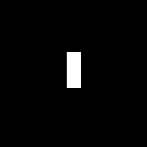

This is it's spectrum:<br>
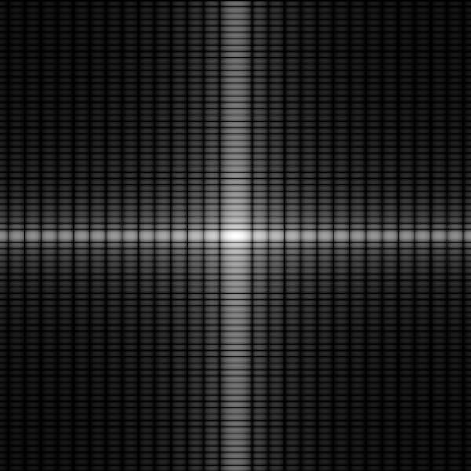<br>

And it's phase angle (potential seizure warning) is available [here](#cube-phase-angle).

We note that the spectrum is four times the size of the image and that it is already *centered*, that is, it's largest component (called the *dc component*) is at the center of the image. This is done to faciliate easier viewing, being a series of oscillating functions the spectrum is of course periodic so we can simply shift the view such that the dc component lines up with the center.

When rendering the spectrum the coefficients magnitudes are log-scaled and normalized into [0,1] *only for viewing*. This is to make inspection easier, the actual dc component is commonly 1000x high than any other components which in image form would make it very hard to inspect the full spectrum.

### 2.4 Accessing Coefficients

Now that we know what the data looks like, this is how we access it:

```cpp
// get a coefficient as std::complex
std::complex<Value_t> get_coefficient(size_t x, size_t y) const;

// get the magnitude component of a coefficient
Value_t& get_component(size_t x, size_t y);
Value_t get_component(size_t x, size_t y) const;

// get the phase angle component of a coefficient
Value_t get_phase_angle(size_t x, size_t y) const;
Value_t& get_phase_angle(size_t x, size_t y);

// access the dc components magnitude directly
Value_t get_dc_component() const;
```

Where x and y are the row and column index of the matrix that we just rendered as an image. We can get the size of the spectrum with ``FourierSpectrum::get_size()`` and since the dc component is at the center, we can also access it like so:

```cpp
auto dc_one = fourier.get_dc_component();
auto dc_two = fourier.get_component(fourier.get_size().x() / 2, fourier.get_size().y() / 2);

assert(dc_one == dc_two);
```

### 2.5 Transforming Back Into an Image

We can transform the spectrum back into an image using ``Image<Inner_t, 1> transform_to() const`` but before we do that let's alter the spectrum so we can notice it's effects. We set part of the spectrum to zero resulting in a modified spectrum that looks like this:

```cpp
auto dc = spectrum.get_dc_component();
for (size_t x = 0; x < spectrum.get_size().x(); ++x)
for (size_t y = 0; y < spectrum.get_size().y(); ++y)
{
    if (x == spectrum.get_size().x() * 0.5 or y == spectrum.get_size().y() * 0.5)
        spectrum.get_component(x, y) = dc;
}
```
Here we multiply each component along the center axis that by factor that increases the farther away from the dc component it is. The spectrum now looks like this:

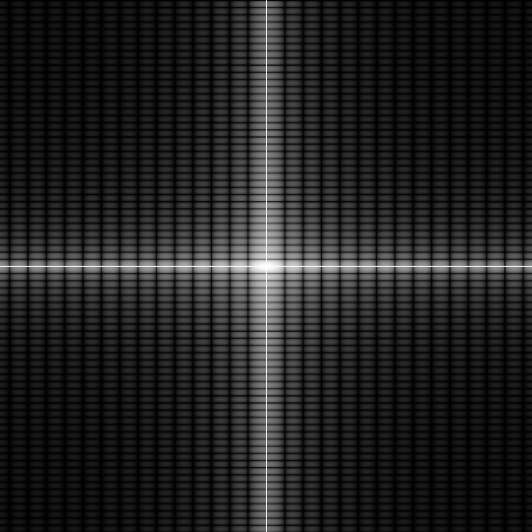

There is no real mathematical purpose to this, it is simply to demonstrate the stark difference once we transform the spectrum back into an image:

```cpp
auto result = spectrum.transform_to<GrayScaleImage>();
// save or render
```

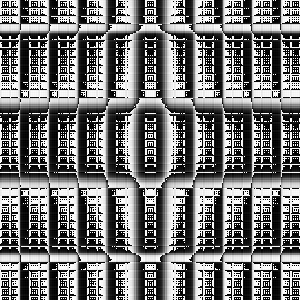

The original image is unrecognizable but we do note both that it roughly adheres to the original boundary of the rectangle and the typical periodicity that is inherent to many spectral techniques.

## 3. Spectral Filters
## 3.1 Creating and Visualizing Filters

Spectral filters can be best thought of as floating point valued matrices of the same size as the fourier spectrum (2*m*2*n as mentioned before) we're trying to filter. Applying the filter usually means multiplying it by the spectrum. 

Similar to spatial filters, ``crisp`` offers a class called ``FrequencyDomainFilter``. We create a filter by specifying it's size:

```cpp
auto filter = FrequencyDomainFilter(2*m, 2*n);

// or let the filter determine the size from a spectrum
auto filter = FrequencyDomainFilter(spectrum);
```

We then need to specify the filters *shape* via ``set_function``. Remember that our filters are 2d matrices so (like everything in crisp) we can visualize them by binding them to a ``crisp::Sprite``:

```cpp
auto sprite = Sprite();
sprite.create_from(filter);
// render

// or

auto image = filter.as_image<GrayScaleImage>();
// save to disk
```
## 3.2 Filter Shapes

The simplest filter shape is ``FrequencyDomainFilter::identity()``. In order to not modify the spectrum after applying (multiplying) the filter we would expect the filter to be valued 1 at all positions:

```
filter.set_function(filter.identity());
```


Visualization confirms this is indeed the case.

## 3.2.1 Low-Pass Filters

Low-Pass filters attenuate (diminish) higher frequencies and pass (do not modify) lower frequencies. For our fourier spectrum the lower frequency is the dc component at the center, the higher frequencies are more towards the outer edges of it. 

``crisp`` provides three types of low-pass filter shaping functions:

+ ``as_ideal_lowpass`` has a sharp cutoff point between is attenuating and passing regions:<br>
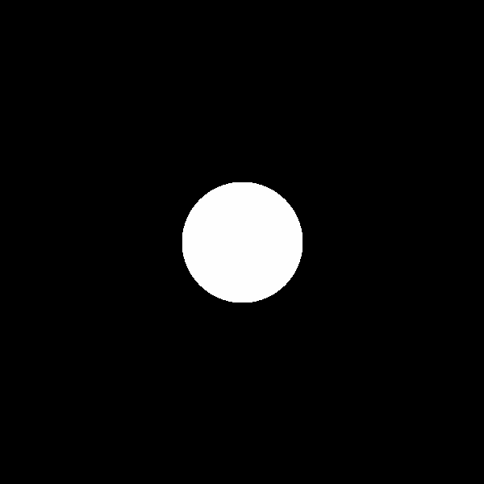<br><br>
+ ``as_gaussian_lowpass`` has a smooth transition between attenuating and passing regions that follows a [gaussian distribution](https://en.wikipedia.org/wiki/Gaussian_filter) :<br>
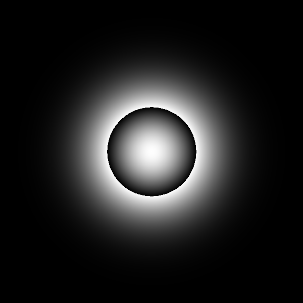<br><br>
+ ``as_butterworth_lowpass`` of order n is a filter that also has a smooth distribution that follows the [butterworth distribution of order n](https://en.wikipedia.org/wiki/Butterworth_filter). This filter approaches the ideal lowpass for order n -> infinity and approaches the gaussian lowpass for order n -> 0. Shown below: order 1, 2 and 3<br>
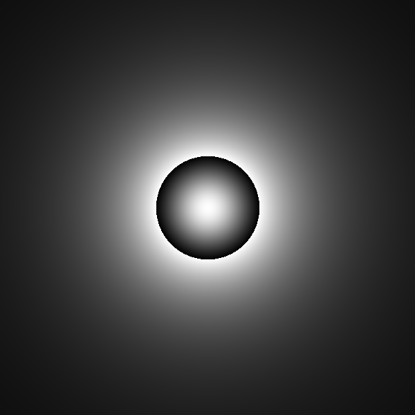<br>
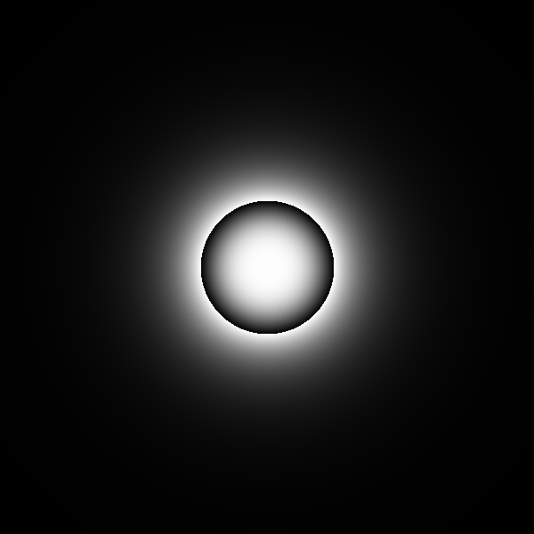<br>
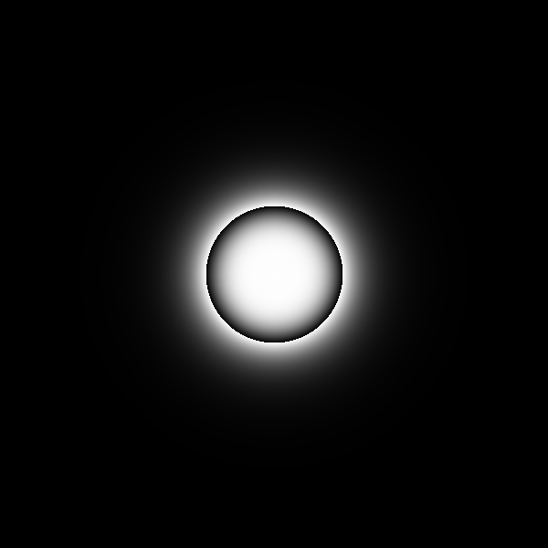<br>
  
Each function takes 3 arguments:
```cpp
void FrequencyDomainFilter::as_xyz_lowpass(
    double cutoff_frequency, 
    double pass_factor, 
    double reject_factor
);
```  
where 
+ ``cutoff_frequency`` is the frequency after which the attenuating region starts, in ``[0, min(2*m, 2*n)]`` where m, n size of the original image
+ ``pass_factor`` is the factor the coefficients in the passing (low frequency, inner) region are multiplied by. By default this factor is 1
+ ``reject_factor`` is the factor the coefficients in the attenuating (high frequency, outer) region are multiplied by. By default this factor is 0

## 3.2.2 High-Pass Filters

High-pass filters attentate low frequncies towards the centrum of the spectrum and pass high frequencies towards the outer edges. Just like low-pass, ``crisp`` offers three filter shaping functions:

+ ``as_ideal_highpass`` again has a sharp cutoff point from attenuating to passing region:<br>
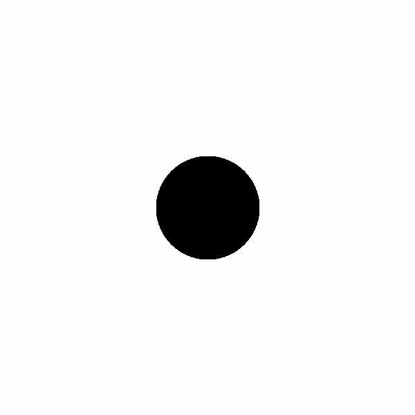<br><br>

+ ``as_gaussian_highpass`` again has a smooth gaussian transition from attenuating to passing region:<br>
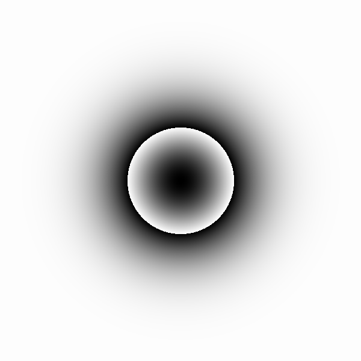<br><br>

+ ``as_butterworth_highpass`` similarly follows the butterworth filter shape along it's cutoff region. Pictured are butterworth highpass filters of order 1, 2, 3:<br>
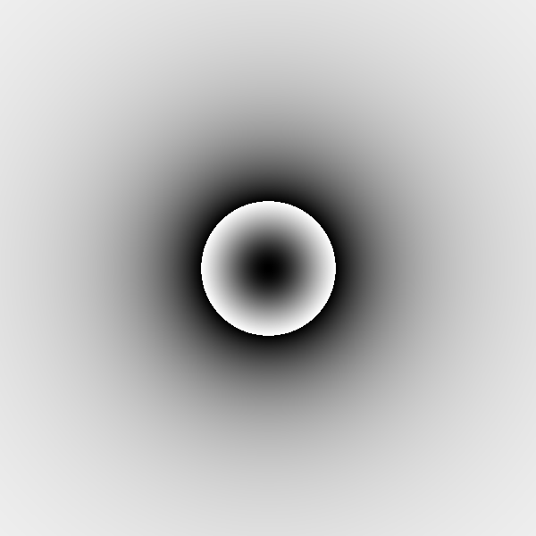<br>
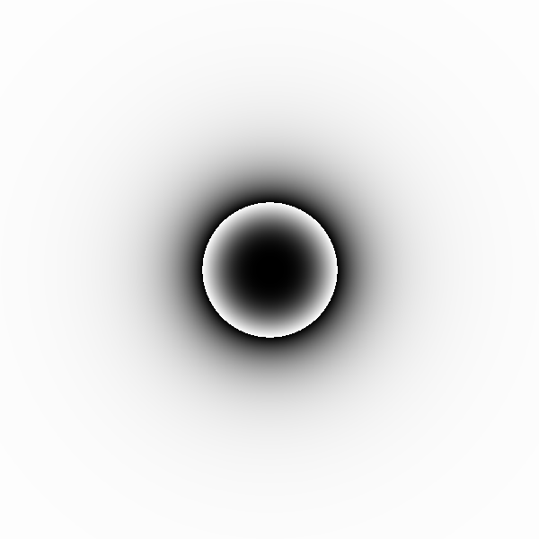<br>
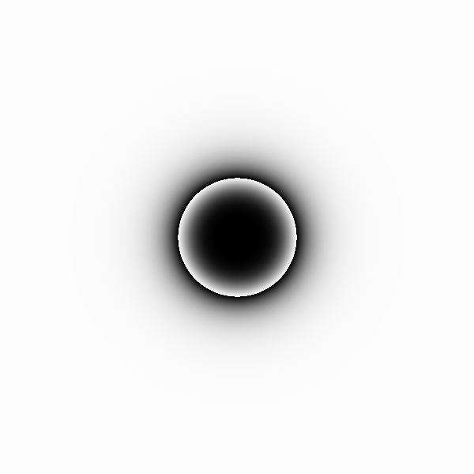<br><br>
  
Just like low-pass filters each high-pass filter shaping function takes three arguments:

```cpp
void FrequencyDomainFilter::as_xyz_highpass(
    double cutoff_frequency, 
    double pass_factor, 
    double reject_factor
);
```  
where 
+ ``cutoff_frequency`` is the frequency after which the passing region starts, in ``[0, min(2*m, 2*n)]`` where m, n size of the original image
+ ``pass_factor`` is the factor the coefficients in the passing (high frequency, outer) region are multiplied by. By default this factor is 1
+ ``reject_factor`` is the factor the coefficients in the attenuating (lower frequency, inner) region are multiplied by. By default this factor is 0

As you may have noticed the highpass filter is the inverse of the low-pass filter, that is for a highpass filter H, lowpass filter I of with the same cutoff frequency, reject- and pass-factor it holds true that: ``identity - H = I`` and ``identity - I = H``. We will see later how we can use arithmetic operations like these to our advantage.

## 3.2.3 Band-Pass Filters

A band-pass filter is a filter that passing frequencies in a specified band, that is for band cutoffs c_min (the inner cutoff) and c_max (the outer cutoff) frequencies ``freq`` such that ``c_min < freq < c_max`` are passed, all other frequencies are attenuated. ``crisp`` again offers the familiar 3 filter shaping function variations:

+ ``as_ideal_bandpass`` has a sharp transition between passing and attenuating region:<br>
<br><br>

+ ``as_gaussian_bandpass`` has a smooth, gaussian transition between passing and attenuating region:<br>
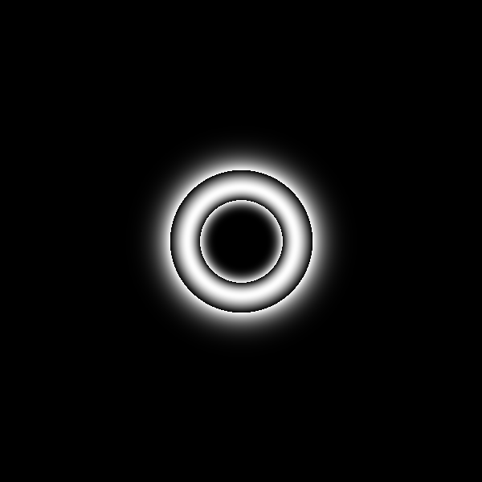<br><br>

+ ``as_butterworth_bandpass`` also has a smooth transition, however it follows, again, the butterworth filter shape of specified order. Pictured are order 1, 2, 3:<br>
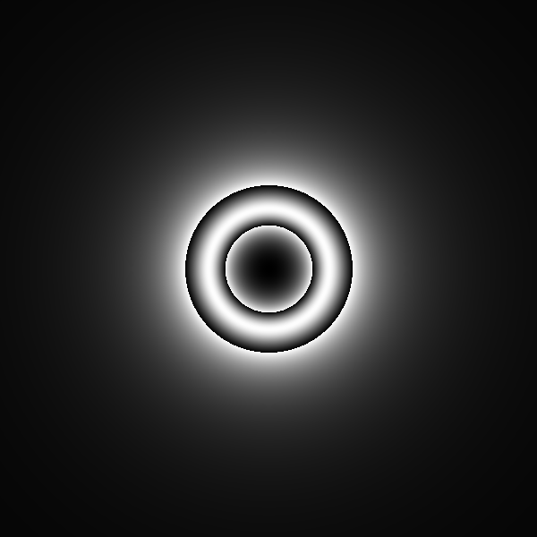<br>
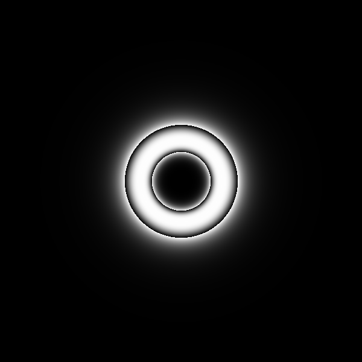<br>
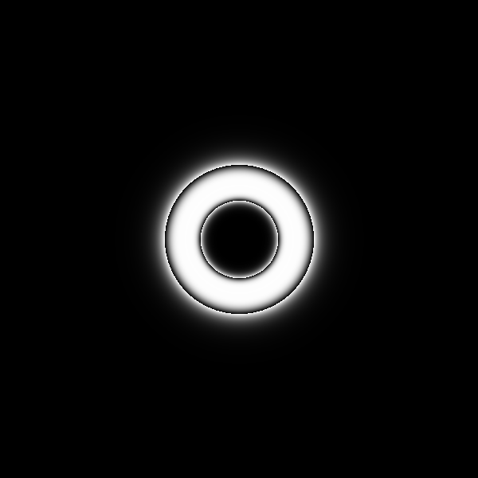<br><br>
  
Unlike low-pass and high-pass filters, band-pass-filters take two cutoff frequencies, c_min and c_max such that frequencies below c_min are attenuated, frequencies between c_min and _cmax are passed and frequencies above c_max are again attenuated:

```cpp
void FrequencyDomainFilter::as_xyz_bandpass(
    double cutoff_min,
    double cutoff_max,
    double pass_factor, 
    double reject_factor
);
```  
where 
+ ``cutoff_min`` is the lower cutoff frequency, in ``[0, min(2*m, 2*n)]`` where m, n size of the original image
+ ``cutoff_max`` is the higher cutoff frequency, also in ``[0, min(2*m, 2*n)]``
+ ``pass_factor`` is the factor the coefficients in the passing (inside the "donut") region are multiplied by. By default this factor is 1
+ ``reject_factor`` is the factor the coefficients in the attenuating (outside the "donut") region are multiplied by. By default this factor is 0

## 3.2.4 Band-Reject Filters

Lastly we have bandreject filters which are the inverse of band-pass filters. Bandreject filters attenuate frequencies inside their two cutoff points and pass frequencies outside of it. ``crisp`` again supplies 3 different shapes:

+ ``as_ideal_bandreject`` with a sharp cutoff:<br>
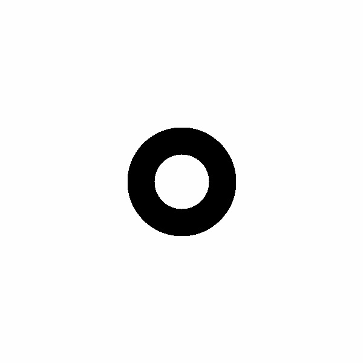<br><br>
  
+ ``as_gaussian_bandreject`` with a smooth, gaussian cutoff transition:<br>
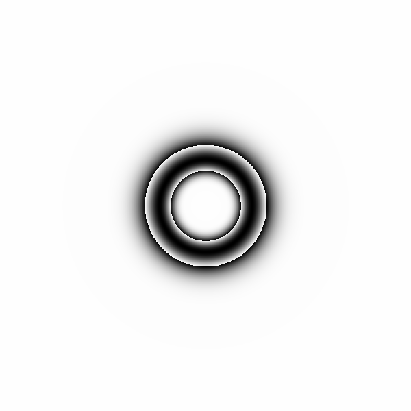<br><br>
  
+ ``as_butterworth_bandreject`` with the now familiar butterworth cutoff transition of specified order, pictured again are order 1, 2, 3:<br>
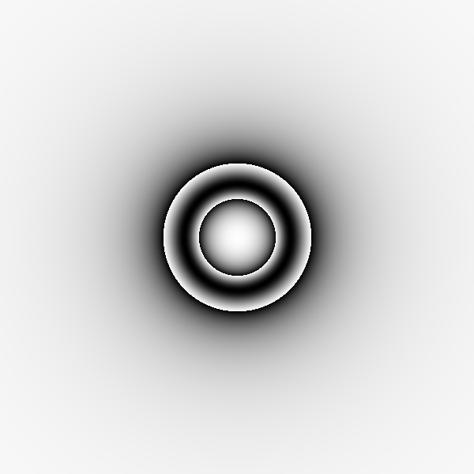<br>
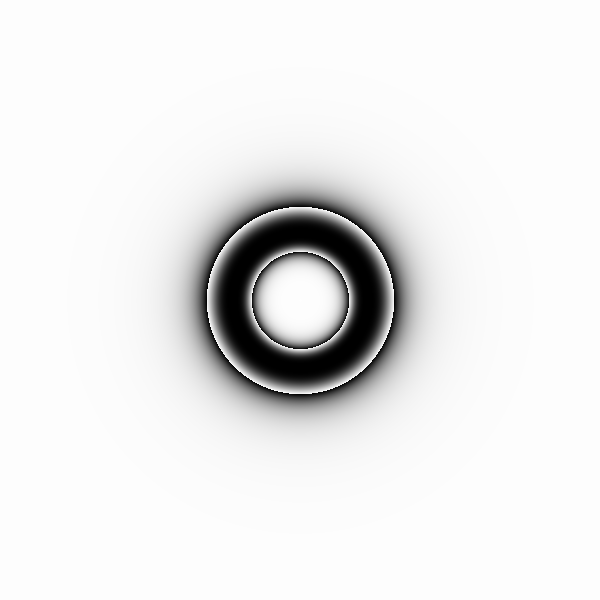<br>
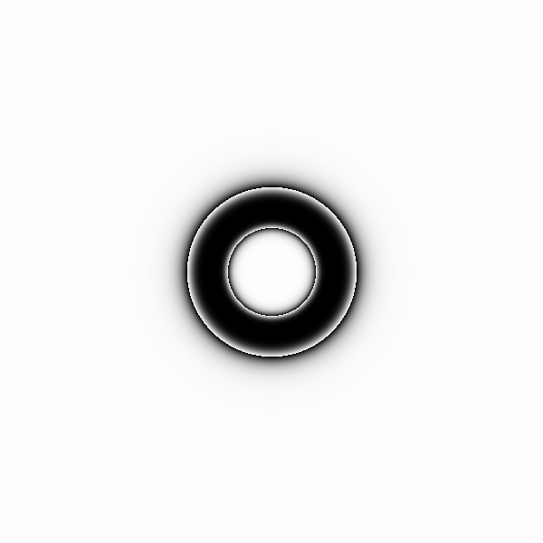<br><br>
  
Bandreject filters are the inverse of band-pass filters, that is for a band-pass filter ``B_p`` and a bandreject filter ``B_r`` it holds true that: ``identity - B_r = B_p`` and ``identity - B_p = B_r``. Similarly bandreject filters again take 4 parameters:

```cpp
void FrequencyDomainFilter::as_xyz_bandreject(
    double cutoff_min,
    double cutoff_max,
    double pass_factor, 
    double reject_factor
);
```  
where 
+ ``cutoff_min`` is the lower cutoff frequency, in ``[0, min(2*m, 2*n)]``. Frequencies below this frequency are passed
  
+ ``cutoff_max`` is the higher cutoff frequency, also in ``[0, min(2*m, 2*n)]``, frequencies above this frequency are passed but frequency below ``cutoff_max`` and above ``cutoff_min`` are attenuated
+ ``pass_factor`` is the factor the coefficients in the passing (outside the "donut") region are multiplied by. By default this factor is 1
+ ``reject_factor`` is the factor the coefficients in the attenuating (inside the "donut") region are multiplied by. By default this factor is 0

## 3.3 Modifying Filter

It's easiest to think of filters as 1D-images with ``double`` pixels because just like images we can access individual elements and those elemnts are indexed just like pixels would be (that is the top-most, left-most pixel has index (0, 0)). The follow functions can be used to access individual elements of the filter:

```cpp
// access as x-y-elements
double & operator()(size_t x, size_t y);
double operator()(size_t x, size_t y) const;

// access with bounds checking
double & at(size_t x, size_t y);
double at(size_t x, size_t y) const;

// access as vector in row-major order
const std::vector<double>& get_values() const;
``` 

Where ``get_values`` returns a vector of pixels in row-major order, that is they are enumerated left-to-right, top-to-bottom just like ``crisp::Image<T, N>::Iterator`` would. 

We already eluded to this earlier but filters support arithmetic filter-filter operations, these are elementwise-operations so multiplying one filter by another is equivalent to multiplying each element by the corresponding element of the other filter. The following arithmetic operators are supported:

```cpp
FrequencyDomainFilter operator+(const FrequencyDomainFilter&) const;
FrequencyDomainFilter operator-(const FrequencyDomainFilter&) const;
FrequencyDomainFilter operator*(const FrequencyDomainFilter&) const;
FrequencyDomainFilter operator/(const FrequencyDomainFilter&) const;

FrequencyDomainFilter& operator+=(const FrequencyDomainFilter&);
FrequencyDomainFilter& operator-=(const FrequencyDomainFilter&);
FrequencyDomainFilter& operator*=(const FrequencyDomainFilter&);
FrequencyDomainFilter& operator/=(const FrequencyDomainFilter&);
```

The fact these are defined and the fact both the attenuating and passing factor are freely choosable lends a huge amount of freedom in filter design. To truly achieve full flexibility however we need to also be able to move a filters center.

After modification, especially addition or subtraction it is common for a filter to have values below 0 or above 1, which in certain circumstances is undiserable. In response to this ``crisp`` offers a member function that projects all filter values into the specified interval:

```cpp
void normalize(double min = 0, double max = 1)
``` 
This function linearly projects all resulting values of the filter into the specified interval or [0, 1] by default.

## 3.4 Filter Offset and Symmetry

``crisp::FrequencyDomainFilter`` uses the following function:

```cpp
void set_offset(
        size_t x_dist_from_center, 
        size_t y_dist_from_center, 
        bool force_symmetry = true);
```

To illustrate how it works let's consider a practical example. We first define a butterworth bandpass filter with a relatively high order, this means we still don't have a completely sharp transition but we're also not as "fanned out" as we would be using a truly gaussian filter:

```cpp
#include <fourier_transform.hpp>
#include <frequency_domain_filter.hpp>

auto image = /*...*/;
auto spectrum = FourierSpectrum(image);
spectrum.transform_from(image);

auto filter = FrequencyDomainFilter(spectrum);
filter.as_butterworth_bandpass(
        0.25 * spectrum.get_size().x(), // lower cutoff
        0.3 * spectrum.get_size().x(),  // upper cutoff
        4,  // order
        1,  // passing factor
        0   // attenuating factor
);
```
This filter currently has the following shape:<br>
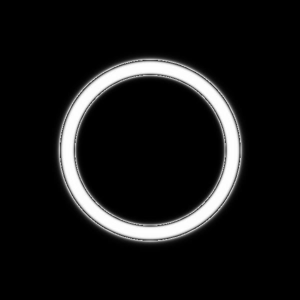<br><br>

We can then offset it with ``set_offset``, for now we leave ``force_symmetry`` off:

```cpp
filter.set_offset(
    -0.2 * spectrum.get_size().x(), // x offset
    -0.1 * spectrum.get_size().y(), // y offset
    false); // force symmetry
```


As expected the filters center moved towards the top left of the image.

Multiplying a fourier spectrum with a filter that is not radially symmetrical changes will result in TODO CITATION. This is why it's usually advisable to keep ``force_symmetry`` on. Doing so results in:

```cpp
filter.set_offset(
    -0.2 * spectrum.get_size().x(),-0.1 * spectrum.get_size().y(), true);
```

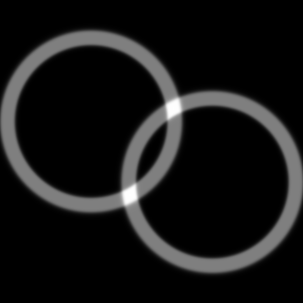

Note that when moving a filters center out of bounds no wrapping will take place. 

## 3.5 Applying a Filter

We conclude this section with a final example. Let's again consider familiar image of a bird:<br>


To filter this image we first compute it's fourier spectrum:

```cpp
auto image = load_grayscale_image(/*...*/ + "/crisp/docs/frequency_domain_filtering/grayscale_opal.png");

auto spectrum = FourierSpectrum();
spectrum.transform_from(image);
```


We can now continue on with filter design. We first create a new ideal highpass filter. Because highpass filters attenuate lower frequencies towards the center of the spectrum, an unmodified highpass filter will inevitably modify the dc component. This would result in an overall lowering of the brightness of the image, to alleviate this we can combine the highpass filter with a lowpass filter, in this case a gaussian lowpass:

```cpp 
auto filter = FrequencyDomainFilter();
filter.as_ideal_highpass(0.4 * spectrum.get_size().x());

auto lowpass = FrequencyDomainFilter();
lowpass.as_gaussian_lowpass(0.1 * spectrum.get_size().x());

filter += lowpass;
filter.normalize();
``` 
After normalizing the filter we can render it to an image to inspect it:


We now apply the filter to the spectrum using ``apply_to`` and then transform the spectrum back into an image:

```cpp
filter.apply_to(spectrum);
image = spectrum.transform_to<GrayScaleImage>();
``` 
The filtered spectrum now looks like this:<br>

<br>

And the resulting image is:<br>


We note expected blurring as highpass filters tend to eliminate lower frequencies. Inspecting the image closely we note "ringing" around the letters:<br>

<br><br>

 This is because higher frequencies tend to correspond to fine detail, the image is overall relatively noise and even but the letters specifically are well-contrasted against the background which is why the effect of the ideal highpass cutoff is most notable for them.

---
<br>
<br>
<br>
<br>
<br>
<br>
<br>
<br>
<br>
<br>
<br>
<br>
<br>
<br>
<br>
<br>

---

#### Cube Phase Angle
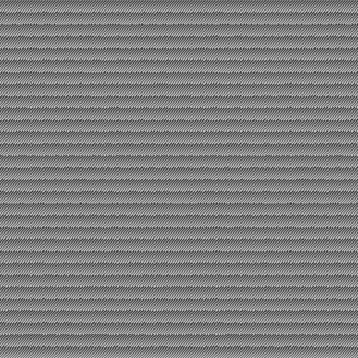<br>
[back to section](#23-visualizing-the-spectrum)


