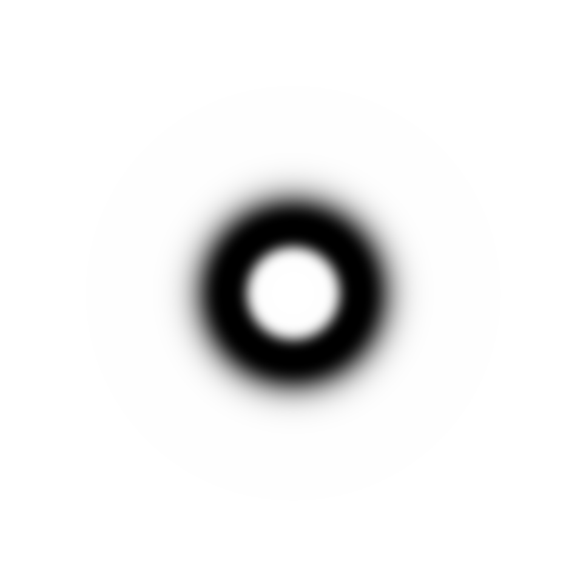

[<< Back to Index](../index.md)

---

# Frequency Domain

2D Discrete Fourier-Transform and Filtering it

```cpp
#include <fourier_transform.hpp>
#include <frequency_domain_filter.hpp>
```

## Table of Contents

1. [Introduction](#1-introduction)<br>
2. [Fourier Transform](#2-fourier-transform)<br>
    2.1 [Fourier Transform Performance Mode](#21-fourier-transform-performance-mode)<br>
    2.2 [Transforming an Image into it's Spectrum](#22-transforming-an-image-into-the-spectrum)<br>
    2.3 [Visualizing the Spectrum](#23-visualizing-the-spectrum)<br>
    2.4 [Accessing Coefficients](#24-accessing-coefficients)<br>
    2.5 [Transforming a Spectrum back into an Image](#25-transforming-the-spectrum-back-into-an-image)<br>
3. [Spectral Filters](#3-spectral-filters)<br>
    3.1 [Creating & Visualizing Filters](#31-creating-and-visualizing-filters)<br>
    3.2 [Filter Shapes](#32-filter-shapes)<br>
        3.2.1 [Low-Pass Filters](#321-low-pass-filters)<br>
        3.2.2 [High-Pass Filters](#322-high-pass-filters)<br>
        3.2.3 [Band-Pass Filters](#323-band-pass-filters)<br>
        3.2.4 [Band-Reject Filters](#324-band-reject-filters)<br>
   3.3 [Modifying and Combining Filters](#33-modifying-filters)
   

## 1. Introduction

When working on an images pixel values directly, we call this working in the *spatial domain*. While this provides a variety of advantages some techniques are much easier to accomplish in the *frequency domain*. These *spectral* techniques, in ``crisp`` are performed on the 2D discrete [Fourier Transform](https://en.wikipedia.org/wiki/Fourier_transform) of an image. The fourier transforms treats our Images as 2D continous functions, regularly sampled at the pixel coordinates, and translates them into a number of [complex](https://en.wikipedia.org/wiki/Complex_number) coefficients of sinusoids functions. Combining the functions weighted by their coefficients returns the original image.

While the exact mechanism behind it is not important for now, `crisp` saves users from interacting with 3rd party libraries and makes creating, inspecting and filtering the fourier transform easy. 

## 2. Fourier Transform
### 2.1 Fourier Transform Performance Mode
Computing the fourier transform of an image is taxing and can be quite slow. To alleviate this, ``crisp`` offers three different ``FourierTransformModes`` that can be handed to ``crisp::FourierTransform`` as a template argument:

```cpp
enum FourierTransformMode {SPEED, BALANCED, ACCURACY};

template<FourierTransformMode Mode = BALANCED>
class FourierTransform
{
```

+ ``SPEED`` is the most computationally optimal version offered by crisp, it uses 32-bit float coefficients and employs a suboptimal heuristic. While artifacting due to low precision is common, this is the only mode that can realistically be run in real time on most at-home machines.
+ ``BALANCE`` is about 1.5 times slower than ``SPEED`` and uses 64-bit double coefficients. It's heuristic is also suboptimal, however is much closer to optimum than ``SPEED``s. For applications where a high performance CPU is available this mode is recommended even in real-time application and is thus specified as default.
+ ``ACCURACY`` is about 10 times slower than ``SPEED``. Like ``BALANCE`` this mode also uses 64-bit double coefficients (or 128bit if the architecture supports it). The significant slow down comes mostly from measuring and computing the optimal parameters first instead of applying a heuristic, this assures that results are as accurate as possible. The difference between it's results and ``BALANCED``s result are often not noticeable to the naked eye, however in situations where accuracy is of the highest priority or in non-real-time applications, this is the mode of choice.

### 2.2 Transforming an Image into the Spectrum

To transform a 1-plane image (henceforth assumed to be ``crisp::GrayScaleImage``) we first allocate the transform itself, then call ``FourierTransform::transform_from(const Image<T, 1>&)``:

```cpp
auto image = load_grayscale_image(/*...*/ + "/crisp/docs/frequency_domain/cube.png");

auto fourier = FourierTransform();  // equivalent to FourierTransform<BALANCED>();
fourier.transform_from(image);
```

### 2.3 Visualizing the Spectrum

Before we continue it is instructive to note that like any class in ``crisp``, we can visualize the transform by either transforming it to an image or binding it to a sprite and rendering it:

```cpp
auto spectrum_image = fourier.as_image();
auto phase_angle_image = fourier.phase_angle_as_image();

// render or save to disk
```

This is the image we start out with, a simple rectangle: <br>


This is it's spectrum:<br>
<br>

And it's phase angle (potential seizure warning) is available [here](#cube-phase-angle).

We note that the spectrum is four times the size of the image. This is to eliminate wrap-around error and the increase in size is mandatory in general applications. We furthermore note that the spectrum is already *centered*, that is it's largest component (called the *dc component*) is at the center of the image. This is done to faciliate easier viewing. Being a series of oscillating functions the spectrum is of course periodic so we can simply shift the view such that the dc component lines up with the center without loosing any information.

When rendering the spectrum the coefficients magnitudes are log-scaled and normalized into [0,1] **only for viewing**. This is to make inspection easier, the actual dc component is commonly 1000x higher than any other components which in image form would make it very hard to inspect the full spectrum. If we want the actual coeffecient values we need to access them directly.

### 2.4 Accessing Coefficients

We can do so using the following functions:

```cpp
// members of crisp::FourierTransform</*...*/>

// get a coefficient as std::complex
std::complex<Value_t> get_coefficient(size_t x, size_t y) const;

// get the magnitude component of a coefficient
Value_t& get_component(size_t x, size_t y);
Value_t get_component(size_t x, size_t y) const;

// get the phase angle component of a coefficient
Value_t get_phase_angle(size_t x, size_t y) const;
Value_t& get_phase_angle(size_t x, size_t y);

// access the dc components magnitude directly
Value_t get_dc_component() const;
```

Where x and y are the row and column index of the matrix that we visualizes as an image. The complex coefficients are stored in [*polar form*](https://en.cppreference.com/w/cpp/numeric/complex/polar) as magnitude and phase angle instead of real and imaginary parts.

We can access the size of the spectrum using ``FourierSpectrum::get_size()``. Since the dc component is at it's center, we could also access it's magnitude like so:

```cpp
auto dc_one = fourier.get_dc_component();
auto dc_two = fourier.get_component(fourier.get_size().x() / 2, fourier.get_size().y() / 2);

assert(dc_one == dc_two);
```

### 2.5 Transforming the Spectrum back into an image

We can transform the spectrum back using ``Image<Inner_t, 1> transform_to() const``. If we were to do this right now we would just get the same image so it may be instructional to first modify the spectrum. We alter it using:

```cpp
auto dc = spectrum.get_dc_component();
for (size_t x = 0; x < spectrum.get_size().x(); ++x)
for (size_t y = 0; y < spectrum.get_size().y(); ++y)
{
    if (x == spectrum.get_size().x() * 0.5 or y == spectrum.get_size().y() * 0.5)
        spectrum.get_component(x, y) = dc;
}
```
Here we multiply each component along the center axis by a factor that increases the "farther away" from the dc component the component is. The spectrum now looks like this:


There is no real mathematical purpose to this, however the effect will be noticeable once we transform the modified transform back into an image:

```cpp
auto result = spectrum.transform_to<GrayScaleImage>();
// save or render
```


The original image is unrecognizable but we do note both that it roughly adheres to the original boundary of the rectangle and the typical periodicity that is inherent to many spectral techniques.

## 3. Spectral Filters

While our previous modification of the spectrum had no real mathematical point , properly *filtering* a spectrum has many applications. To make this just as easy as creating the transform, `crisp` offers a multitude of common filter shapes as well as tools to combine filters. We can then combine the created filter and apply it to a spectrum. 

## 3.1 Creating and Visualizing Filters

Spectral filters can be best thought of as floating point valued matrices of the same size as the fourier spectrum (`2*m*2*n`, where `m*n the size of the image) we're trying to filter. Applying the filter usually means element-wise multiplying the spectrum with it. 

Similar to spatial filters, ``crisp`` offers a class called ``FrequencyDomainFilter``. We create a filter by specifying it's size:

```cpp
auto filter = FrequencyDomainFilter(2*m, 2*n);

// or let the filter determine the size from a spectrum
auto filter = FrequencyDomainFilter(spectrum);
```

We then need to specify the filters *shape* using function of the form ``filter.as_xyz()``. Remember that our filters are 2d matrices so (like everything in crisp) we can visualize them by binding them to a ``crisp::Sprite`` or transforming them into an image:

```cpp
auto sprite = Sprite();
sprite.create_from(filter);

// or
auto image = filter.as_image<GrayScaleImage>();
```
## 3.2 Filter Shapes

The simplest filter shape is ``FrequencyDomainFilter::identity()``. In order to not modify the spectrum after applying (multiplying) the filter we would expect the filter to be valued 1 at all positions:

```
filter.set_function(filter.identity());
```


Visualization confirms this is indeed the case.

## 3.2.1 Low-Pass Filters

Low-Pass filters *attenuate* (diminish) higher frequencies and *pass* (do not modify) lower frequencies. For our fourier spectrum the lowest frequency is the dc component at the center, the higher a frequency the more towards the outer edges of the spectrum it is.

``crisp`` provides three types of low-pass filter shaping functions:

+ ``as_ideal_lowpass`` has a sharp cutoff point between it's attenuating and passing regions:<br>
<br><br>
+ ``as_gaussian_lowpass`` has a smooth transition between attenuating and passing regions that follows a [gaussian distribution](https://en.wikipedia.org/wiki/Gaussian_filter) :<br>
<br><br>
+ ``as_butterworth_lowpass`` of order n is a filter that follows a [butterworth distribution of order n](https://en.wikipedia.org/wiki/Butterworth_filter). This filter approaches the ideal low-pass shape for order n -> infinity and approaches the gaussian low-pass shape for order n -> 0.<br> Shown below: order 1, 2 and 3<br>
<br>
<br>
<br>
  <br>
  
Each low-pass filter shaping function takes 3 arguments:
```cpp
void FrequencyDomainFilter::as_xyz_lowpass(
    double cutoff_frequency, 
    double pass_factor, 
    double reject_factor
);
```  
where 
+ ``cutoff_frequency`` is the frequency after which the attenuating region starts
+ ``pass_factor`` is the factor the coefficients in the passing (low frequency, inner) region are multiplied by. By default this factor is 1
+ ``reject_factor`` is the factor the coefficients in the attenuating (high frequency, outer) region are multiplied by. By default this factor is 0

The cut-off frequency will usually be a value in `[0, 2*m*2*n]` where `m`, `n` the size of the original image, though there is no mechanism to specifically enforce this.

## 3.2.2 High-Pass Filters

High-pass filters attentate low frequncies towards the center of the spectrum and pass high frequencies towards the outer edges. Just like with low-pass filters, ``crisp`` offers three filter shaping functions:

+ ``as_ideal_highpass`` has a sharp cutoff point between attenuating and passing region:<br>
<br><br>

+ ``as_gaussian_highpass`` has a smooth gaussian transition from attenuating to passing region:<br>
<br><br>

+ ``as_butterworth_highpass`` similarly follows the butterworth filter shape along it's cutoff region.<br> Pictured are butterworth high-pass filters of order 1, 2, 3:<br>
<br>
<br>
<br><br>
  
Just like with low-pass filters, each high-pass filter shaping function takes three arguments:

```cpp
void FrequencyDomainFilter::as_xyz_highpass(
    double cutoff_frequency, 
    double pass_factor, 
    double reject_factor
);
```
where
+ ``cutoff_frequency`` is the frequency after which the passing region starts
+ ``pass_factor`` is the factor the coefficients in the passing (high frequency, outer) region are multiplied by. By default this factor is 1
+ ``reject_factor`` is the factor the coefficients in the attenuating (lower frequency, inner) region are multiplied by. By default this factor is 0

The cutoff frequency will again usually be in `[0, 2*m*2*n]`, where `m`, `n` the size of the image.

As you may have noticed the high-pass filter is the inverse of the low-pass filter, that is for a high-pass filter H, low-pass filter I with the same cutoff frequency, reject- and pass-factor, it holds true that: ``identity - H = I`` and ``identity - I = H``. We will see later how we can use arithmetic operations like these to our advantage.

## 3.2.3 Band-Pass Filters

A band-pass filter is a filter that passes frequencies inside a specified interval or "band", that is for cutoff frequencies `c_min` (the inner cutoff) and `c_max` (the outer cutoff) frequencies ``freq`` such that ``c_min < freq < c_max`` are passed, all other frequencies are attenuated. ``crisp`` again offers the familiar filter shaping functions:

+ ``as_ideal_bandpass`` has a sharp transition between passing and attenuating region:<br>
<br><br>

+ ``as_gaussian_bandpass`` has a smooth, gaussian transition between passing and attenuating region:<br>
<br><br>

+ ``as_butterworth_bandpass`` also has a smooth transition that follows, again, the butterworth filter shape of specified order.<br> Pictured are order 1, 2, 3:<br>
<br>
<br>
<br><br>
  
Unlike low-pass and high-pass filters, band-pass-filters take two cutoff frequencies, `c_min` and `c_max` such that frequencies below `c_min` are attenuated, frequencies between `c_min` and `c_max` are passed and frequencies above `c_max` are attenuated:

```cpp
void FrequencyDomainFilter::as_xyz_bandpass(
    double cutoff_min,
    double cutoff_max,
    double pass_factor, 
    double reject_factor
);
```  
where 
+ ``cutoff_min`` is the lower cutoff frequency
+ ``cutoff_max`` is the higher cutoff frequency
+ ``pass_factor`` is the factor the coefficients in the passing (inside the "donut") region are multiplied by. By default this factor is 1
+ ``reject_factor`` is the factor the coefficients in the attenuating (outside the "donut") region are multiplied by. By default this factor is 0

Where `cutoff_min`, `cutoff_max` in `[0, 2*m*2*n]` and `cutoff_min < cutoff_max`.

## 3.2.4 Band-Reject Filters

Lastly we have band-reject filters which are the inverse of band-pass filters, that is for a band-pass filter 'B_p' and band-reject filter 'B_r' with the same cutoff frequencies, it holds that `identity - B_p = B_r` and `identity - B_r = B_p`. Band-reject filters attenuate frequencies between their two cutoff points and pass frequencies outside it. ``crisp`` again supplies 3 different shapes:

+ ``as_ideal_bandreject`` with a sharp cutoff:<br>
<br><br>
  
+ ``as_gaussian_bandreject`` with a smooth, gaussian cutoff transition:<br>
<br><br>
  
+ ``as_butterworth_bandreject`` with the now familiar butterworth cutoff transition of specified order.<br>Pictured are order 1, 2, 3:<br>
<br>
<br>
<br><br>
  
Similarly to band-pass filters, band-reject filters take 4 parameters:

```cpp
void FrequencyDomainFilter::as_xyz_bandreject(
    double cutoff_min,
    double cutoff_max,
    double pass_factor, 
    double reject_factor
);
```  
where 
+ ``cutoff_min`` is the lower cutoff frequency
+ ``cutoff_max`` is the higher cutoff frequenc
+ ``pass_factor`` is the factor the coefficients in the passing (outside the "donut") region are multiplied by. By default this factor is 1
+ ``reject_factor`` is the factor the coefficients in the attenuating (inside the "donut") region are multiplied by. By default this factor is 0

Where `cutoff_min`, `cutoff_max` in `[0, 2*m*2*n]` and `cutoff_min < cutoff_max`.

## 3.3 Modifying a Filter

It's easiest to think of filters as 1-plane images with ``double`` pixels. This is because, just like with actual images, we can access individual elements as if they were pixels. The following functions can be used to access individual elements of the filter:

```cpp
// access like a pixel
double & operator()(size_t x, size_t y);
double operator()(size_t x, size_t y) const;

// access like a pixel with bounds checking
double & at(size_t x, size_t y);
double at(size_t x, size_t y) const;

// access as vector in row-major order
const std::vector<double>& get_values() const;
``` 

Where ``get_values`` returns a vector of pixels in row-major order, that is they are enumerated left-to-right, top-to-bottom just like ``crisp::Image<T, N>::Iterator`` would an image.

Filters support arithmetic, filter-filter operations. These are element-wise operations, so multiplying one filter by another is equivalent to multiplying each element of the first fitler by the corresponding element of the second filter. The following arithmetic operations are supported:

```cpp
FrequencyDomainFilter operator+(const FrequencyDomainFilter&) const;
FrequencyDomainFilter operator-(const FrequencyDomainFilter&) const;
FrequencyDomainFilter operator*(const FrequencyDomainFilter&) const;
FrequencyDomainFilter operator/(const FrequencyDomainFilter&) const;

FrequencyDomainFilter& operator+=(const FrequencyDomainFilter&);
FrequencyDomainFilter& operator-=(const FrequencyDomainFilter&);
FrequencyDomainFilter& operator*=(const FrequencyDomainFilter&);
FrequencyDomainFilter& operator/=(const FrequencyDomainFilter&);
```

These combined with the multitude of filter shapes lends a lot of freedom in filter design.

After modification, especially addition or subtraction it is common for a filter to have values below 0 or above 1, which in certain circumstances is undiserable. In response to this ``crisp`` offers a member function that projects all filter values into the specified interval:

```cpp
void normalize(double min = 0, double max = 1)
``` 
This function linearly interpolates all resulting values of the filter into the specified interval or [0, 1] by default.

## 3.4 Filter Offset and Symmetry

To achieve full flexibility we need to be able to move a filters center. We do this using the following function:

```cpp
void set_offset(
    size_t x_dist_from_center, 
    size_t y_dist_from_center, 
    bool force_symmetry = true
);
```

Where 
+ `x_dist_from_center` is the x-offset, usually in [0, 0.5 * 2*m]
+ `y_dist_from_center` is the y-offset, usually in [0, 0.5 * 2*n]

For a spectrum of size '2*m*2*n'.

To illustrate what this function does exactl, let's consder a practical example. We first define a butterworth bandpass filter of a relatively high order. This way we still don't have a completely sharp transition but we're also not as "smokey" as with proper gaussian filter:

```cpp
auto image = GrayScaleImage(/*...*/);
auto spectrum = FourierSpectrum(image);
spectrum.transform_from(image);

auto filter = FrequencyDomainFilter(spectrum);
filter.as_butterworth_bandpass(
        0.25 * spectrum.get_size().x(), // lower cutoff
        0.3 * spectrum.get_size().x(),  // upper cutoff
        4,  // order
        1,  // passing factor
        0   // attenuating factor
);
```
This filter now has the following shape:<br>
<br>

We can then offset it with ``set_offset``, for now we leave ``force_symmetry`` off:

```cpp
filter.set_offset(
    -0.2 * spectrum.get_size().x(), // x offset
    -0.1 * spectrum.get_size().y(), // y offset
    false); // force symmetry
```


As expected the filters center moved towards the top left of the image.

Multiplying a fourier spectrum with a filter that is not symmetrical, will result in it's phase angle shifting. This usually corrupts the resulting image. To prevent this, we can turn on ``force_symmetry``, which automatically mirrors the offset filter across the center, resulting in a symmetrical image:

```cpp
filter.set_offset(
    -0.2 * spectrum.get_size().x(),-0.1 * spectrum.get_size().y(), true);
```

<br>

## 3.5 Applying a Filter

We conclude this section with a final example. Let's again consider this familiar image of a bird:<br>

<br>

To filter the image we first compute it's fourier spectrum:

```cpp
auto image = load_grayscale_image(/*...*/ + "/crisp/docs/frequency_domain_filtering/grayscale_opal.png");

auto spectrum = FourierSpectrum();
spectrum.transform_from(image);
```

<br>

We can now design our filter by first creating a fresh ideal high-pass filter. Because high-pass filters attenuate lower frequencies towards the center of the spectrum, an unmodified high-pass filter will inevitably modify the dc component. This would result in an overall lowering of the brightness of the image, to alleviate this we can combine the high-pass filter with a low-pass filter as for low-pass filters, the dc component is in the passing region. We choose a gaussian low-pass for this:

```cpp 
auto filter = FrequencyDomainFilter();
filter.as_ideal_highpass(0.4 * spectrum.get_size().x());

auto lowpass = FrequencyDomainFilter();
lowpass.as_gaussian_lowpass(0.1 * spectrum.get_size().x());

filter += lowpass;
filter.normalize();
``` 
After normalizing the filter we can render it to an image to inspect it:


As expected the dc component is in a completly white region, meaning it will be passed unaltered.

We now apply the filter to the spectrum using ``apply_to``. This multiplies the filter with spectrum coefficients magnitudes (if we were to modify the phase angle, the overall phase angle would shift again ruining the image). We then transform the spectrum back into an image:

```cpp
filter.apply_to(spectrum);
image = spectrum.transform_to<GrayScaleImage>();
``` 
The filtered spectrum now looks like this:<br>

<br>

And the resulting image is:<br>


We note blurring, this is expected as our filter attenuated much of the high-freuqency region of the spectrum and high frequencies tend to be associated with fine detail, thus removing them blurs the image. Inspecting the image closely we note "ringing" around the letters:<br>

<br>

This is due to the ideal shape of the filters outer cutoff region. A gaussian filters fourier transform is also gaussian, so it will result in no artifacting as seen in the relatively even region of the image such as the background. An ideal filters fourier transform however exhibits periodic interference which results in ringing around areas associated with that frequency region. We could eliminate this completely by instead choose a gaussian high-pass filter to start out with.

---
<br>
<br>
<br>
<br>
<br>
<br>
<br>
<br>
<br>
<br>
<br>
<br>
<br>
<br>
<br>
<br>

---

#### Cube Phase Angle
<br>
[back to section](#23-visualizing-the-spectrum)


