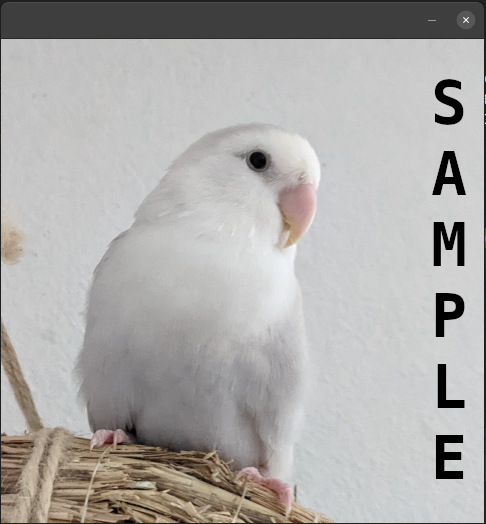
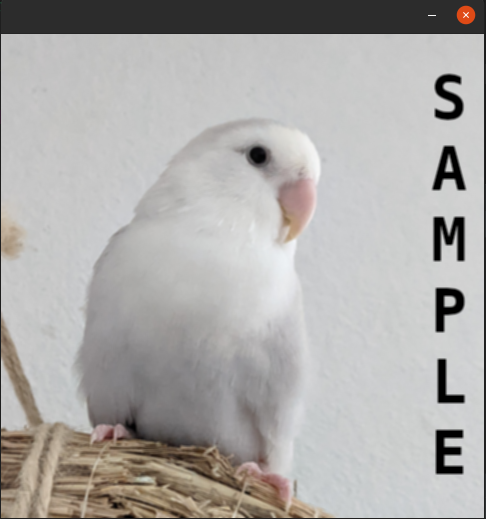

[[<< Back to Index]](../index.md)

---

# Hardware Accelerated Image Processing

Textures, Hardware Accelerated Versions of Spatial Filter, Spectral Filters, Morphological Operations

```cpp
#include <gpu_side/textures.hpp>

// separate:
#include <benchmark.hpp>
```


## Table of Contents

## 0. Foreword

GPU-side computation can be quite difficult and require a serious amount of knowledge to fully grasp. This tutorial only covers the areas of `crisp` that make use of the graphics card in a way so abstract that it is just as easy as the regular `crisp` functions and algorithms. For an in-depth tutorial on the graphics card interface `crisp::State`, please visit the [authors blog](www.clemens-cords.com/posts).

## 1. Motivation & Benchmarks

When reproducing some of the examples in the past chapters, you may have noticed that it's runtime can vary and that some algorithms are quite slow. This is not necessarily due to the implementation, rather, some operations are just inherently very costly. Consider an image of size 1920x1080, this image has 2 073 600 pixels. Each of them has to be allocated, move from the disk to the ram, transformed into a color, etc.. If we now want to operate on the image, each operation will have to be executed 2073600 times. 

To investigate the nature of this behavior, `crisp` offers a very compact benchmarking object:

```cpp
template<typename Function_t>
struct Benchmark
{
    Benchmark(Function_t&& lambda);
    
    template<typename... Args_t>
    float execute(size_t number_of_cycles, Args_t...);
}
```

When creating the object, we hand it a lambda which is saved in the benchmark object. When we call `execute`, we forward the arguments to the lambda and lambda is then itself executed. The benchmark object calculates the time it takes for the lambda to return and reports the time in microseconds.

Using our familiar image of a bird:<br>

<br>

We want to measure the time it takes to create a deep-copy of this image. The image is `483*483 = 233289` pixels in size and each pixel has three, 32-bit floats (one of each RGB color plane).

```cpp
#include <benchmark.hpp>

auto image = load_color_image(get_resource_path() * "/docs/hardware_acceleration/.resources/color_opal.png");

auto copy_benchmark = Benchmark([&](){
    volatile auto deep_copy = image;
});

std::cout << copy_benchmark.execute(1000) << std::endl;
```

Here we're creating a lambda that allocates a copy of the image and the deep-copies each pixel value into the new image. The `volatile` specified here is used to prevent the compiler from optimizing out the unused variable. 
We then execute the benchmark 1000 times and print the average time per cycle to the console. On this machine, the benchmark reports a time of `86404.3` microseconds on average which is about 0.09s. This doesn't sound that bad but is relativey slow considering the relatively low size of the image. 

To address this runtime issue, `crisp` offers what is basically a high-performance mode. Using this mode, all operations take place on the graphics card which is optimized for image operations on a hardware level. The gpu-side equivalent of an image is called a *texture*. We will learn more about how it works exactly soon but for now we just want to see how much faster it is:

```cpp
#include <benchmark.hpp>
#include <gpu_side/texture.hpp>

auto image = load_color_image(get_resource_path() * "/docs/hardware_acceleration/.resources/color_opal.png");

// create a texture from the image
auto texture = Texture<float, 3>(image);

auto copy_benchmark = Benchmark([&](){
    volatile auto texture_deep_copy = texture;
});

std::cout << copy_benchmark.execute(1000) << std::endl;
```
Here we're first loading the image, then creating a texture from the image. Inside the lambda we then deep copy this texture once per cycle. The benchmark reports an average time (in microseconds) of:

```
2.675
```

That's... a lot faster. This result is not erronous, each call did indeed allocated a new image of the same size and copy all data from the original into the new image. Comparing 2.675 microseconds to 86404.3 microseconds we get a sense of just how much faster gpu-side computation is. Now, dealing with many 60fps streams at the same time seems a lot more doable.

# 2. Textures

Textures are the gpu-side equivalent of images. Similar to images they have a *value type* and a number of *planes*. Because we are limited to types supported natively by the graphics card. The template for textures looks familiar:

```cpp
// in gpu_side/texture.hpp

template<typename T, size_t N>
class Texture
{
    static_assert(std::is_same_v<T, float> std::is_same_v<T, bool>);
    static_assert(1 <= N and N <= 4);

    /* ... */
}
```

We see that textures, like multi-plane images, take two template parameters: the *value type* `T` and the number of planes `N`. Unlike images, however, we are somewhat limited here. There are only two possible value types: `bool` and 32-bit `float`. Furthermore we can only have up to a maximum amount of 4 planes.

We can create a texture from an image like so:

```cpp
auto render_window = /* ... */;
render_window.set_active(true);

auto image = crisp::load_color_image(get_resource_path() + "docs/hardware_acceleration/.resources/color_opal.png");
auto texture = Texture<float, 3>(image);

State::bind_texture(NONE, "_texture", texture.get_handle());
State::display();
```

<br>

As expected, rendering the texture we see that it identical to our now familiar image of a bird.

When creating the texture, we need to make sure that it has the same number of planes as the original image, otherwise a static assertion is raised. We now want to create a 1-plane texture using the grayscale version of our image of a bird:

```cpp
auto grayscale = crisp::load_grayscale_image(get_resource_path() + "docs/hardware_acceleration/.resources/color_opal.png");
auto grayscale_texture = Texture<float, 1>(image);

State::bind_texture(NONE, "_texture", grayscale_texture.get_handle());
State::display();
```

<br>

Instead of a grayscale image we see that the image is red. This is correct behavior, when rendering a texture to the screen, it is always first converted into rgba format. Since we only have one plane in the actual data of the texture, the graphics set the red component to our data and keeps all other components at 1. This is why when working with less than 3 or 4-plane images where the 4th component is not the alpha component can be quite confusing when rendering them to the screen. It is important to always remember that in memory, the data layout is correct and the confusion only arrises once the data is renderered to the screen.

Most of the time we don't want to just view our texture, we can do so with the image in the first place, rather we would like to modify the texture and use the hardware acceleration for faster results. 

While the textures sport a lot of the same functions as `crisp::Image` such as `get_size`, and move- and copy assignment/construction, we have no way to modify the texture directly once it it loaded into the graphics cards memory. All modification has to either be done through `crisp::State` (see Section 0) or internally. It is therefore recommended for most users to do any manual modification to the image, then export it to a texture for more specialized used such as filtering. 

# 3. Spatial Filtering

With the release of the gpu-side module, `crisp::SpatialFilter` has a new member function overload:

```cpp
template<typename Image_t>
void apply_to(Image_t&);

template<typename T, size_t N>
void apply_to(Texture<T, N>&);
```

All other function work exactly the same. Let's say we want to gaussian blur the image with a 3x3 kernel. We measuer both the performance of doing so with an image, as well as a texture

```cpp
auto filter = SpatialFilter();
filter.set_kernel(filter.gaussian(3));

auto filter_image = Benchmark([&](){
    filter.apply_to(image);
});

auto filter_texture = Benchmark([&](){
    filter.apply_to(texture);
});

std::cout << "image: " << filter_image.execute(100) << "ms" << std::endl;
std::cout << "texture: " << filter_texture.execute(100) << "ms" << std::endl;
```
```
image: 1.70168e+06ms
texture: 4410.4ms
```

We see the vast performance increase when using textures. Indeed, a cpu-side spatial filter triples it's runtime when working with color images compared to grayscale images. While this is techncially true gpu-side, the actual impact of this is neglible meaning 4-plane images are processed in about the same time as 1-plane images. 

Inspecting the texture after a single blurring cycle:

```cpp
filter.apply_to(texture);

State::bind_texture(NONE, "_texture", texture.get_handle());
State::display();
```

<br>

We confirm that the texture has indeed been blurred slightly. 

A word on optimization, gpu-side filtering is fastest with kernels of size n*m where n,m in {2, 3, 4}. For larger kernels, significant overhead can be introduced and for very large kernels, the performance increase me not be significant enough to warrant gpu-side computation at all.

# 4. Morphological Transforms

Similar to spatial filters, `crisp` now also supports morphological operations on textures. With the gpu-side module, the following functions have been added to `crisp::MorphologicalTransform`:

```cpp
/// erode
template<typename T, size_t N>
void erode(Texture<T, N>& texture);

/// geodesically erode
template<typename T, size_t N>
void erode(Texture<T, N>& image, const Texture<T, N>& mask);

/// dilate
template<typename T, size_t N>
void dilate(Texture<T, N>& texture);

/// geodesically dilate
template<typename T, size_t N>
void dilate(Texture<T, N>& image, const Texture<T, N>& mask);

/// erode, then dilate
template<typename T, size_t N>
void open(Texture<T, N>& texture);

/// dilate, then erode
template<typename T, size_t N>
void close(Texture<T, N>& texture);
```

We recognize these functions as the texture-versions of the most common morphological operations. We can again illustrate their performant nature using a small benchmark:

```cpp
auto texture = Texture<float, 3>(image);

auto transform = MorphologicalTransform();
transform.set_structuring_element(transform.all_foreground(4, 4));

auto filter_image = Benchmark([&](){
    transform.open(image);
});

auto filter_texture = Benchmark([&](){
    transform.open(texture);
});

std::cout << "image: " << filter_image.execute(100) << "ms" << std::endl;
std::cout << "texture: " << filter_texture.execute(100) << "ms" << std::endl;
```
```
image: 9.38551e+06ms
texture: 6261.3ms
```
Once again, the performance increase is significant. If you are curious what the texture looks like after being opened 100 times:

<br>

# 5. Thresholding


