# Images

## Table of Content

## 1. Introduction

Images are obviously at the heart of image processing so it's includeant to understand them thoroughly. In ``crisp`` Image are n-dimensional matrices of abritrary value and arbitrary but arithmetic value type Each dimension (for example red, green, blue in an rgb image) we'll call a "plane" henceforth. ``crisp`` offers a central template all images inherit from called [``crisp::Image``](../include/image/multi_plane_image.hpp):

```cpp
template<typename InnerValue_t, size_t N>
class Image
{
```

We see it takes two template arguments: 
+ ``InnerValue_t`` is the value type of the elements in all planes
+ ``N`` is the number of planes

Most of the time we won't be dealing with this class directly but with one of it's 3 implementations:
+ [``crisp::BinaryImage``](/include/image/binary_image.hpp) (daughter of ``Image<bool, 1>``) is a 1-dimension image where each value can either be white (true) or black (false). Because the term "black and white image" is colloqially ill-defined we will call them *binary images*
+ [``crisp::GrayScaleImage``](/include/image/grayscale_image.hpp) (daughter of ``Image<float, 1>``) is a 1-dimensional image where each value is a 32-bit float in [0, 1]
+ [``crisp::ColorImage``](/include/image/binary_image.hpp) (daughter of ``Image<float, 3>``) is a 3-dimensional image where each value is a vector representing color in RGB format. Each component of the vector is a 32-bit float in the range [0, 1]

Now that we established a more easily imagined form than n-dimensional matrices, let's go through ``crisp::Image``s features:

## 2. Image I/O
### 2.1 Loading Images

To load an image from the disk we can use:

```cpp
#include <image/image_io.hpp>

// in main.cpp
std::string path = /*...*/ + "/crisp/.test/opal_color.png";

ColorImage color = load_color_image(path);
GrayScaleImage grayscale = load_grayscale_image(path);
BinaryImage binary = load_binary_image(path);
```
  

Loading functions are provided for the three main image types, implicit conversion is guruanteed to suceed so ``crisp`` has no problem loading a color image as grayscale for example or vice-versa. ``crisp`` supports the following file extensions:``.bmp``,``.png``,``.tga``,``.jpg``,``.gif``,``.psd``,``.hdr`` and ``.pic``.

When loading non-binary images as binary the image is automatically thresholded with a threshold of ``0.5f`` applied to whatever the underlying data type is. If this threshold doesn't work for us we can simply threshold it manually using any of the various thresholding methods provided in [``crisp::Segmentation``](TODO: tutorial). 

### 2.2 Saving Images

To store an image (any of binary, grayscale or color) we use [``save_to_disk``](/include/image/binary_image.hpp):

```cpp
#include <image/image_io.hpp>

std::string path = /*...*/
save_to_disk(color, path + "/my_color.png");
save_to_disk(grayscale, path + "/my_grayscale.png");
save_to_disk(binary, path + "/my_binary.png");
``` 

Again the above mentioned file extentions are supported. 

## 3. Working with Images
### 3.1 Rendering Images
To render an image we need to bind it to a ``crisp::Sprite`` via ``sprite::create_from`` and then display it by binding it to a window during the familiar render loop:

```
#include <images.hpp>
#include <system.hpp>

int main() 
{
    // load the image
    auto path = /*...*/ + "/crisp/.test/opal_color.png";
    auto image = load_grayscale_image(path);
    
    // bind it to a sprite
    auto sprite = Sprite();
    sprite.create_from(image);
    sprite.set_scale(2);
    
    // create a render window
    auto window = RenderWindow(sprite.get_size().x(), sprite.get_size().y());
    
    // render loop
    while (window.is_open())
    {
        auto time = window.update();

        window.clear();
        window.draw(sprite);    // draw the image
        window.display();
    }
}
``` 
A more detailed and clearer explanation of what is happening here can be found in the [system tutorial](TODO), for now just know that we're loading a grayscale image from the disk and rendering it in a little window for easy viewing:

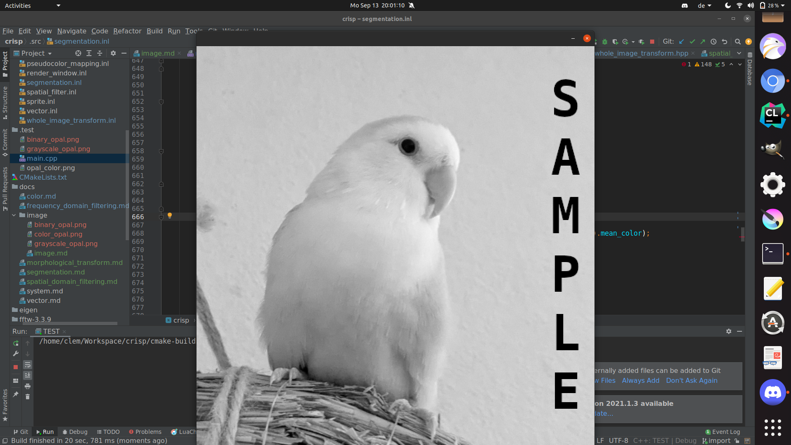

## 3.2 Accessing Individual pixels

Recall that our images are matrices, we will stick to grayscale images for now so our matrices have 1 dimension in which we have m*n elements of 32-bit floats. m is the x-dimension of the image, n the y-dimensions. Images provide the following access operators:

```cpp
// for crisp::Image<float, 1>
float at(size_t x, size_t y) const;
float& at(size_t x, size_t y);

float  operator(int x, int y) const;
float& operator(int x, int y);
```

Image coordinates are by convention the right-hand coordinate system where the positive x-axis extends to the right and the positive y-axis extends downward. This means the top-most left-most pixel in an image gets index (0, 0), the top-most right-most pixel is (m, 0), the one in the bottom left corner is (0, n) and the pixel in the bottom right corner is at position (m, n). 

Using the above mentioned operators we can access any pixel, when using ``at`` the function will do bounds checking and throw an exception if a pixel coordinate (a, b) is supplied that is **not** such that ``0 <= a < m and 0 <= b < n``. Using the const version of at simply returns the pixels value, using the non-const version returns a reference to the pixels value that can be modified to modify the corresponding pixel in the image. 

``operator()(int, int)`` does not check for bounds, instead if the coordinates are out of bounds it accesses what is called [*Padding*](../../include/image/padding_type.hpp). You can think of padding like a frame that extends outwards from the image into infinity. The values on that frame depend on the ``crisp::PaddingType`` specified for the image:

+ ``ZERO``: Simply makes it so all calls to oob areas will return 0 (or the equivalent value type such as rgb(0, 0, 0) for a color image)
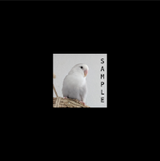

+ ``ONE``: Similar to ``ZERO`` but returns 1 (or the appropriate value type equivalent) instead
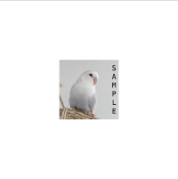
+ ``REPEAT``: "tiles" the image such that if you leave off the right side you enter the image from the left and vice-versa. 
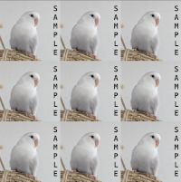
+ ``MIRROR``: Mirrors the image along the connected boundary
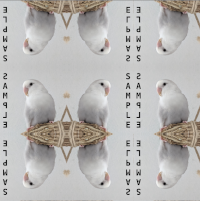
+ ``STRETCH``: Extendes the pixels on the outer most row/column of the pixels side nearest to the oob position infinitely
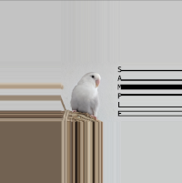
  
By default, any image regardless of type will have it's paddingtype set to ``STRETCH``. To change it, simply call:

```cpp
#include <image/padding_type.hpp>
image.set_padding_type(PaddingType::MIRROR);
```

The padding-type can have significant effects as it will often modify the behavior of filters and other transforms around the edges of the image so be sure to keep in mind the current padding type and how appropriate it is for your application. 

Now that we know how to access pixels individually we can use them to create our own images or modify existing ones:

```
#include <images.hpp>

int main() 
{
    // load the image
    auto image = load_grayscale_image(/*...*/ + "/crisp/.test/opal_color.png");
    
    for (size_t i = 0; i < image.get_size().x() and i < image.get_size().y(); ++i)
        image(i, i) = 0.f;
    
    // render cycle
    /* ... */
}
```

Can you guess what this short loop will draw?


As expected we set the horizontal elements of the matrix to 0, creating a black line from the top left corner to the bottom right corner. 

## 3.3 Creating Images

Now that we have a way to fill them we might as well start with an empty canvas. We create an image like so:

```cpp
#include <images.hpp>

// in main.cpp
auto image = GrayScaleImage();
image.create(500, 500);

// or equivalently:
auto image = GrayScaleImage(500, 500);
```

This creates an image of size 500, 500. If you want the image to have an initial value you can specify a third optional element:

```cpp
// create image and set all pixels to 0.5
auto image = GrayScaleImage();
image.create(500, 230, 0.5f);
``` 


## 3.4 Image Iterators

To iterate through an entire image we could do:

```cpp
for (size_t y = 0; y < image.get_size().y(); ++y
for (size_t x = 0; x < image.get_size().x(); ++x)
{        
    auto& px = image(x, y)
    // do something here
}
```
While this is sometimes necessary image also provides a range operator similar to ``std::vector``s. When using this range expression the pixels are iterated on left to right, top to bottom. The following behavior is exaclty equivalent to the code just above:

```
for (auto& px : image)
    // do something here
``` 

Remember that px is the value of the pixel so in the ranged-for loop we have no way to access it's coordinates but sometimes that isn't necessary. To reinforce in what order pixels are iterated through, consider the following:

```
#include <images.hpp>
#include <color.hpp>

auto image = ColorImage(300, 50)

float step = 1.f / float(image.get_size().x() * image.get_size().y());

size_t i = 0;
for (auto& px : image)
{
    auto color = HSV{float(i), 1, 1};
    px = color.to_rgb();
    i++;
}
```
Here we assign each now colored pixel an HSV value where the hue is increasing as we visit more pixels. What will the resulting image look like? Recall that color elements are float in [0, 1] and that the number of pixels in an image of size m, n is m*n

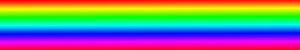

Because the iterator starts at the top left, then goes left until it meets the end of the line and so jumps to the next y index and resets x back to 0 the resulting pattern is a vertical rainbow. Usin the above for-in-loop is equivalent to:

```cpp
size_t i = 0;
for (size_t y = 0; y < image.get_size().y(); ++x)
for (size_t x = 0; x < image.get_size().x(); ++y)
{
    auto& px = image(x, y);
    auto color = HSV{float(i), 1, 1};
    px = color.to_rgb();
    i++;
}
```


Note the right-to-left, top-to-bottom order of the elements.
If we were to instead iterate top-to-bottom, right-to-left, we would get:

```
#include <images.hpp>
#include <color.hpp>

auto image = ColorImage(300, 50)

float step = 1.f / float(image.get_size().x() * image.get_size().y());

size_t i = 0;
for (size_t x = 0; x < image.get_size().x(); ++x)
    for (size_t y = 0; y < image.get_size().y(); ++y)
    {
        auto color = HSV{float(i), 1, 1};
        image(x, y) = color.to_rgb();
        i++;
    }
```
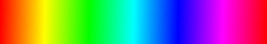

Keep this order of elements in mind when writing loops and when using the range expression, by default iterator iterates *top-to-bottom, left-to-right*

## 3.4 Image Arithmetics
Images support at least the following arithmetic operators:
```cpp
Image<InnerValue_t, N> operator+(const Image<InnerValue_t, N>&) const;
Image<InnerValue_t, N> operator-(const Image<InnerValue_t, N>&) const;
Image<InnerValue_t, N> operator*(const Image<InnerValue_t, N>&) const;
Image<InnerValue_t, N> operator/(const Image<InnerValue_t, N>&) const;

Image<InnerValue_t, N>& operator+=(const Image<InnerValue_t, N>&);
Image<InnerValue_t, N>& operator-=(const Image<InnerValue_t, N>&);
Image<InnerValue_t, N>& operator*=(const Image<InnerValue_t, N>&);
Image<InnerValue_t, N>& operator/=(const Image<InnerValue_t, N>&);
```
These are all element-wise for both images, this is *not* matrix multiplication (outer product), these simply iterate through each element at x_i, y_j and then adding, subtracting, etc. the element at x_i, y_j in the other image.

BinaryImages furthermore provide the following operators:

```cpp
BinaryImage operator!() const;
BinaryImage operator&(const BinaryImage&) const;
BinaryImage operator|(const BinaryImage&) const;
BinaryImage operator^(const BinaryImage&) const;

BinaryImage& operator&=(const BinaryImage&);
BinaryImage& operator|=(const BinaryImage&);
BinaryImage& operator^=(const BinaryImage&);
```
These are bitwise operators so to for example invert each pixel in a binary image so black becomes white and white becomes black we can simply call ``image = not image`` because ``operator!`` is defined.

## 4. Multi Dimensional Images

We've already used a color image in the last example as as you saw very little changed in terms of notation and what functions we can use. Indeed almost all functions, filters and algorithms in ``crisp`` work on all images, regardless of dimensionality or value-type (though both may have a very significant impact on performance). 
Realizing what the value-type ``Value_t`` of an image is is important and it may be somewhat hard to realize just from the code because the return type depends on the template arguments. Consider this table:

```
InnerValue_t        N       Value_t
char                1       char
uint64_t            1       uint64_t
BinaryImage         1       bool
GrayScaleImage      1       float

bool                3       Vector<bool, 3>
float               3       Vector<float, 3>
ColorImage          3       crisp::RGB

float               4       Vector<float, 4>
Vector<float, 5>    7       Vector<Vector<float, 5>, 7>
``` 

For N = 1 the value type internally is a 1-dimensional vector, however as mentioned in the [vector tutorial](TODO), 1-dimensional vectors decay into their value type so for most applications you can assume that ``image<x, 1>::Value_t == x``. ColorImage has it's own template specialization to make working with colors easy without worrying for conversions. The only difference between ``crisp::ColorImage`` and ``crisp::Image<float, 3>`` is that you will have to ``dynamic_cast`` all the ``Vector<float, 3>`` to ``crisp::RGB`` if you use ``Image<float, 3>``. ``ColorImage`` does this for you making it a more convenient option, however maybe you want a color image that treats it's vectors as hsv instead of rgb, in that case ``Image<float, 3>`` is the better choice.

## 4.1 Access Planes directly

When working with n-dimensional images we sometimes don't want our function to act on all elements at the same time. Due to vector arithmetics in crisp this is not directly possible, instead crisp provides a function available to every image called

``            
template<typename InnerValue_t, size_T N>
tempalte<size_t PlaneIndex>
Image<InnerValue_t, 1> Image<InnerValue_t, N>::get_nths_plane() const;
``

This function takes an index and returns the nths plane as a 1-dimensional image, for an easy example let's consider ``Crisp::ColorImage``. We recall that it's value type ``Value_t`` is ``crisp::RGB`` which has 3 dimensions: red, green and blue. Therefore if we want to isolate the blue-plane we only need to call:

```cpp
auto image = load_color_image(/*...*/
auto blue_plane = image.get_nths_plane<2>();
``` 
because of rgb, the first component (index 0) is red, the second (index 1) is green and the third (index 2) is blue. 

After we modified the isolated plane we can reinsert it into the image by using:

```cpp
// do something with blue plane
image.set_nths_plane<2>(blue_plane);
```

## 5. A final example

As an example of how to use  let's consider the following familiar image of a bird:

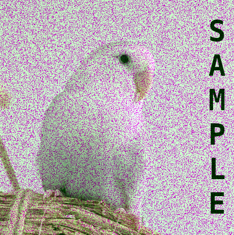

We observe very noticable corruption, the overall image has a green tint and in numerous spots we see isolated magenta drops in intensity. Since both of these artifacts are colored, we investigate each color plane individually:

```cpp
#include <images.hpp>

// in main.cpp
auto image = load_color_image(/*...*/ + "/crisp/docs/image/opal_blue_corrupted.png");
auto blue_plane = image.get_nths_plane<2>();

  // investigate planes
auto red_plane = (image.get_nths_plane<0>());
save_to_disk(red_plane, /*...*/);

auto green_plane = (image.get_nths_plane<1>());
save_to_disk(green_plane, /*...*/);

auto blue_plane = (image.get_nths_plane<2>());
save_to_disk(blue_plane, /*...*/);
```


red and blue look fine but green shows clear problems. We observe that it is slightly lighter in parts that aren't completely corrupted by the noise. If the green component of color is lowered we would expect the final color to go closer to it's complement: magenta. This is indeed the case so we can ascertain that the magenta dots in the original assembled image are what's called "drop-out-noise", small spots where at that point the value of only green goes way down.

Both of these issues, the overall higher values and the drop-out-noise, can be fixed with a single filter operation. If you're not sure what this means, please reference the [tutorial on filters](TODO):

```cpp
// median filter the green plane
auto median_filter = SpatialFilter();
median_filter.set_kernel(median_filter.box(3, 1));
median_filter.set_evaluation_function(SpatialFilter::MEDIAN);
median_filter.apply_to(green_plane);

// and normalize the results to remove artifacting
normalize(green_plane);
```


This is what our green plane now looks like. Much better; not perfect, but better. Now we can reassemble the entire image again:

```cpp
image.set_nths_plane<1>(green_plane);
```

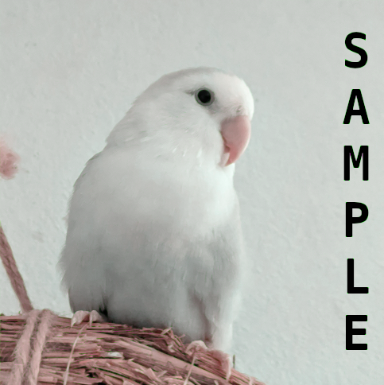

On the left (top depending on your devices screen) we have the restored picture, on the right (bottom) the restored one. The restored picture looks much more like the original, but we still note a slight green tint. We also notice small artifacting around the boundaries of the letters but overall the major issues have been fixed by a simple filter operation on only one of the 3 planes.

To clean up the tint we can simply do:

```cpp
for (auto& px : green_plane)
    px -= 0.035f
```

before reassembling:

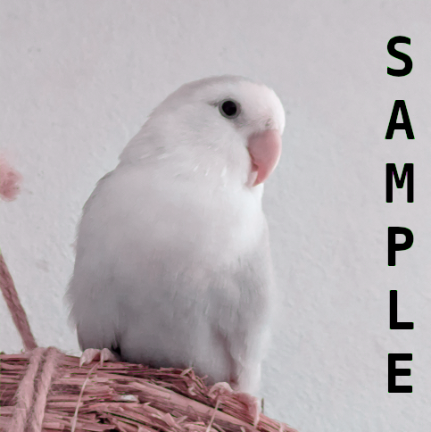


And we're done.

# Post Scriptum

You may ask how we got that arbitrary seeming value of 0.035f. It was determined experimentally by writing and interactive program where pressing up adds 0.005 to the value and pressing down substracts it and then simply feeling around which one was best. This is the true advantage of crisp, thanks to the game-like interactivity you can do it truly interactively, not just by changing a value and recompiling again. The full script for our entire example can be found here:


