[[<< Back to Index]](../index.md)

---

# Images

Multi-Dimensional Images of Arbitrary Type, Plane-Wise and Whole-Image Processing, Creating and Rendering Image Histograms

```cpp
#include <image/multi_plane_image.hpp>
#include <image/binary_image.hpp>
#include <image/grayscale_image.hpp>
#include <image/multi_plane_image.hpp>
#include <image/padding_type>

// all of the above collected in:
#include <image.hpp>

// separate:
#include <whole_image_processing.hpp>
#include <histogram.hpp>
```

## Table of Content

1. [**Introduction**](#1-introduction)</br>
2. [**Image I/O**](#2-image-io)</br>
    2.1 [Loading Images](#21-loading-images)</br>
    2.2 [Saving Images](#22-saving-images)</br>
3. [**Working with Images**](#3-working-with-images)</br>
    3.1 [Rendering Images](#31-rendering-images)</br>
    3.2 [Padding & Accessing Pixels](#32-accessing-individual-pixels)</br>
    3.3 [Creating Images](#33-creating-images)</br>
    3.4 [Image Iterators](#34-image-iterators)</br>
    3.5 [Image-Image arithmetic operators](#35-image-arithmetics)</br>
    3.6 [A Note on Artifacting](#36-a-note-on-artifacting)<br>
4. [**Multi Dimensional Images**](#4-multi-dimensional-images)</br>
    4.1 [Accessing Planes Directly](#41-accessing-planes-directly)</br>
5. [**Image Histograms**](#5-histograms)<br>
6. [**Whole Image Transforms**](#5-whole-image-transforms)</br>
    6.1 [Normalize](#51-normalize)<br>
    6.2 [Histogram Equalization](#52-histogram-equalization)<br>
    6.3 [Gradient Magnitude](#53-compute-gradient-magnitude)<br>
    6.4 [Bitplane Decomposition](#54-bitplane-decomposition)<br>
    <strike>6.5 [Wavelet Transform](#55-wavelet-transform)</strike>
   

## 1. Introduction

Images are obviously at the heart of image processing, so it's important to understand them thoroughly. In ``crisp``, images are n-dimensional matrices of arbitrary value and arithmetic value type. Rather than storing n-many matrices, `crisp` stores one matrix where each of its elements is a n-dimensional vector:

```cpp
template<typename InnerValue_t, size_t N>
class Image
{
    public:
        /*...*/
    private:
        Eigen::Matrix<Vector<InnerValue_t, N>, /*...*/> _data;    
};
```

This class takes two template arguments: 
+ ``InnerValue_t`` is the value type of the elements of the vectors in the matrix
+ ``N`` is the number of dimensions (the size or "rank" of the vectors)

Conceptually it's easier to think of each image as n layered matrices, we will call each of these matrices a *plane*. For example, a 3-dimensional rgb image has three planes: red, green and blue.

Most of the time we won't be dealing with ``crisp::Image`` directly, but rather with one of it's 3 implementations:
+ [``BinaryImage``](/include/image/binary_image.hpp) (inherits from ``Image<bool, 1>``)<br>
  1-plane image where each value can either be white (true) or black (false). 
+ [``GrayScaleImage``](/include/image/grayscale_image.hpp) (inherits from ``Image<float, 1>``)<br>
  1-plane image where each value is a 32-bit float
+ [``crisp::ColorImage``](/include/image/binary_image.hpp) (inherits from ``Image<float, 3>``)<br>
  3-plane image where each value is a vector represents color in the RGB format. Each component of the vector is a 32-bit float

For all images we assume that all values (that is, all components of the vectors that are the elements of the image's matrix) are in the range [0, 1]. For example, ``ColorImage`` assumes that for each pixel, both red, green and blue are in [0, 1].

It may be easier to actually visually compare images instead of having to imagine them, so let's work on getting them to show up on our screen

## 2. Image I/O
### 2.1 Loading Images

To load an image from the disk, we use:

```cpp
#include <system/image_io.hpp>
using namespace crisp;

// in main.cpp
std::string path = /*...*/ + "/crisp/.test/opal_color.png";

ColorImage color = load_color_image(path);
GrayScaleImage grayscale = load_grayscale_image(path);
BinaryImage binary = load_binary_image(path);
```
<br>
<br> 
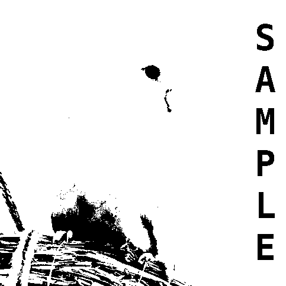<br>

To find out more about these functions, please visit the [system tutorial](../system/system.md).

To convert a binary image into a visually identical color or grayscale image, we use:

```cpp
#include <images.hpp>
using namespace crips;

auto binary = load_binary_image(/*...*/);
GrayScaleImage = binary.convert_to_grayscale()
ColorImage as_color = binary.convert_to_color();
```

Similarly, we can also convert a grayscale image to a visually identical color image using ``GrayScaleImage::conver_to_color()``.

To convert from color to grayscale, we simply assign to the intensity the mean of all RGB components `(red + green + blue) / 3`.

To convert from grayscale to binary we would need to *threshold* the image, we will learn how this is done later in the [segmentation tutorial](../segmentation). 

Using these methods, we have a way to convert an image into any other image type. For higher plane images we will need to do it manually as `crisp` does not want to make assumptions about custom formats that my limit flexibility.

### 2.2 Saving Images

To save an image, we use [``save_to_disk``](../../include/image/binary_image.hpp):

```cpp
#include <system/image_io.hpp>

std::string path = /*...*/
save_to_disk(color, path + "/my_color.png");
save_to_disk(grayscale, path + "/my_grayscale.png");
save_to_disk(binary, path + "/my_binary.png");
``` 

For both loading and saving, the following underlying image types are supported, for all other image types we will need to convert them into one of the following:

+ ``crisp::BinaryImage``
+ ``crisp::GrayScaleImage``
+ ``crisp::ColorImage``
+ ``crisp::Image<T, 1>`` for any arithmetic ``T``
+ ``crisp::Image<T, 3>`` for any arithmetic ``T``

For the last two cases, `crisp` will convert them to grayscale and color respectively.

## 3. Working with Images
### 3.1 Rendering Images
To render an image, we need to bind it to a ``crisp::Sprite`` via ``Sprite::create_from`` and then display it by binding it to a window during the familiar render loop:

```cpp
#include <images.hpp>
#include <system.hpp>
using namespace crisp;

int main() 
{
    // load the image
    auto path = /*...*/ + "/crisp/.test/opal_color.png";
    auto image = load_grayscale_image(path);
    
    // bind it to a sprite
    auto sprite = Sprite();
    sprite.create_from(image);
    sprite.set_scale(2); // scales only the sprite, not the image
    
    // create a render window
    auto window = RenderWindow(sprite.get_size().x(), sprite.get_size().y());
    
    // render loop
    while (window.is_open())
    {
        auto time = window.update();

        window.clear();
        window.draw(sprite);    // draw the image
        window.display();
    }
}
``` 
A more detailed explanation of what is happening here can be found in the [system tutorial](../system/system.md). For now, just know that all we're doing is creating a window that is the same size as the sprite and rendering the image into it. This way we can view it easily without having to export it to the disk first.

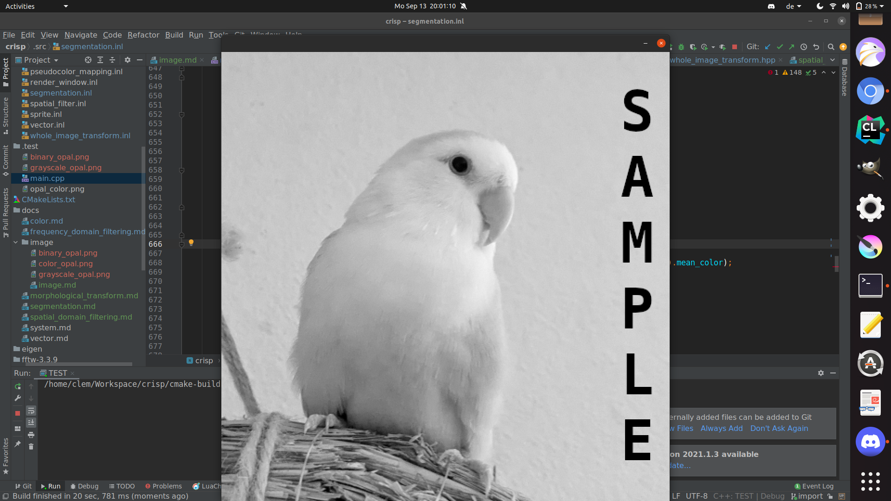

Note that to render images we need to move them from the ram to the graphics card, operations that scale or move the image may result in artifacting that is only visible in the render window. Always remember: modifying the sprite does not modify the image in any way, as the  memory is completely separate.

## 3.2 Accessing Individual pixels

Recall that our images are matrices of vectors of a specific value type. Sticking to grayscale images for now, our matrices have 1 plane in which we have `m*n` 32-bit floats, where `m` is the x-dimension of the image, `n` the y-dimensions. ``crisp::GrayScaleImage`` provides the following access operators:

```cpp
float  at(size_t x, size_t y) const;
float& at(size_t x, size_t y);

float  operator(int x, int y) const;
float& operator(int x, int y);
```

Image coordinates are in right-hand coordinate system, where the positive x-axis extends to the right and the positive y-axis extends downward. This means the top-most, left-most pixel in an image is at index (0, 0), the one right to it is (1, 0), the one directly below (0, 0) is (1, 0), etc. The top-most right-most pixel is (m, 0), bottom-most left-most is (0, n) and the pixel in the bottom right corner of the image is at position (m, n). 

Using the above-mentioned operators, we can access any of the pixels directly. When using ``at``, bounds checking will occur and an exception will be thrown if pixel coordinates `(a, b)` are supplied that do not fulfill ``0 <= a < m and 0 <= b < n``. 

If we want to modify the image, we use the non-const version of either ``at`` or ``operator()``, in all other cases the non-const versions should be preferred for the sake of const-correctness.

``operator()(int, int)`` does not check bounds, instead if the coordinates are out of bounds it accesses what is called [*Padding*](../../include/image/padding_type.hpp). We can think of padding like the frame of an image that extends outwards into infinity in all directions. The values on that frame depend on the ``crisp::PaddingType`` specified for the image:

+ ``ZERO`` Simply makes it so all calls to out of bounds areas will return 0 (or the equivalent value type such as rgb(0, 0, 0) for a color image)<br>


+ ``ONE`` is similar to ``ZERO`` but returns 1 (or the appropriate value type equivalent, rgb(1, 1, 1) for example) instead<br>
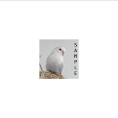
+ ``REPEAT`` "tiles" the image such that if we leave off the right side we "overflow" and reenter the image from the left and vice-versa in all directions<br>
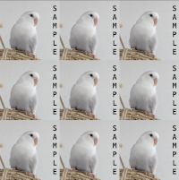
+ ``MIRROR`` mirrors the image along its edges<br>
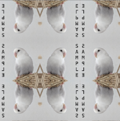
+ ``STRETCH`` extends the values on the outermost row/column of the sides infinitely (the "sample" text has been moved slightly towards the right side to illustrate this effect)<br>
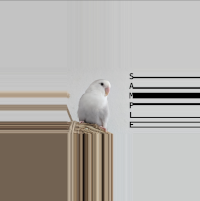
  
By default, any image regardless of type will have it's padding set to ``STRETCH``. To change it, we simply call:

```cpp
image.set_padding_type(PaddingType::MIRROR);
```

The padding-type can have significant effects on our processing pipelines. It will often modify the behavior of filters and other transforms around the edges of the image, so we need to keep in mind the current padding type and regularly evaluate how appropriate it is for our application. 

Now that we know how to access pixels individually, we illustrate the discussed operators with an example:

```cpp
#include <images.hpp>
using namespace crisp;

int main() 
{
    // load the image
    auto image = load_grayscale_image(/*...*/ + "/crisp/.test/opal_color.png");
    
    for (size_t i = 0; i < image.get_size().x() and i < image.get_size().y(); ++i)
        image(i, i) = 0.f;
    
    // render cycle
    /* ... */
}
```

Can you guess what this short loop will draw?


As expected, we set the horizontal elements along the trace of the matrix that is the image to 0, creating a 1-pixel thick black line from the top left corner to the bottom right corner of the image. 

## 3.3 Creating Images

Now that we have a way to modify and fill images with our own values, we might want to start with an empty canvas. We can create an image using:

```cpp
auto image = GrayScaleImage();
image.create(500, 230);

// or equivalently:
auto image = GrayScaleImage(500, 230);
```

This creates an image of size 500x230. If we want the image to have an initial value, we can specify a third optional argument:

```cpp
// create image and set all pixels to 0.5
auto image = GrayScaleImage();
image.create(500, 230, 0.5f);
``` 


## 3.4 Image Iterators

To iterate through an entire image, we could do:

```cpp
for (size_t y = 0; y < image.get_size().y(); ++y
for (size_t x = 0; x < image.get_size().x(); ++x)
{        
    auto& px = image(x, y)
    // do something here
}
```
While in some situations this is necessary, images in `crisp` also provide a range operator similar to ``std::vector``s. When using the following range expression, the pixels are iterated left-to-right, top-to-bottom (sometimes also called *row-major order*). The following code is exactly equivalent to the code just above:

```cpp
for (auto& px : image)
    // do something here
``` 

Remember that `px` only lets us access the *value* of the pixel, when using the ranged for-loop we have no way to access a pixel's coordinates.

To reinforce in what order pixels are iterated through, consider the following:

```cpp
#include <images.hpp>
#include <color.hpp>

// create and image
auto image = ColorImage(300, 50)

// fill the image with colors increasing in hue from 0 to 1
float step = 1.f / float(image.get_size().x() * image.get_size().y());

size_t i = 0;
for (auto& px : image)
{
    // current color in HSV
    auto color = HSV{float(i) * step, 1, 1};
    
    // convert to rgb because ColorImage uses RGB
    px = color.to_rgb();
    
    // proceed to the next hue level
    i++;
}
```
Here we assign each colored pixel an HSV value, with the hue increasing as we visit more pixels. What will the resulting image look like? Recall that color components are floats in [0, 1] and that the number of pixels in an image of size `m`, `n` is `m*n`. 

We get<br>

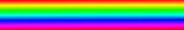 ,<br>

because the iterator starts at the top left, then goes left until it meets the end of the row, then jumps to the next y index and resets x back to 0 and continues. The resulting pattern is a vertical rainbow. Using the regular for-loop with pixel coordinates, we get:

```cpp
size_t i = 0;
for (size_t y = 0; y < image.get_size().y(); ++x)
for (size_t x = 0; x < image.get_size().x(); ++y)
{
    auto& px = image(x, y);
    auto color = HSV{float(i), 1, 1};
    px = color.to_rgb();
    i++;
}
```


Illustrating ``crisp::Image::Iterator`` is indeed iterating in row-major order.

So far we've been iterating top-to-bottom, left-to-right. What would the image look like if we instead iterator left-to-right, top-to-bottom?

```cpp
auto image = ColorImage(300, 50)

float step = 1.f / float(image.get_size().x() * image.get_size().y());

size_t i = 0;

for (size_t x = 0; x < image.get_size().x(); ++x)
for (size_t y = 0; y < image.get_size().y(); ++y)
{
    auto color = HSV{float(i), 1, 1};
    image(x, y) = color.to_rgb();
    i++;
}
```
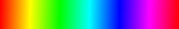

As expected, the rainbow gradient was rotated 90° and is now horizontal instead of vertical.

## 3.5 Image Arithmetics
Regardless of value type, images `crisp` support the following arithmetic operators:
```cpp
Image<InnerValue_t, N> operator+(const Image<InnerValue_t, N>&) const;
Image<InnerValue_t, N> operator-(const Image<InnerValue_t, N>&) const;
Image<InnerValue_t, N> operator*(const Image<InnerValue_t, N>&) const;
Image<InnerValue_t, N> operator/(const Image<InnerValue_t, N>&) const;

Image<InnerValue_t, N>& operator+=(const Image<InnerValue_t, N>&);
Image<InnerValue_t, N>& operator-=(const Image<InnerValue_t, N>&);
Image<InnerValue_t, N>& operator*=(const Image<InnerValue_t, N>&);
Image<InnerValue_t, N>& operator/=(const Image<InnerValue_t, N>&);
```

Like with [vectors](../vector/vector.md),
all of these operations are *element-wise*, that is, each element of image `A` is added/subtracted/multiplied/divided by each corresponding element in image `B` at the same coordinates. This is **not** matrix-matrix multiplication. The images have to be the same size, otherwise the operator will throw an exception.

`BinaryImage`s furthermore provide the following operators:

```cpp
BinaryImage operator!() const;
BinaryImage operator&(const BinaryImage&) const;
BinaryImage operator|(const BinaryImage&) const;
BinaryImage operator^(const BinaryImage&) const;

BinaryImage& operator&=(const BinaryImage&);
BinaryImage& operator|=(const BinaryImage&);
BinaryImage& operator^=(const BinaryImage&);
```
All of these are element-wise, bit-wise operators. If we, for example, want to change every white pixel in a binary image to black and every black pixel to white, we can simply call ``image = not image`` because ``operator!`` is defined. 

### 3.6 A Note on Artifacting

Recall that our images are matrices of a type that is assumed to be valued in `[0, 1]`. However, there is no mechanism in place to actually enforce this. If we don't normalize an image back into that interval before rendering it, we will see artifacting that may throw off newer users. Consider this example:

```cpp
auto image = load_color_image("/home/clem/Workspace/crisp/.test/opal_color.png");

float factor = M_PI;
for (auto& pixel : image)
{
    pixel *= factor;
    factor *= 1.000001;
}
```

Here we're taking each pixel and multiplying it by PI (3.14159..) while also slowly increasing that factor, the more pixels we visit. This maps our color values from [0, 1] to [0, PI+). This is what the image looks like now:


The image is almost unrecognizable, even though all we did was multiply it by a deterministic factor. If we see something like this happen, our values are most likely outside [0, 1]. We can simply call ``crisp::normalize`` as provided in ``whole_image_processing.hpp`` to map the values back into [0, 1]:

```cpp
#include <whole_image_processing.hpp>

normalize(image)
```


Doing so reveals that the actual effect of the loop on the image is adding a simple gradient.

## 4. Multi Dimensional Images

While the dimensionality (number of planes) of images is relevant to performance, in terms of notation and available functions, very little changes. Indeed, almost all functions, filters and algorithms in ``crisp`` work on all images, regardless of dimensionality or value-type (though both may have a very significant impact on performance). 

``crisp::Image`` provides a member ``crisp::Image::Value_t`` that exposes the images value type. The type it deduces to depends on the template arguments as such:

|InnerValue_t   |    N   |  Value_t 
|---------------|--------|----------
|char           |   1    |  char
|uint64_t       |   1    |  uint64_t
|BinaryImage    |   1    |  bool
|GrayScaleImage |   1    |  float
|               |        |
|bool           |   3    |  Vector<bool, 3>
|float          |   3    |  Vector<float, 3>
|ColorImage     |   3    |  crisp::RGB
|               |        |
|float          |   4    |  Vector<float, 4>
|double         |   6    |  Vector<double, 6>

For `N = 1`, the value type, internally, is a 1-dimensional vector, however (as mentioned in the [vector tutorial](../vector/vector.md)) 1-dimensional vectors decay into their value type and can be treated as such.

``ColorImage``, specifically, has it's own template specialization to make working with colors easier by not having to worry about conversions. The only difference between ``ColorImage`` and ``Image<float, 3>`` is a slight performance overhead for the latter that comes from the need to cast ``crisp::RGB`` to ``crisp::Vector<float, 3>`` everytime we assign a color to a pixel value. ``ColorImage`` does this for us automatically, making it a much more convenient option. If we want a color image that interprets it's values in a different color representation, however, we are forced to use ``Image<float, 3>`` and do the conversion ourselves.

## 4.1 Accessing Planes directly

When working with n-dimensional images, we sometimes don't want our function to act on all components of the vectors that are the pixels values at the same time. Due to vector arithmetics in ``crisp`` being element-wise in all dimensions, this is not directly possible. Instead, ``crisp`` provides the following function for all images, regardless of value type:

```cpp
template<typename InnerValue_t, size_t N>
Image<InnerValue_t, 1> Image<InnerValue_t, N>::get_nths_plane(size_t n) const;
```

This function takes an index and returns the nths plane as a 1-dimensional image. As an example, let's consider ``Crisp::ColorImage``: We recall that it's value type ``Value_t`` is ``crisp::RGB``, which has 3 planes: red, green and blue. Therefore, if we want to isolate the blue-plane we only need to call:

```cpp
auto image = load_color_image(/*...*/
auto blue_plane = image.get_nths_plane<2>();
``` 
because in rgb representation the first component (index 0) is red, the second (index 1) is green and the third (index 2) is blue. 

After we modified the isolated plane, we can reinsert it into the image by using:

```cpp
image.set_nths_plane<2>(blue_plane);
```

## 5. Histograms

It's often useful to inspect the distribution of intensity values in an image. To make this convenient, `crisp` offers a histogram class that, just like everything else in `crisp`, can be rendered for visual inspection or exported to an image and saved to a disk. 

```cpp
template<size_t N_Bins = 256>
class Histogram
{
```

We see that the histogram class takes a template argument that is a number. This number is the number of *bins*. Because intensity values are floating point, we need to quantize them into integers. How many integers are used, is governed by this template argument. It is defaulted to 256 which would be equivalent to the accuracy of an 8-bit image, but any number is valid. Do beware that when exporting the histogram to an image, the resulting image will be of size `N_Bins * N_Bins` so while setting N to a very high number will result in a high degree of accuracy while in memory, when we export it, it could cause memory overload.

We construct a histogram like so:
```cpp
auto image = load_grayscale_image(/*...*/);

auto histogram = Histogram(image);

// or equivalently
auto histogram = Histogram();
histogram.create_from(image);
```
Once `create_from` is called, the image is parsed and the histogram is created. This means, if the image data is changed after the histogram is created, the histogram will not change.

We can iterate through the bins using `Histogram<N>::Iterator` or we can target a specific bin using `Histogram<N>::at(size_t i)` where i is the *bin index*. We can also access the number of occurrences using `Histogram<N>::get_n_occurrences(Value_t v)` where `v` is the raw intensity value. This automatically transforms `v` to its bin index by simply computing `floor(v * N)`.

Once the histogram is created, we can either bind it to a sprite for rendering or transform it to an image:

```cpp
auto histogram = /*...*/;

auto sprite = Sprite();
sprite.create_from(histogram);

// or:
auto as_image = histogram.as_image();
```
 
The vertical bars of the histogram are normalized into the range [0, N], which means that one pixel does not necessarily represent 1 occurrence. The sprite or image is purely a visual aid meant to give a human a rough estimate of the histograms shape. For example, the vertical bars are scaled such that the highest number of occurrences occupies 85% of the resulting image's y-dimension. This means we cannot directly compare two image histograms.

<br>
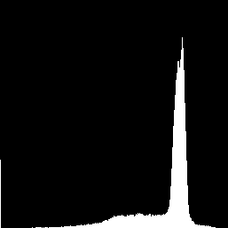<br>
<br>
We note the two large spikes corresponding to the letters of the word "sample" (in black on the very left of the histogram) and the white, relatively even intensity background.

For a good example of using histograms to inspect images, consider visiting the [noise](../noise/noise.md) or [image region tutorial](../feature_extraction/feature_extraction.md).

## 6. Whole Image Transforms

The header `whole_image_transform.hpp` provides miscellaneous operations and algorithms that are applied to an entire image. We will detail each of these functions and their uses in this section.

### 6.1 Normalize

```cpp
template<typename Image_t>
void normalize(Image_t&);
```

We've already used this function earlier, but let's explore what it does in detail: for an image with minimum intensity value `min` and maximum intensity value `max`, the function projects all intensity values in the image from [min, max] into [0, 1]. This is useful either for addressing artifacting that happens because the intensity values were outside [0,1], or to increase the dynamic range of an image. Consider the following example

<br>
(source: texasoutdoors)

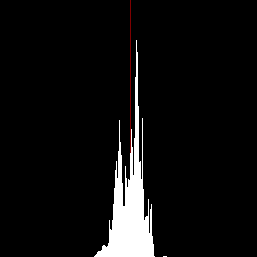<br>

This is an infrared image of deer that we used for our [pseudocolor tutorial](../color/color.md). Inspecting it and it's histogram, we note that the gray tones are fairly close together and that there are neither very bright nor truly dark spots. Indeed, the minimum intensity value in this image is `0.32` while the maximum is `0.7` so we only have 30% of the dynamic range. To fix this, we simply use:

```cpp
auto deer = load_grayscale_image(/*...*/ + "/crisp/docs/color/.resources/infrared_deer.png");
normalize(deer);

// render or save to disk
```

The maximum and minimum are now closer to [0, 1] and the effect on the image is very noticeable.<br>

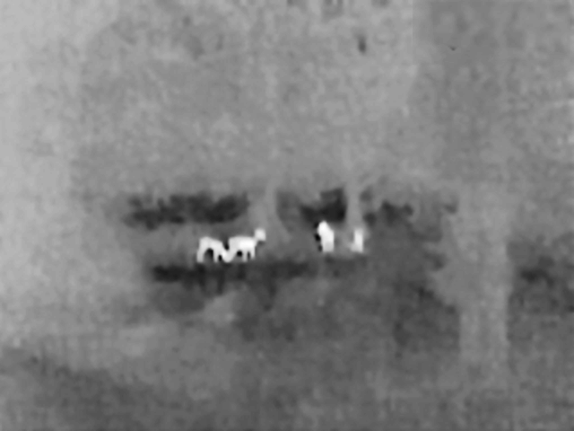<br>
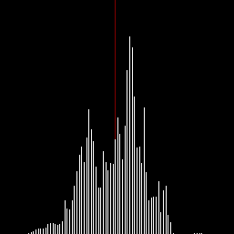<br>

### 6.2 Histogram Equalization

(this feature is not yet implemented)

### 6.3 Compute Gradient Magnitude

The gradient of an image can be thought of as the rate of change in a specific direction. If we go from an intensity of 0 to a neighboring pixel in a specified direction that has an intensity of 1, we would see a high gradient while going from 0.5 to 0.51 would result in a low gradient response. The *gradient magnitude* than is the euclidean norm of the gradient vector over all directions.

To compute the gradient magnitude we could filter the image with the sobel operator and then reassemble it, however `crisp` gives us a one-stop-shop function that does the filtering, assembling and kernel separation all automatically. Using our already normalized deer image from the previous section:

```cpp
auto deer = /* see above */;
auto deer_gradient = compute_gradient_magnitude(deer);

// render or save to disk
```

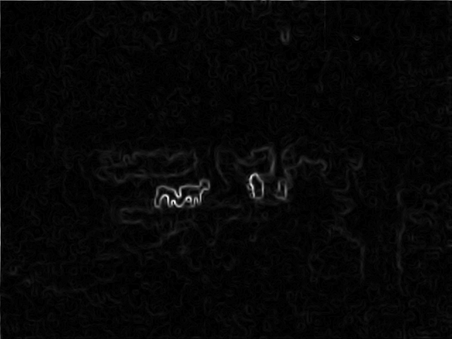<br>

As expected, the gradient response is low (darker) for the noisy foliage and high (lighter) around the outline of the deer. The gradient magnitude is used in many algorithm, and most segmentation functions in `crisp` are based on computing and thresholding it in some way. We can learn more about this in the [segmentation tutorial](../segmentation/segmentation.md).

### 6.4 Bitplane Decomposition

(this feature is not yet implemented)

### 6.5 Wavelet Transform

(this feature is not yet implemented)
---
[[<< Back to Index]](../index.md)