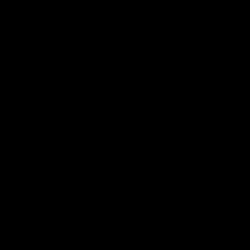
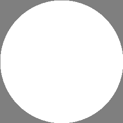
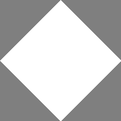
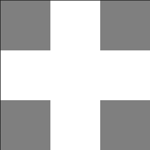
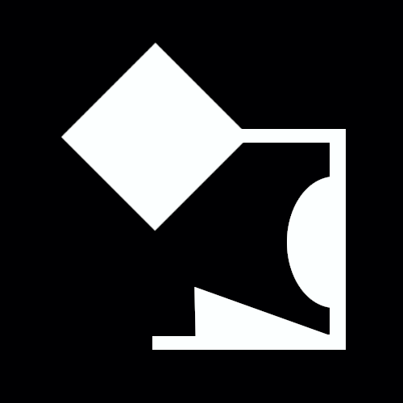

# Morphological Transforms

Erosion, Dilation, Opening, Closing, Hit-or-Miss-Transforms with flat and non-flat structuring elements

## Table of Contents

1. [Introduction](#1-introduction)<br>
2. [Structuring Elements](#2-structuring-element)<br>
    2.1 [Foreground, Background, "Don't Care" elements](#21-foreground-background-and-dont-care-elements)<br>
    2.2 [Binding a Structuring Element](#22-binding-an-structuring-element)<br>
    2.3 [Origin of a Structuring Element](#23-origin)<br>
    2.4 [Types of Structuring Elements](#24-types-of-structuring-elements)<br>
    2.4.1 [All Foreground](#241-all-foreground)<br>
    2.4.2 [All Background](#242-all-background)<br>
    2.4.3 [All "don't care"](#243-all-dont-care)<br>
    2.4.4 [Circle](#244-circle)<br>
    2.4.5 [Diamond](#245-diamond)<br>
    2.4.6 [Cross](#246-cross)<br>
3. [Transform Functions](#3-tranform-functions)<br>
    3.1 [Erosion](#31-erosion)<br>
    3.2 [Dilation](#32-dilation)<br>
    3.3 [Geodesic Erosion](#33-geodesic-erosion)<br>
    3.4 [Geodesic Dilation](#34-geodesic-dilation)<br>
    3.5 [Closing](#35-closing)<br>
    3.6 [Opening](#36-opening)<br>


## 1. Introduction

A morphological transform is a function in mathematical morphology that alters the topology of a function. In image processing it does this by sliding what's called a *structuring element* accross an image and altering the image at each spot depending on which transform is used. We will learn more about the different transforms later on but for now we should focus on just the structuring element

## 2. Structuring Element

## 2.1 Foreground, Background and "Don't Care" Elements

Somewhat similar to a Kernel, a flat structuring element is a n*n matrix where each element can have exactly one ofthe following three properties: 
+ it is *background' which means it interacts with values in the emage equal to ``0`` or ``false`` for binary images
+ it is *foreground* and interacts with image values that are ``> 0`` or ``true`` for binary images
+ it is a "don't care" element which means it will be completely skipped and ignore whatever image value may correspond to it in the image

Image values that are ``< 0`` will be treated as background, however this has no basis in mathematical morphology and morphologically transforming images with values outside the range [0, 1] should be avoided.

Internally ``crisp`` uses an ``std::optional<bool>`` for the structuring elements components where for a component x:
+ if ``x.has_value() and x == true`` it is *foreground*
+ if ``x.has_value() and x == false`` it is *background*
+ if ``not x.has_value()`` it is a "don't care" element.

Just like with filter kernels ``crisp`` uses [Eigens matrix class](https://eigen.tuxfamily.org/dox/group__TutorialMatrixClass.html) so it is important that we are familiar with it's basic usage before continuing. 

## 2.2 Binding an Structuring Element

We use ``crisp::MorphologicalTransform`` for all morphological operations. We first need to create the transform object, then we can create the structuring element and bind it via ``set_structuring_element``:

```cpp
#include <morphological_transform.hpp>
using namespace crisp;

// in main.cpp
auto se = StructuringElement();

// create as all foreground
se.resize(3, 3);
se.set_constant(true);

// create transform object
auto transform = MorphologicalTransform();

// bind
transform.set_structuring_element(se);
``` 

We can access or modify the structuring element by using any of the following methods of ``crisp::MorphologicalTransform``:

```cpp
// get reference to the structuring element currently bound
StructuringElement& get_structuring_element();

// access individual elements
std::optional<bool>& operator()(size_t x, size_t y);
std::optional<bool> operator()(size_t x, size_t y) const;
```

## 2.3 Origin

Each structuring element se furthermore has an origin ``Vector2ui{o_x, o_y}`` where ``0 < o_x < se.rows()`` and ``0 < o_y < se.cols()``. This governs where the structuring element is anchored to during the transform. 
The origin is not an inherent property of ``crisp::StructuringElement``, instead we need to specify it using:

```cpp
auto transform = MorphologicalTransform();
transform.set_structuring_element(/*...*/);

transform.set_structuring_element_origin(1, 3);
```

By default the origin is at the center of the structuring element or at position ``(se.rows() / 2, se.cols() / 2)`` for structuring elements with even dimensions.

## 2.4 Types of Structuring Elements

Much like with filter kernels, ``crisp`` offers a wide variety of structuring elements that can be modified, combined or used directly to fit any application. Like anything in ``crisp`` we can render the structuring element using ``crisp::Sprite`` and inspect it. Often structuring elements will be quite small so it is helpful to scale the sprite by a factor of 100 to more easily visualize them.

When rendering a foreground element will be shown as white rgb(0, 0, 0), a background element will be black rgb(0, 0, 0) and a "don't care" element will be shown as gray rgb(0.5, 0.5, 0.5).

## 2.4.1 All Foreground

Using ``MorphologicalTransform::all_forgeround(size_t, size_t)`` we can create a structuring element that has all it's values set to ``true``:

```cpp
auto se = MorphologicalTransform::all_foreground(5, 5);

auto sprite = Sprite();
sprite.create_from(se);
sprite.set_scale(50);
// render
```


## 2.4.2 All Background

Similarly ``MorphologicalTransform::all_background(size_t, size_t)`` creates a structuring element with all values set to ``false``:

```cpp
auto se = MorphologicalTransform::all_background(5, 5);

auto sprite = Sprite();
sprite.create_from(se);
sprite.set_scale(50);
// render
```



## 2.4.3 All "don't care"

Just like ``all_background`` and ``all_foreground``, ``all_dont_care`` returns a structuring element where no component has a value (remember that these are shown in gray):

```cpp
auto se = MorphologicalTransform::all_dont_care(5, 5);

auto sprite = Sprite();
sprite.create_from(se);
sprite.set_scale(50);
// render
```


## 2.4.4 Circle

This and the following structuring elements will have geometric shapes, ``circle(size_t size)`` returns an elemen that has a circle with radius ``size / 2``, all non-circle elements are set to "don't care":

```cpp
auto se = MorphologicalTransform::circle(250);

auto sprite = Sprite();
sprite.create_from(se);
// render
```



## 2.4.5 Diamond

``diamond(size_t)``has the shape of a square rotated 45°:

```cpp
auto se = MorphologicalTransform::diamond(250);

auto sprite = Sprite();
sprite.create_from(se);
// render
```



## 2.4.6 Cross

Lastly for the flat structuring elements we have ``cross(size)`` which has the shape of a two lines intersecting at the center of the matrix. Each line has a width of 1/3 * size while all other elements are set to "don't care"

```cpp
auto se = MorphologicalTransform::cross(250);

auto sprite = Sprite();
sprite.create_from(se);
// render
```



## 3. Tranform Functions

Now that we know how to generate and bind structuring elements we can apply them to images. We will be using a circular structuring element of size 9x9 and we will be transforming the following, 500x500 binary and grayscale images:

<br>
<br>
<br>
We take special note of a 1 pixel thick line in the bottom left quarter of the image

```cpp
const auto binary = load_binary_image((/*...*/ + "/crisp/docs/morphological_transform/binary_template.png");
const auto grayscale = load_grayscale_image((/*...*/ + "/crisp/docs/morphological_transform/grayscale_template.png");

auto transform = MorphologicalTransform();
transform.set_structuring_element(transform.circle(9));
```

## 3.1 Erosion

Erosions "eats away" at the shapes for a grayscale image tends to reduce light detail. A proper mathemtical definition can be found [here](https://en.wikipedia.org/wiki/Erosion_(morphology)).

We apply it using:

```cpp
transform.erode(binary);
transform.erode(grayscale);
```


We note thinning along all boundaries, widening of the hole in the circle and the absence of the thin white line. For grayscale we furthermore not widening of black elements.

## 3.2 Dilation

Dilation "widens" shapes, again a proper mathematical definition can be acccessed on [wikipedia](https://en.wikipedia.org/wiki/Dilation_(morphology)).

We apply it similarly to erosion, using:

```cpp
transform.dilate(binary);
transform.dilate(grayscale);
```


We notice that the 1-pixel line is no much wider, the hole in the center of the circle has reduced in diameter and that on the grayscale image, white highlights such as the spot on the top right 90° bend of the shape have been intensified. 

## 3.3 Geodesic Erosion

To geodesically erode a shape we need what is called a *mask*. Henceforth the following mask is use:
<br>
<br>

And comparing the mask to the orignal image (shown in gray):

<br>

When geodesically eroding a shape it cannot "eat away" at any part of the shape that overlaps the mask, thus the mask represents the image left if we were to iteratively erode until no more change in the image happens. 

First we load the mask:

```cpp
auto binary_mask = load_binary_image((/*...*/ + "/crisp/docs/morphological_transform/mask.png");
```

and then apply it to the image by simply handing it to ``erosion`` as a second parameter:

```cpp
transform.erode(binary, mask);
```


We note how the erosion was limited by the cricular and triangular elements of the mask and how the hole did not change diameter at all as it was not present in the mask. The 1-pixel line was still eroded away completely as there is no element in the mask that would limit it.

When applying geodesic erosion to a grayscale image we need the mask to also be a grayscale image. Apart from this it is analog to it's binary version.

## 3.4 Geodesic Dilation

Similarly we can use the same mask to geodesically dilate an image. Now instead of limiting the "eating away", we now limit the shapes growths as it can not grow past the mask. 

```cpp
transform.dilate(binary, mask);
```


Especially in the triangular section at the bottom of the shape it's noticeable how the dilation ("growing") was limited by the mask

## 3.5 Closing

The closing of a shape is defined as the erosion of it's dilation. Closing tends to smooth out fine detail while presevering rough shapes 

```cpp
transform.open(binary);
transform.open(grayscale);
```


In both example the different to the original template is fairly minor, we do note however how the concave bends where the triangular elements meet the central "bar" have been rounded. The 1-pixel line is still present.

## 3.6 Opening

Similar to closing, opening is the dilation of the erosion of a shape. 


Again the difference is fairly minor, where closing rounded the concave bends, opening has rounded the convex bends, best noticed at the very bottom left corner of the the shape. Because the 1-pixel line was eroded first, there was nothing left to dilate so it vanished completely.

---


## 4. Non-flat Structuring Elements

(this feature is not yet implemented and the documentation may be incomplete)

We so far have used a what's called a *flat* structuring element. A flat structuring elements component have one of 3 values: foreground, background and "don't care". For non-flat structuring elements we instead have a range of values: {[0, 1], "don't care"}. In crisp this works similarly to flat structuring elements but instead of a ``std::optional<bool>`` we now have a ``std::optional<float>``. In addition to the already discussed ``all_foreground``, ``all_background``, ``all_dont_care``, ``diamond``, ``circle``, ``cross`` we also have 3 non-flat structuring element templates. In terms of naming it's best to think of these as 3d shapes which we view directly from above along the y axis:

## 4.1 Square Pyramid

## 4.2 Diamond Pyramid

## 4.3 Cone

## 4.4 Hemisphere


