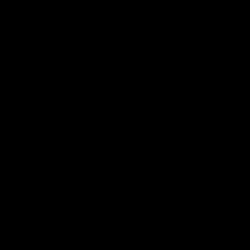
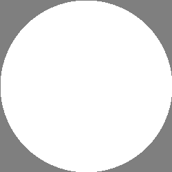
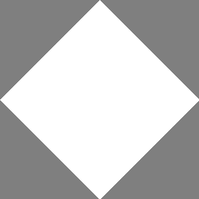
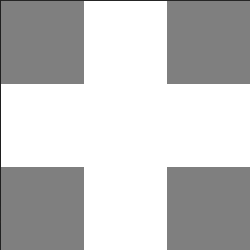
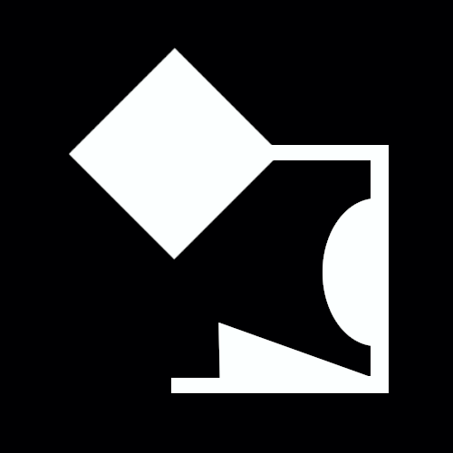
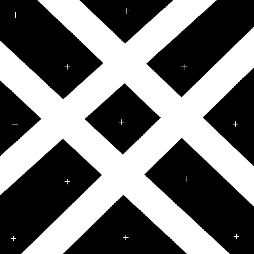
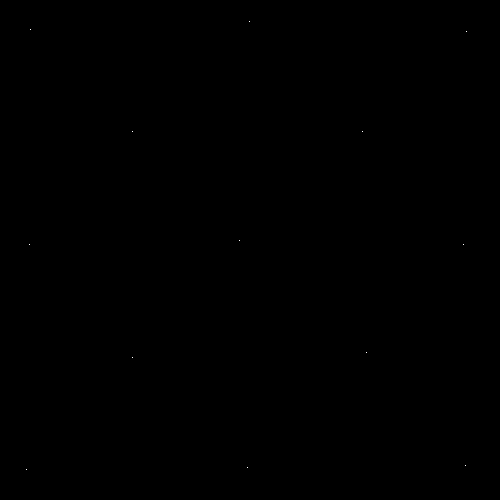

[<< Back to Index](../index.md)

---
# Morphological Transforms

Erosion, Dilation, Opening, Closing, Hit-or-Miss-Transforms, Pattern Detection with flat and non-flat structuring elements

```cpp
#include <morphological_transform.hpp>
```

## Table of Contents

1. [Introduction](#1-introduction)<br>
2. [Structuring Elements](#2-structuring-element)<br>
    2.1 [Foreground, Background, "Don't Care" elements](#21-foreground-background-and-dont-care-elements)<br>
    2.2 [Binding a Structuring Element](#22-binding-an-structuring-element)<br>
    2.3 [Origin of a Structuring Element](#23-origin)<br>
    2.4 [Types of Structuring Elements](#24-types-of-structuring-elements)<br>
    2.4.1 [All Foreground](#241-all-foreground)<br>
    2.4.2 [All Background](#242-all-background)<br>
    2.4.3 [All "don't care"](#243-all-dont-care)<br>
    2.4.4 [Circle](#244-circle)<br>
    2.4.5 [Diamond](#245-diamond)<br>
    2.4.6 [Cross](#246-cross)<br>
3. [Different Types of Transforms](#3-transform-functions)<br>
    3.1 [Erosion](#31-erosion)<br>
    3.2 [Dilation](#32-dilation)<br>
    3.3 [Geodesic Erosion](#33-geodesic-erosion)<br>
    3.4 [Geodesic Dilation](#34-geodesic-dilation)<br>
    3.5 [Closing](#35-closing)<br>
    3.6 [Opening](#36-opening)<br>
    3.7 [Hit-or-Miss Transform](#37-hit-or-miss-transform)<br>
    3.8 [Pattern Replacement](#38-pattern-replacement)<br>


## 1. Introduction

A morphological transform is a function in mathematical morphology that alters the topology of a 2D region. In image processing it does this by sliding what's called a *structuring element* accross an image, altering the image in a way that depends on the structuring element, similar to a [spatial filter](../spatial_filters/spatial_domain_filtering.md). Unlike filter kernels however, structuring elements have more than just a numeric type.

## 2. Structuring Element

## 2.1 Foreground, Background and "Don't Care" Elements

A *flat* structuring element is a n*n matrix where each element can have exactly one of the following three values: 
+ *background* elements interact with image pixels that have a value equal to `0` or `false` for binary images
+ *foreground* elements interact with image pixel values in `(0, 1]` where the 0 is excluded or `true` for binary images.
+ *don't care* elements match any image value, similar to a joker in a cardgame

Image values that are ``< 0`` will be treated as background, values `> 1` as foreground, however this has no basis in mathematical morphology and morphologically transforming images with values outside `[0, 1]` should be avoided.

Internally ``crisp`` uses an ``std::optional<bool>`` as the type of structuring element components for each element `x` it holds that,
+ if ``x.has_value() and x == true`` it is foreground
+ if ``x.has_value() and x == false`` it is background
+ if ``not x.has_value()`` it is a "don't care" element.

Just like with filter kernels ``crisp`` uses [Eigens matrix class](https://eigen.tuxfamily.org/dox/group__TutorialMatrixClass.html), it is recommended to study their excellent tutorial on it before continuing.

## 2.2 Binding an Structuring Element

We use an instance of ``crisp::MorphologicalTransform`` for all morphological operations. First we create the transform object, then we can define the structuring element and bind it via ``set_structuring_element``:

```cpp
#include <morphological_transform.hpp>
using namespace crisp;

// in main.cpp
auto se = StructuringElement();

// create as all foreground
se.resize(3, 3);
se.setConstant(true);

// create transform object
auto transform = MorphologicalTransform();

// bind
transform.set_structuring_element(se);
``` 

We can access or modify the structuring element using any of the following member functions of ``crisp::MorphologicalTransform``:

```cpp
// get reference to the structuring element
StructuringElement& get_structuring_element();

// access individual elements
std::optional<bool>& operator()(size_t x, size_t y);
std::optional<bool> operator()(size_t x, size_t y) const;
```

By default the transform will be initialized with a 1x1 structuring element whos single value is "don't care".

## 2.3 Origin

Each structuring element `se` has an origin ``Vector2ui{o_x, o_y}`` where ``0 < o_x < se.rows()`` and ``0 < o_y < se.cols()``. The origin the alignment of the structuring element, similar to how a filter kernel is always anchored at it's center, the sturcturing element is always anchored at it's origin.

The origin is not an inherent property of ``crisp::StructuringElement``, instead we specify it using:

```cpp
auto transform = MorphologicalTransform();
transform.set_structuring_element(/*...*/);

transform.set_structuring_element_origin(1, 3);
```

By default the origin is at the center of the structuring element. For structuring elements with even dimensions, the origin is instead initialized as ``(se.rows() / 2, se.cols() / 2)``.

## 2.4 Types of Structuring Elements

Much like with filter kernels, ``crisp`` offers a wide variety of structuring elements that can be modified, combined or used as is to fit any application. Like anything in ``crisp`` we can render the structuring element using ``crisp::Sprite`` and inspect it. Often structuring elements will be quite small so it is helpful to scale the sprite by a factor of about 50 to more easily visualize them.

When rendering a a structuring element, a foreground element will be shown as white rgb(1, 1, 1), a background element will be shown as black rgb(0, 0, 0) and a "don't care" element will be shown as gray rgb(0.5, 0.5, 0.5);

## 2.4.1 All Foreground

Using ``MorphologicalTransform::all_forgeround(size_t, size_t)`` we can create a structuring element that has all it's values set to ``true``:

```cpp
auto se = MorphologicalTransform::all_foreground(5, 5);

auto sprite = Sprite();
sprite.create_from(se);
sprite.set_scale(50);
// render
```


## 2.4.2 All Background

Similarly ``MorphologicalTransform::all_background(size_t, size_t)`` creates a structuring element with all values set to ``false``:

```cpp
auto se = MorphologicalTransform::all_background(5, 5);

auto sprite = Sprite();
sprite.create_from(se);
sprite.set_scale(50);
// render
```



## 2.4.3 All "don't care"

Just like ``all_background`` and ``all_foreground``, ``all_dont_care`` returns a structuring element where no component has a value, they are "don't care" element.

```cpp
auto se = MorphologicalTransform::all_dont_care(5, 5);

auto sprite = Sprite();
sprite.create_from(se);
sprite.set_scale(50);
// render
```


Recall that "don't care" elements are shown in gray.

## 2.4.4 Circle

``circle(size_t size)`` returns an element in the shape of a circle with radius ``size / 2``, all non-circle elements are set to "don't care":

```cpp
auto se = MorphologicalTransform::circle(250);

auto sprite = Sprite();
sprite.create_from(se);
// render
```



## 2.4.5 Diamond

``diamond(size_t size)``has the shape of a square with length `sqrt(size)` rotated 45°:

```cpp
auto se = MorphologicalTransform::diamond(250);

auto sprite = Sprite();
sprite.create_from(se);
// render
```



## 2.4.6 Cross

``cross(size_t size)`` has the shape of a two lines intersecting at the center of the matrix. Each line has a width of `1/3 * size` while all other elements are set to "don't care"

```cpp
auto se = MorphologicalTransform::cross(250);

auto sprite = Sprite();
sprite.create_from(se);
// render
```



## 3. Transform Functions

Now that we know how to generate and bind structuring elements we can apply them to images. We will be using a circular structuring element of size 9x9 and we will be transforming the following, 500x500 binary and grayscale images:

<br>
<br>
<br>
We take special note of a 1 pixel thick line in the bottom left quarter of the image

```cpp
const auto binary = load_binary_image((/*...*/ + "/crisp/docs/morphological_transform/.resources/binary_template.png");
const auto grayscale = load_grayscale_image((/*...*/ + "/crisp/docs/morphological_transform/.resources/grayscale_template.png");

auto transform = MorphologicalTransform();
transform.set_structuring_element(transform.circle(9));
```

## 3.1 Erosion

Erosions "eats away" at the shapes by thinning the borders or, for a grayscale image tends to reduce light detail and widen dark detail. A proper mathemtical definition can be found [here](https://en.wikipedia.org/wiki/Erosion_(morphology)) though the intuitive understanding can be quite helpful to keep in mind.

We apply it using:

```cpp
transform.erode(binary);
transform.erode(grayscale);
```

original (left), eroded (right)<br>
 
<br><br>

original (left), eroded (right)<br>
 


We note thinning along all boundaries, widening of the hole in the circle and the absence of the thin white line. For grayscale we furthermore not widening of black elements and notable reduction around of light "silver lining" around the original images boundary.

## 3.2 Dilation

Dilation "widens" shapes or for grayscale images, dilates light features and reduces black features. Again a proper mathematical definition can be acccessed on [wikipedia](https://en.wikipedia.org/wiki/Dilation_(morphology)).

We apply it similarly to erosion, using:

```cpp
transform.dilate(binary);
transform.dilate(grayscale);
```

original (left), dilate (right)<br>
 
<br><br>

original (left), dilation (right)<br>
 

We notice that the 1-pixel line is now much wider, the hole in the center of the circle has reduced in diameter and, for the grayscale image, white highlights such as the spot on the top right 90° bend of the shape have been intensified. 

## 3.3 Geodesic Erosion

To geodesically erode a shape we first need what is called a *mask*. We will use the following mask:
<br>
<br>

Comparing the mask to the orignal image (shown in gray):

<br>

We note how the mask covers the hole, in some parts it is completely enclosed by the original shape while in other parts such as the elliptical and triangular regions petruding from the connecting bars the masks boundary goes outside the original shapes boundary. Furthermore the 1-pixel thick line is not covered at all.

Geodesically eroding a shape means to erode it while comparing the result to a mask. Regions covered by the mask (where the mask is `true`) cannot be "eaten away", if we were to iteratively erode the image an infinite number of time, at some point only the mask would be left and no further change will occurr from that point on.

To do this using `crisp`, we first load the mask:

```cpp
auto binary_mask = load_binary_image((/*...*/ + "/crisp/docs/morphological_transform/mask.png");
```

and then apply it to the image by simply calling an overload of ``erosion`` that takes it as the second parameter:

```cpp
transform.erode(binary, mask);
```


We note that the hole has no changed in diameter because the mask fully covers it, thus no erosion can take place in that are. The triangular region at the bottom of the shape now has a "bump", this is here the part of the shape that would've been eroded was overlapping with the mask. The 1-pixel line still dissapeared completely as the mask had no interaction with that region.

When applying geodesic erosion to a grayscale image, the mask also needs to be a grayscale image. Apart from this, it is analog to it's binary version.

## 3.4 Geodesic Dilation

When geodesically dilating a shape we also use a mask, however instead of limiting reduction the mask now limits growth. In any area where the mask is `false`, no dilation will happen while in areas where the mask is `true` dilation is unlimited until it reaches the masks boundary.

```cpp
transform.dilate(binary, mask);
```


We note that the diameter of the hole was allowed to decrease as it is covered by the mask. The triangular region again exhibit "bumps" where the overlapy with the mask however the 1-pixel line has not changed in thickness. This is because it does not overlap with the mask and is thus in the `false` region.

## 3.5 Closing

The closing of a shape is defined as the erosion of it's dilation. Closing tends to smooth out fine detail while presevering rough shapes:

```cpp
transform.open(binary);
transform.open(grayscale);
```

original (left), closed (right)<br>
 <br>
<br>

original (left), closed (right)<br>
 

In both example the different to the original template is fairly minor, we do note however how the concave bends where the triangular elements meet the central "bar" have been rounded. The 1-pixel line is still present, the black strip along the transition of the radial gradient texture to the triangular bottom textured part was enhanced by the closing step.

## 3.6 Opening

Similar to closing, opening is the dilation of the erosion of a shape. 

original (left), opening (right)<br>
 <br>
<br>

original (left), opening (right)<br>
 

Again the difference is fairly minor, the most notable is the absence of the 1-pixel line, this is because it was completely eroded first, any further dilation step had nothing left to dilate. Rather than the convex corners we no see rounding of the concave corners such as at the very left of the base of the shap. For grayscale we note that the "silver lighning" is much more duller and gray compared to the original.

## 3.7 Hit or Miss Transform

While mathematically related, the [hit-or-miss transform](https://en.wikipedia.org/wiki/Hit-or-miss_transform) in practice is rarely used to alter the shape of a region. It can be best thought of as a method of detecting patterns in an image. Let's consider the following image first:<br>



We note a note thick, white lines and small cross-shaped elements around the image. HMT can be used to identify the position of patterns that have the same shape as the structuring element so we first need to create a structuring element that looks like one of the small crosses:

```cpp
auto cross = StructuringElement();
cross.resize(7, 7);
cross <<  0, 0, 0, 1, 0, 0, 0,
          0, 0, 0, 1, 0, 0, 0,
          0, 0, 0, 1, 0, 0, 0,
          1, 1, 1, 1, 1, 1, 1,
          0, 0, 0, 1, 0, 0, 0,
          0, 0, 0, 1, 0, 0, 0,
          0, 0, 0, 1, 0, 0, 0;
```
This matrix is different from ``cross(5, 5)`` because the non-cross elements here are background, rather than "don't care". We can now call the hit-or-miss transform:

```cpp
auto image = load_binary_image("/home/clem/Workspace/crisp/docs/morphological_transform/.resources/hmt_template.png");

auto transform = MorphologicalTransform();
transform.set_structuring_element(cross);
transform.hit_or_miss_transform(image);
```

<br>

We note that everything except the origin of the structure element where it matched the crosses was set to 0. It is evident how this can be useful for identifying the position of a pattern, corners and other regularly occuring shapes.


## 3.8 Pattern Replacement

Similarly to the HMT, this function also detects a pattern specified by the structuring element however instead of leaving a single white pixel at the correct place and changing anything else to background, `pattern_replace(Image_t, StructuringElement)` takes a second structuring element and replaces any occurence of the first with the second. All other parts of the image are left unchanged. 

Again working with our previous image:


We want to complitely eliminate the crosses in this image. While our previous structuring element matched the very center of each cross, we now need to generate a structuring element that is exactly the same size as the crosses. After having written a lambda function to do so, we can call ``pattern_replace`` using the already bound structuring element and an all-black square the same size as the crosses:

```cpp
auto generate_cross = [](size_t dimensions) -> StructuringElement
{
    auto out = StructuringElement();
    out.resize(dimensions, dimensions);
    out.setConstant(0);

    for (size_t i = 0; i < dimensions; ++i)
    {
        out(i, dimensions/2) = 1;
        out(dimensions/2, i) = 1;
    }

    return out;
};

transform.set_structuring_element(generate_cross(11));
transform.pattern_replace(image, MorphologicalTransform::all_background(11, 11);
```
The resulting image is:


Which clearly had the crosses and only the crosses removed. It is evident how an operation like this can be valuable in post-processing numerous binary images such as removing noise and specles after segmentation.

---

## 4. Non-flat Structuring Elements

(this feature is not yet implemented)

## 4.1 Square Pyramid
## 4.2 Diamond Pyramid
## 4.3 Cone
## 4.4 Hemisphere


