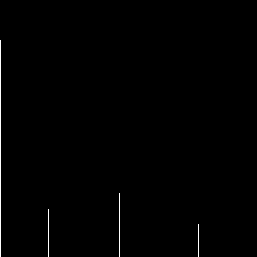
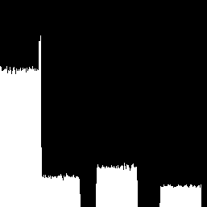
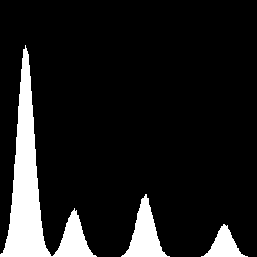
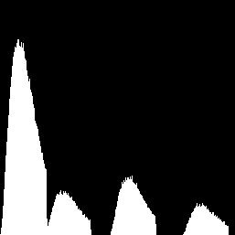
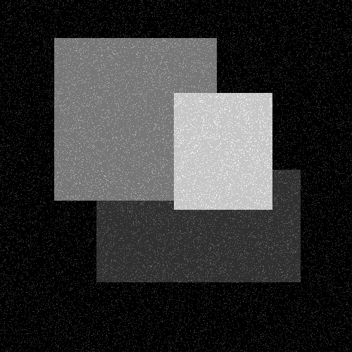
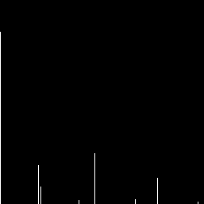

[[<< Back to Index]](../index.md)

---
# Noise Generation

Spatially Independent Noise using Gaussian, Gamma, Uniform, Salt-and-Pepper Distribution

```cpp
#include <noise_generator.hpp>
```

## Table of Content

1. [**Introduction**](#1-introduction)
2. [**Spatially Invariant Noise**](#2-noise-generator-for-spatially-invariant-noise)<br>
    2.1 [Uniform Noise](#21-uniform-noise)<br>
    2.2 [Gaussian Noise](#22-gaussian-noise)<br>
    2.3 [Gamma Noise](#23-gamma-noise)<br>
    2.4 [Salt and Pepper Noise](#24-salt-and-pepper-noise)<br>


## 1. Introduction

A common problem in image processing is removing noise from an image, for example as a pre-processing step before segmentation. To aid in debugging a program tasked to do this, ``crisp`` offers a quick and easy way to generate noise and add it to an image.

There are two types of noise in `crisp`: spatially invariant and periodic noise. "Spatially invariant" means that the function generating the noise value for a certain pixel does not take the pixel's location into account. For periodic noise, the location is taken into account and the noise function is set up in a way where the resulting pattern repeats. Sinusoidal interference would be a common type of periodic noise, while the "white noise" on a CRT TV would be considered spatially invariant.

## 2. Noise Generator for Spatially Invariant Noise

Noise is generated using `crisp::NoiseGenerator`:

```cpp
template<typename RandomNumberDistribution_t>
class NoiseGenerator
{
    public:
        // ctor
        NoiseGenerator(size_t seed = /*...*/);
        
        // specify interval
        void set_interval(float min, float max);
        
        // call operator
        virtual float operator()();
    
    private:
    /*...*/
}
```

We see that this class takes one template argument and offers three functions, we will discuss shortly.

The template argument is a class that satisfies all conditions to be a [std::RandomNumberDistribution](https://en.cppreference.com/w/cpp/named_req/RandomNumberDistribution). Most user will not have to interact with this template as crisp offers 4 convenient implementation for the most common distribution.

When constructing a noise generator, we provide it with a *seed*. This seeds the underlying random engine and makes noise patterns repeatable. If we leave the seed unspecified, `crisp` picks a random seed itself, this seed is not reproducible.

`operator()()` is the call operator, executing it, the noise generator returns a number distributed according to it's the generator's template argument. It then advances the random state. By default, the numbers value is in [0, 1], we can use `set_interval(float min, float max)` to change the range from [0, 1] to [min, max].

As mentioned before, `crisp` offers 4 noise models, to illustrate their effects consider the following image simple image:<br>

```cpp
#include <noise_generator.hpp>
#include <system/image_io.hpp>
#include <image/grayscale_image.hpp>

// in main.cpp
auto image = load_grayscale_image(/*...*/ + "/crisp/docs/noise/.resources/noise_base.png");
```

<br>

We can get a rough idea of its histogram like so:

```cpp
auto histogram = Histogram<256>(image);
save_to_disk(histogram.as_image(), /*...*/);
```


We see four spikes associated with black and the four shades of gray. Keep this in mind as we corrupt the image with noise.

## 2.1 Uniform Noise

Uniform noise adheres to the [real uniform distribution](https://en.wikipedia.org/wiki/Continuous_uniform_distribution). We can corrupt the above image like so:

```cpp
auto uniform = UniformNoiseGenerator();

// additive noise
uniform.set_interval(0, 0.2);

for (auto& px : image)
    px += uniform());
```

Here we're adding noise of strength [0, 0.2] to the image.

<br>

And this is its histogram:<br>

<br>

We note the typical uniform platform shape around the former spikes. We note a large spike where the distributions overlap, this is because the new noisy values of two gray tones happened to be the same as another gray tone already present, raising its number of occurrences

## 2.2 Gaussian noise

Gaussian noise follows the [normal distribution](https://en.wikipedia.org/wiki/Normal_distribution). `crisp` automatically chooses the mean and standard deviation, but if we want to manually specify it, we can do so using the following constructor:

```cpp
// member of crisp::GaussianNoise
GaussianNoise(float mean, float sigma, size_t seed = /*...*/);
``` 
We can apply gaussian noise to the image in the same way as before:

```cpp
auto gaussian = UniformNoiseGenerator();
gaussian.set_interval(0, 0.2);

for (auto& px : image)
    px += gaussian());
```

<br>
<br>

The classic bell curve shape around each spike is evident.

## 2.3 Gamma Noise

Gamma noise follows the [erlang distribution](https://en.wikipedia.org/wiki/Normal_distribution). It takes two parameters: `shape` (sometimes called k) and `scale` (also called beta). Again we can have `crisp` pick these automatically or specify them manually using:

```cpp
// member of crisp::GammaNoise
GammaNoise(float shape, float scale, size_t seed = initialize_seed());
```

Applying it to the image:

```cpp
auto gamma = GammaNoise();
gamma.set_interval(0, 0.2);

for (auto& px : image)
    image += gamma();
```

<br>
<br>

We note the slightly "tilting" shape of the curves. The erlang distribution is useful because it approaches other distributions like the exponential distribution for different parameters. 

## 2.4 Salt-and-Pepper Noise

More formally called "data-drop-out" (pepper) and "spike" (salt) noise, salt-and-pepper noise are infrequent events of the intensity either dropping to 0 or spiking far above 1 (usually clipped to 1). This type of noise happens often because of equipment-induced artifacting. In `crisp` we can change the resulting salt and pepper noise values freely using `set_interval(pepper, salt)` such that pepper noise will be a spike of value `pepper` and likewise for `salt`. To create the noise generator we need to provide two parameters: the salt chance and the pepper chance, everything else is just as before:

```cpp
auto salt_and_pepper = SaltAndPepper(0.1, 0.1);
salt_and_pepper.set_interval(0, 0.2);

for (auto& px : image)
    image += gamma();
```

<br>
<br>

Instead of curves, we now note small spikes that occur a set distance from the original spikes. This is consistent with the binary nature of salt-and-pepper noise. 

## 3. Periodic Noise

(this feature is not yet implemented)

---
[[<< Back to Index]](../index.md)

