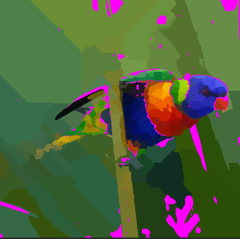
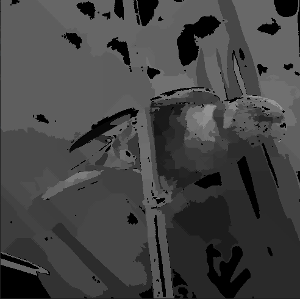

# Segmentation

Segmenting an image into parts and processing these parts individually is what allows modern image libraries and algorithms to work, however reliably doing so depends on a huge number of environmental factos and the image itself. To address this crisps offers a broad variety of algorithms that excel in one situation but not others to hopefully allow a user to have the confidence that at least one of the algorithsm outlined here will do the job. 

First let's talk about the main output of the segmentation algorithms, ``ImageSegment``s

## [ImageSegment](../../include/image_segment.hpp)

In ``crisp`` and image segment is simply a set of pixel coordinates, internally it is just a typedef for ``std::set`` with a custom order operator. The set is ordered such that the top-most, left-most pixel is the first pixel as such:

TODO: image of numbering

Unlike ``ImageRegion``, ``ImageSegment`` puts not constraints of connectivity on it's pixels, the only property it enforces is that each pixel only occurs exactly once in the same segment (that is, it is not a multiset).

ImageSegments can be extracted from Images via *decomposition*. ``crisps`` offers two types of functions to do this:

+ ``decompose_into_segments`` iterates through an image and creates a new cluster everytime a new value is encountered. Then if another pixel with the same value is seen it adds it to the existing cluster. This is useful if you want to divide an image into a number of parts and don't care about wether or not the parts are connected. Calling this function on an BinaryImage of an 8x8 chessboard will return 2 segments: one of the black tiles and one for the white tiles
  
+ ``decompose_into_connected_segments`` iterates and each time it encounters a value not currently allocated to a cluster it starts growing the cluster from that seed. This means that each segment (cluster) has the same value and all pixels in it are 8-connected. Calling this function on a binary image of a chessboard we would get 64 segments, 32 for each white tile and 32 for each black tile

Both functions have a variant that takes two more arguments: ``min_cluster_size`` is a convenience function that simply discards any cluster that is smaller than the specified threshold, useful for segmenting noise images as without it every 1-pixel noise would become it's own segment when calling ``decompose_into_connected_segments``.
The other argument is a vector of allowed values, so for our chess board example if we call ``decompose_into_connected_segments(chess_board, {true})`` we would get 32 segments, one for each white tile as the black tiles were discarded.

Both functions run in O(m*n) wheren m, n size of the image so they are as optimal as possible so don't be afraid to re-segment an image! For reference here are all decomposition functions signatures:

```cpp
// unconnected segments of any value
std::vector<ImageSegment> decompose_into_segments(const BinaryImage& image, size_t min_segment_size = 2);
std::vector<ImageSegment> decompose_into_segments(const GrayScaleImage&, size_t = 2);
std::vector<ImageSegment> decompose_into_segments(const ColorImage&, size_t = 2);

// unconnected segments of specified values
std::vector<ImageSegment> decompose_into_segments(const BinaryImage&, std::vector<bool> allowed_values, size_t = 2);
std::vector<ImageSegment> decompose_into_segments(const GrayScaleImage&, std::vector<float>, size_t = 2);
std::vector<ImageSegment> decompose_into_segments(const ColorImage&, std::vector<Color>, size_t min_segment_size = 2);

// connected segments of any value
std::vector<ImageSegment> decompose_into_connected_segments(const BinaryImage&, size_t = 2);
std::vector<ImageSegment> decompose_into_connected_segments(const GrayScaleImage&, size_t = 2);
std::vector<ImageSegment> decompose_into_connected_segments(const ColorImage&, size_t = 2);

// connected segments of specified value
std::vector<ImageSegment> decompose_into_connected_segments(const BinaryImage&, std::vector<bool>, size_t = 2);
std::vector<ImageSegment> decompose_into_connected_segments(const GrayScaleImage&, std::vector<float>, size_t = 2);
std::vector<ImageSegment> decompose_into_connected_segments(const ColorImage&, std::vector<Color>, size_t = 2);
``` 

Now that we know how to decompose an image into segments we can finally get to the actually interesting part: how to modify images so the segmentation makes sense:

# Segmentation by Thresholding

Thresholding is one of the simplest method of dividing a gray-scale Image into two parts. We specify a threshold T in some way and then set all pixels p_i to ``false`` (black) if p_i <= T, otherwise we set p_i to ``true`` (white) if p_i > T. Remember that you can simple call ``BinaryImage::invert()`` if you would like to change what relation to the threshold results in what colors.

``crisp`` offers 5 algorithms to arrive at a threshold, each with their own strengths and weaknesses

To show all the following algorithms results we use two pictures:

 

To the human eye both images are clearly ledigble but to the computer the non-uniform lightning on the right may cause problems depending on the method used.

### Manual Threshold
Manual threshold is the simplest, the user simply specified a threshold and that threshold is used. This is useful if you want the absolute best performance and already know what you want to do. This functions is equivalent to calling ``BinaryImage::BinaryImage(const GrayscaleImage&, float threshold)``. For these examples we simply set the threshold to 0.5:

 

Because the 0.5 was picked basically at random, the resulting thresholded image doesn't make much sense, especially in the first clean image the beak and was not isolated at all while in the second non-uniform corrupted image the illuminated made the beak take on a more fuzzy shape.

For the rest of this section we will express runtime perfoamnce *relatively*, where the manual threshold took t seconds. If something takes 2t seconds, it means it is twice as a slow as this method which runs in O(m*n) where m, n size of the image

### Basic Threshold
All following functions will employ a heuristic and choose the optimum threshold themself. For ``basic_threshold`` the threshold is arrived at iteratively by starting with the images histograms median and then computing the mean of the resulting two groups. Then a threshold is calculated by taking the average of the two means and then they resulting group-specific means are calculated again until convergence is achieved. This method gives decent results  but is very sensitive to noise and non-uniform lighting so while it is not very flexible or reliable it is the fastest of the global threshold heuristics

 

For the clean image the heuristic picked a treshold that was much more useful, all major features are articulated and the shadow on the birds abdomen represents the color gradient from white to grey in the image. Note how in the second corrupted image the threshold notably changed, this is because the non-uniform lightning lowered the overall intensity level. Furthermore the "S" is completely hidden, in a real world example we would always want text to be thresholded correctly. This shows the methods sensitivity to non-uniform lighting.

Because the method had to analyse the histogram, it took 2t seconds, meaning it took twice the time of the basic threshold.

### Otsu's Method

Otsus method is an algorithm that maximizes the between-class variance of the two resulting segments. How we arrive at the threshold is out of the scope of this paragraph but Otsu's Method generally represents the gold standard for global thresholding. If you need to use a global one, many people will say you should be using this heuristic. 

 

Both images resulting from otsu's method are fairly similar to the basic thresholds method, the thresholds chosen are actually only about 0.05 intensity levels apart. This often happens and considering otsus method took 3t seconds compared to the 2t for the basic threshold while otsu is more accurate in more scenarios, sometimes the difference between it and the basic version isn't worth the performance overhead. This is why ``crisp`` offers both, otsu is better accuracy, worse performance while basic is worse accuracy, better performance. Which is best depens on the users intent. 

### Variable Threshold

All thresholding functions so far completely failed at isolating the "sample" text in the image when non-uniform illumination is present. This is because they use a global threshold, that is all pixels are thresholded by the same value. This is not the case for variable threshold. You can best image the algorithm like a snake from the titular game "snake". It slithers in a spiral pattern from the outside to the inside and drags a tail behind it. The threhold for the current pixel is based on mean of that tail, so if we would let the tail be of length m*n we would simply use the global mean, if we let the tail be of length 10, only the ten last visited pixels are considered. You can change the lenght of the tail with the argument ``constant``. If experimentation is possibel I recommend values between 0.1 and 1, if you just want ``crisp`` to take it's best guess, leave it to the defaulted 0.25. 

 

We see a drastic difference compared to the global thresholding methods, there is a lot of artifacting going on but notice that for the non-uniform picture this is the first method that properly isolated the "S". Variable thresholding runs in 1.5t so it is faster that bost heuristic global thresholds and it is thus best use together with a global threshold. Compute the global threshold and then ``&&`` it with the variable trehshold one to negate part of the non-unfiorm lighting. If you do not need the performance though, the following method is even more resistant to the lighting problem

## Neighborhood Thresholding

Like variable thresholding, Neighborhood Thresholding uses a different threshold for each pixel but instead of that threshold being based on the "snakes tail", it is based on the immediate neighborhood of the pixel. the function actually checks around it in kind of a spider-web pattern, if it used a every point in a square the performance would tank as for a 10x10 square we suddenly go from m*n operations to 100 m*n operations, a 100x increase. To control this, this method also offers a paramter `neigbhborhood_size`. This changes how many pixels the function takes into account everytime it visits a pixel so using more will incur more overhead but improve accuracy

 

We again notice significant artifacting however this method almost completely eliminated the problem with the text not being visible. It came at a cost though, the operation used a 7x7 neighborhood and took 30t which would be inacceptable in a real-time context. Neighborhood threshold is the most flexible, accurate and resistant of the thresholding methods but it comes at an obvious cost

Overall we have found that each method has it's own strengths and weaknesses which are summarized here:

```
Name            Performance     Accuracy    Flexibility
-------------------------------------------------------
Manual          1t              low         low
Basic           2t              mid-high    low
Otsu            3t              high        low
Variable        1.5t            low         high
Neighborhood    30t             high        high
```

# Segmentation by Clustering

Clustering is the optimal way to segment an image however it comes with significant performance overhead. In most cases in real-time applications, clustering is not an option however if either enough hardware or time is available, properly clustering an image results in almost perfect (by human visual standards) segmentation. Also unlike segmentation, clustering allows for segmenting color images into more than two clusters. So for a color clustered color image that will result in 4 clusters, the result is also a color image where each pixel has one of the 4 colors depending on what cluster it was assigned to. 

### Region Growing Clustering

Region growing means taking a "seed" point and starting from that point, adding neighboring pixels to the image only if they are similar enough to the current cluster. This method has great accuracy but it has the obvious downside that seed points need to be available. One was is to randomize them but in practice often the nature of the work allows for seed points to be easily specified. For example if we were designing a robot that inspects bottles for fluid, the robot is always in the same place and the bottle can only move a cross the screen in so many orientation so we could simple align seed points with all points for fluid to be present and then cluster it. A different approach is to first threshold an image and use that thresholded image as a seed image. We illustrate both approaches here:


This will be our picture for now, we notice many well-defined clusters of colors and a human tasked to segment the image would most likely segment it as following:

+ the stalk the bird is holding onto 
+ the blurry background
+ the leaf in the background
+ each region of one colors of the birds plumage

We thus manually specify the cluster points and hand these to ``region_growing_clustering`` as a binary picture. Note that while here the bird is still visible for clarity, the actual seed picture only has the white seeds and everything else is black. Note the number of seeds, it's fine to half-hazardly place them and even have multiple next to each other because the algorithm automatically merges redundant seeds at the beginning. This also allows for automated seeding to be more feasible as we will see later.


I intentionally basically just clicked around the birds body at random to simulate the inaccuracy of an automated process. 

```cpp
auto image = GrayScaleImage();
image.create_from_file("/home/clem/Workspace/image_processing/docs/segmentation/cluster_clean.png");

auto seeds = BinaryImage();
seeds.create_from_file("/home/clem/Workspace/image_processing/docs/segmentation/cluster_seeds_binary.png");

auto result = Segmentation::region_growing_clustering(image, seeds, 0.075, 0.001);
```
Region growing clustering takes two more parameters, ``add_upper_threshold`` which determines that maximum color-distance (range [0,1]) a pixel is allowed to have to still be added to the cluster currently inspecting it and ``merge_upper_threshold`` which is the maximum color-distance *between clusters* that is allowed before those two clusters are merged. Because merging is possible, the performance of this algorithm depends not only on the number of seeds (the more seeds the more clusters the slower) but how and if at all clusters are allowed to merge.



We note that most of the major areas were succesfully isolated but the tail of the bird was "swallowed" by the background which indicates that the merge-threshold was not low enough. A color of magenta (solid black for grayscale images) denotes that that part of the image was not assigned to any cluster. If this happens it means that not enough seeds were present or that ``add_upper_threshold`` was specified too low however in many application unclustered-areas aren't very bad, if our objective was to simplify the image in order for computer vision to identify the birds main colors that object would be met by just setting the magenta areas to one of the background greens.

Region growing clustering is technically the on of the most accurate clustering methods in ``crisps`` however due to it's reliancy on pre-defined seeds it is also the least flexible. There are several methods in the literature on how to automatically select seeds, one is to threshold an image using otsu's method and then morphologically erode it until only the very centers of the regions is left and use these as points. If we need automated maximum accuracy, a path like this will be a good bet, especially when we also take things like edges into account

Any of the clustering algorithms including region-growing can also be used on grayscale images, all arguments and methodolgy is the same, the distance measures for all types of images are normalized into the same range but it's often the case that clustering a color image first and then transforming the result into black and white is not the same as transforming the color image first and then clustering it. Notably clustering grayscale images results in a ~2 times performance increase for all of the algorithms presented here.



## Superpixel Clustering

Superpixel clustering is a variant of the region growing clustering where instead of arbiratry position one seed is placed in a regular tiling and the clustering is done by growing / reducing each tile. Each of these tiles is called a "superpixel" and there are many methods of doing it. ``crisps`` variation is based on a custom distance measure that prioritzes color over spatial proximity. 
The only argument for superpixel clustering is the number of superpixels, a higher number doesn't necessary mean more accurate, it's more that a certain sweetspot should be hit to properly represents all the images detail but still use the minimum number of superpixels to reduce color and shape variation.

```cpp
auto image = ColorImage();
image.create_from_file("/home/clem/Workspace/image_processing/docs/segmentation/cluster_clean.png");

auto result = Segmentation::superpixel_clustering(image, 100);
```


Having chosen 100 superpixel we note a high quality of detail. Any human looking at the clustered image would instantly be able to describe what the image is depicting. Unlike the previous images the leaf in the background is still articulated. 

Superpixel clustering is a great way to reduce color variation for computer-vision and it can be used with other cluster algorithms together for great effect, as we will see shortly

## k-means clustering

k-means clustering is segmenting a set (image) in k clusters such that for each point in the image, the distance to the clusters center (mean value) is minimal. Solving this for true optimality is NP-hard and thus not achievable on current machines, instead crisps assumes a set amount of k and then uses a sophisticated heuristic to pick the best cluste centers to start out with. After having picked the initial clusters, the algorithm goes through every pixel one-by-one and chooses the best cluster for it. Once all pixels are allocated, the new clusters are updated so that their mean represents the mean of all it's members and the entire process is done again. As you can already tell, this is incredibly computationally expensive and in practice you want to stop this process after the first or second iteration. If you let it run it is guruanteed to always converge and the convergence will be optimal with regards to the cluster center. To show the difference, let's first run the algorithm and let it converge on it's own:

```cpp
// 5 clusters, run until convergence is achieved
auto result = Segmentation::k_means_clustering(image, 5);
```


On my pc this took 24s however the resulting image is clearly defined, all the major colors are present and out of all the clustering methods so far, I'd consider this one to be most accurate. To address the 24s, we can add a 3rd argument to k-means: ``max_n_iterations``. This will simply shut down the algorithm after so many iterations, resulting in a less acurracte but quicker acquired image. 

   

images after 1, 2, 5 and 10 iterations, taking 2, 3.4, 10, 18s respectively. Other than the colors the best thing to notice the loss of detail is with the boundary of the leaf in the background. In the fully converged image the leaf is clearly defined, in 1 it is basically non existent and as the iterations increase the more of the background is removed from the leafst cluster. Either way as you can see k-means returning early can still result in a decent product and for some applications there's a sweet spot where you can get the same result with about 10% of the runtime compared to full convergence. 

Overall the k-means algorithm is the most accurate and most flexible but it comes at the cost of runtime. For real-time the best way is to automate region-growing and use the context of the application to achieve an exact result.

This concludes an overview of all of crisps segmentation techniques. If you want to now analyze your new segments and hand them to an AI or another algorithm to compare them, you can do so by transforming them into an ``crisp::ImageRegion`` which is covered in the feature_extraction tutorial.