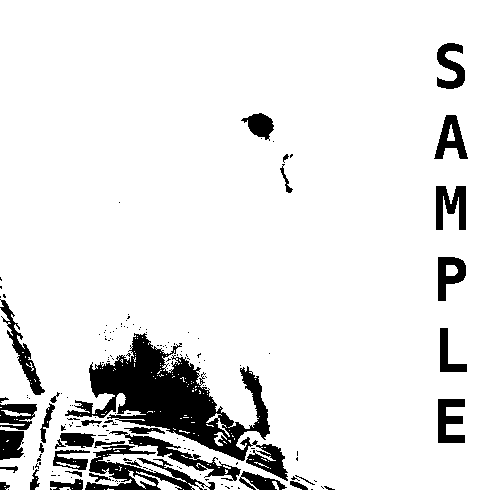
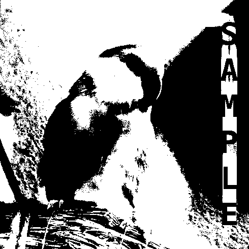

[[<< Back to Index]](../index.md)

---

# Segmentation and Edge Detection

Thresholding, Clustering, Edge Detection & Linking

```cpp
#include <segmentation.hpp>
#include <edge_detection.hpp>
```

## Table of Contents

1. [Introduction](#1-introduction)<br>
    1.1 [Extracting Segments](#11-extracting-segments)<br>
2. [Thresholding](#2-thresholding)<br>
    2.1 [Manual Thresholds](#21-manual-threshold)<br>
    2.2 [Basic Automated Thresholding](#22-basic-threshold)<br>
    2.3 [Otsu's Method](#23-otsus-method)<br>
    2.4 [Variable Threshold](#24-variable-threshold)<br>
    2.5 [Neighborhood Threshold](#25-neighborhood-threshold)<br>
3. [Edge Detection](#3-edge-detection)<br>
    3.1 [Threshold Sobel Gradient Magnitude](#31-threshold-sobel-gradient)<br>
    3.2 [Canny's Algorithm](#32-canny)<br>
4. [Clustering](#4-clustering)<br>
    4.1 [k-means Clustering](#41-k-means-clustering)<br>
    4.2 [Superpixel Clustering](#42-superpixel-clustering)<br>
    4.3 [Clustering by Region Growing](#43-region-growing-clustering)<br>
   
## 1. Introduction

Segmentation is the act of dividing image space into *segments*, best though of a a set of unique pixel coordinates. In ``crisp``, segments are literally just that:

```cpp
struct PixelCoordCompare
{
    bool operator()(const Vector2ui& a, const Vector2ui& b) const
    {
        return a.y() != b.y() ? a.y() < b.y() : a.x() < b.x();
    }
};

using ImageSegment = std::set<Vector2ui, PixelCoordCompare>;
```

We see that `ImageSegment` is just an `std::set` of pixel coordinates (2-element vectors) that are sorted left-to-right, top-to-bottom. ``crisp::ImageSegment`` should not be confused with ``crisp::ImageRegion`` which is more than just a set of pixel coordinates, to learn more about the difference between segments and regions, please consult the [feature extraction tutorial](../feature_extraction/feature_extraction.md).

## 1.1 Extracting Segments

We can *decompose* any image into it's segments using the following functions:

```cpp
template<typename Image_t>
std::vector<ImageSegment> decompose_into_segments(const Image_t&, size_t);

template<typename Image_t>
std::vector<ImageSegment> decompose_into_connected_segments(const Image_t&, size_t);
```

``decompose_into_segments`` returns a set of segments such that for each pixel coordinate in the segment the pixel value pointed to is the same. This means segments are parts of an image with identical intensity.
For a binary image we would expect `decompose_into_segments` to return 2 segments, one for all white pixel and one for all black pixels. For a grayscale image that has 255 different possible values we would get 255 different segments only if all values are present in the image. The same applies to color and images with more than 3 planes.

``decompose_into_connected_segments`` decomposes an image into segments such all corresponding pixels have the same value and that all pixels are 4-connected. Formally this means that for an pair of pixels in the resulting segment, we can draw a 4-connect path to any other pixel in the segment. A much less formal way would be to imagine it like an area that one would fill with the standard MS Paint (or similar programs) paintbucket tool. It fills everything as long as it's the same value and connected.

We will further illustrate the difference using an example. Consider the following binary image:


We spot multiple disconnected "blobs" in white on a black background. 

We now decompose this image and then create a colored image that, for each different segment, colors each segment in a different hue:

```cpp
// load 
auto blobs = load_binary_image(/*...*/ + "/crisp/docs/segmentation/blobs.png");

ColorImage colored;
colored.create(image.get_size().x(), image.get_size().y());

// decompose
auto segments_unconnected = crisp::decompose_into_segments(image);

// color in fo visualization
float step = 1.f / segments_unconnected.size();
size_t i = 0;

for (auto& segment : segments_unconnected)
{
    for (auto& px : segment)
        colored(px.x(), px.y()) = HSV{step * i, 1, 1}.to_rgb();

    i++;
}
```

Can you guess what the resulting image will look like?<br>


The algorithm returned two segments, one marked in red and one marked in cyan. These correspond to the black and white pixels in the image respectively. 

If we repeat the same process but now ask for connected segments:

```cpp
auto segments_unconnected = crisp::decompose_into_connected_segments(image);
``` 
The result is the following:<br>


Here, the algorithm found 4 different segments: the background in red and the three blobs in green, cyan and purple respectively. The purple blob is barely connected enough for the "ball" towards the bottom of the image to still count as 4-connected which is why it, too, is colored purple.

We can use the resulting segments in various ways
(see the [feature extraction tutorial](../feature_extraction/feature_extraction.md) for more information) but for now we instead want to instead focus on how to get an image into a state that makes segmentation like this even possible. Not all images are binary images of connected blobs after all.

## 2. Thresholding

Thresholding means to translate a 1-plane (grayscale) image ``I`` into a binary image ``B`` by applying a threshold ``t`` to it such that:

```cpp
if (I(x, y) > t)
    B(x, y) = true;
else 
    B(x, y) = false;
```

The algorithms presented in this function concern themself with how to determine this threshold `t`.

To illustrate each algorithms performance, consider the following two images of a bird:<br>

```cpp
#include <segmentation.hpp>
#include <system/image_io.hpp>

auto uniform = load_grayscale_image(/*...*/ + "/crisp/docs/segmentation/.resources/opal_clean.png");
auto non_uniform = load_grayscale_image(/*...*/ + "/crisp/docs/segmentation/.resources/opal_non_uniform.png");
```


While the first version is clear, the second version exhibits a radial gradient emanating from the top right corner. We note that the gradient results in the background intensity being closer to the black of the letters. In general the applicability of thresholding methods is determined by their ability to handle *non-unfiorm lighting* like this, though a method that cannot do so may not necessarily be inferior in all situations. 

## 2.1 Manual Threshold

The computationally easiest way to threshold an image is to simply have a human guess a decent threshold and apply it directly. We can do so using ``crisp::manual_threshold(const Image<T, 1>&, float)``:

```cpp
auto uniform_thresholded = manual_threshold(uniform, 0.5f);
auto non_uniform_thresholded = manual_threshold(non_uniform, 0.5f);
```




``manual_threshold`` is the fastest of the thresholding methods. If there is ample control over the type of image and the situation in which it is taken, manual thresholding may be both the easiest and most optimal method.

## 2.2 Basic Threshold

``crisp::basic_threshold`` finds a threshold by iteratively moving the threshold to the median between the two clusters mean until convergence is achieved. Unlike later methods, the resulting threshold is not guaruanteed to be optimal in terms of in-between cluster variance, however it's relative computational simplicity makes it a decent choice nonetheless.


We note that with non-uniform lighting, this method was not able to seperate both the "S" and "A" from the background.

## 2.3 Otsu's Method

``crisp::otsu_threshold`` uses otsu's method which is an algorithm that finds a threshold that maximizes the in-between class variance. While being statistically optimal, computationally it tends to be slightly slower than ``basic_threshold``, however if a higher quality seperation is desired, otsu's method is the thresholding algorithm of choice.


We again weren't able to isolate all letters. This tends to be a problem with *global* thresholding algorithms in general. Global means that there is one threshold that is applied to all pixels. To fully address non-uniform lighting we instead need to employ a *local* threshold which computes a new threshold for every individual pixel.

## 2.4 Variable Threshold

This methods visits each pixel in the image in a spiral pattern and some of the already-visited pixels are used for estimating the current threshold. Because the "tail" of the current position changes orientation as the algorithms proceeds, this thresholding method is more resistant to non-uniform lightning. 
The algorithm takes one parameter that governs the length of the "tail". It is recommended to keep it's value in the range [0.01, 1], the lower the number the shorter the tail and the shorter the tail the more resistent the method is to non-uniform lighting but the more artifacting will be exhibited in the result.

```cpp
auto uniform_threshold = variable_threshold(uniform, 0.5f);
auto non_uniform_thresholded = variable_threshold(uniform, 0.1f);
```

While it is computationally quite fast and the fastest of the local thresholding operations, the results are of lower quality compared to the global thresholding methods:




Note how the spiral pattern is noticeable as it "carves out" areas around the word sample. It did a lot better at seperating the letters from the background in non-uniform lighting, however there is a method that can do so more reliable, if at a computational cost.

## 2.5 Neighborhood Threshold

This method computes a local threshold for each pixel based on samples taken from the pixels neighborhood. `neighborhood_threshold` also has one optional argument that governs the size of the neighborhood and number of samples taken. `crisp` employs a heuristic to choose these automatically if we do not want to specify them ourselfs.

```cpp
auto uniform_threshold = neighborhood_threshold(uniform);
auto non_uniform_thresholded = neighborhood_threshold(uniform);
```


While we notice some artifacting in areas of relative constant intensity the method isolated both the boundaries of the bird and each letter of the text clearly. It is therefore recommend as the most robust for both uniform and non-uniform lighting, however in applications where performance is important it may be more appropriate to choose any of the other thresholding methods presetned so far or pre-process the image to negate effects of non-uniform lighting

## 3. Edge Detection

If we were to intuitively seperate an image into region, the boundary of those regions are called *edges*. Algorithmically, edges are determined identifying areas with a high image *gradient magnitude*. This ideally results in a binary image of lines, which follow the outer perimeter of the objects in the image. ``crisp`` offers 3 different methods for edge detection, to demonstrate them we again use this familiar but now colored image of a bird:<br>

<rb>

## 3.1 Threshold Sobel Gradient

For this method we first compute the gradient response in both direction using the sobel operator as provided by ``SpatialFilter::sobel_gradient_/*...*/``. We then compute the gradient magnitude, scale it into the range [0, 1] and threshold the resulting image, thus leaving only the strongest edge responses. Of course `crisp` does all of this itself, we as users only have to do the following function call:

```cpp
#include <edge_detection.hpp>
using namespace crisp;

auto image = load_color_image(/*...*/ + /crisp/docs/segmentation/opal_clean.png);

auto edges = EdgeDetection::threshold_gradient(image);
```
If desired, we can manually specify a threshold using the overload ``threshold_gradient(Image<T, N>, float threshold)``. If left unspecified the threshold is determined heuristically instead. The above function call results in the following image:


The edges of letters were well preserved, the birds boundaries were reasonably accurately isolated, however more noisy image such as the rope on the left and the straw the bird is perching on exhibit a large amount of false-positive edges. Furthermore edges in these regions are noisy.

At a computational cost we can get a much cleaner result using the following algorithm instead.

## 3.2 Canny

Cannys algorithm combines thresholding the gradient magnitude post-processing and linking edges. A somewhat complicated scheme first eliminates edges least likely to be part of the boundary and then post-processes them to reduce their width to 1 pixel and link them if possible. 

```cpp
auto edges = EdgeDetection::canny(image);
```


While we notice some distortion of the letter boundaries, each individual straw is now accurately resprented. It is evident that canny's algorithm results in much cleaner results, though pre-processing the image manually and morphological post-processing the resulting binary image are still recommended for applications were a high accuracy of edge detection is imperative.

## 4. Clustering

Clustering in image processing means to, for each pixel in the image, assign it to one or more clusters, usually based on the pixels intensity or position. We then average the intensity of the pixels in each cluster and create an image where we replaced the value of a pixel with the value of it's cluster.

Ideally our clusters should adhere to boundaries and the clusters themself should make sense conceptually. Consider the following image of a rainbow lorikeet:<br>

<br>

If we were to ask a human to isolate relevant segments based on color they would likely consider them to be
+ the out of focus background
+ the branch
+ each different region of coloration on the birds plumage
+ the birds beak

``crisp`` offers two automated algorithms for image clustering, we will judge their effectiveness against our conceptually ideal version of what the clustered image should result in.

## 4.1 k-means Clustering

[k-means clustering](https://en.wikipedia.org/wiki/K-means_clustering) ideally assigns pixels to clusters such that the sum of distances of each pixel to their respective cluster is minimal. Properly solving this problem is NP-hard which is why a wide variety of heuristics are available. 
``crisp`` uses the euclidian distance in n-dimensions (where n the number of planes for the image, 3 in our case) as distance-measure and employs a custom heuristic for choosing initial cluster centers. We do however still need to specify the number of clusters:

```cpp
auto image = load_color_image(/*...*/ + "/crisp/docs/segmentation/rainbow_lorikeet.jpg");

auto result = Segmentation:k_means_clustering(image, 5);
```


We observe that both the orange, green and blue plumange are represented, the branch was isolate from the background, however the feet of the bird have been assigned to the same cluster as the branch which would be somewhat expected as both are similar in hue and saturation.

While this result is satisfactory, the above function call took about 20s on a below-average machine to complete. This is because, by default, clustering in `crisp` will run until convergence is achieved. We can limit the maximum amount of time it takes to return via the function argument ``number_of_iterations``. This simply exits the algorithm after the specified amount of clustering cycles. 

```cpp
auto result = Segmentation:k_means_clustering(image, 5, 1);
```
<br>
```cpp
auto result = Segmentation:k_means_clustering(image, 5, 2);
```
<br>
```cpp
auto result = Segmentation:k_means_clustering(image, 5, 3);
```
<br>
```cpp
auto result = Segmentation:k_means_clustering(image, 5, 5);
```
<br>
```cpp
auto result = Segmentation:k_means_clustering(image, 5, 10);
```
<br>

We note that after 10 iterations we are already pretty close to the final result, even though the algorithm took 34 iterations to converge when left in default configuration.

## 4.2 Superpixel Clustering

Superpixel clustering is a variant of the k-means algorithm. 
Cluster centers are chosen not by a heuristic but by placing them on a regular grid, effectively tiling the image in n *superpixels*. Each superpixels boundary is then modified in iterative cycles until convergence is achieved. `crisp` employs a custom heuristic that moves the cluster centers off this regular grid to some extend to achieve better adherence to boundaries.

When starting the algorithm we need to manually specify the number of superpixels `n`. Just like with k-means, we can also limit the number of iterative cycles by specifying a third, optional argument though he superpixel algorithm tends to be far faster than k-means, even when left to fully achieve convergence.

```cpp
auto result = Segmentation::superpixel_clustering(image, 300);
```


Compared to k-means we note a more noisy, yet still high-quality result. Each plumage color is represented, the beak and eyes are assigned to clusters seperate from their surroundings. These smaller elements are more likely to be isolated because we now have 300 clusters instead of 5. The nature of the superpixel algorithm, however, makes it so these clusters are limited in growth, resulting in overall better performance compared to k-means.

If the maximum level of accuracy is desired and run-time is of no consideration, it can be useful to first superpixel cluster an image, then k-means cluster the resulting image, using the number of colors in the superpixel clustering result as an indicator for how many clusters the k-means clustering should be run with. 

## 4.3 Region Growing Clustering

(this feature is not yet implemented)

---
[[<< Back to Index]](../index.md)


