[[<< Back to Index]](../index.md)

---
# Filtering in the Spatial Domain

Filter Kernels & Convolution, Non-Maxima Surpression, Median Filtering 

```cpp
#include <spatial_filter.hpp>
```

## Table of Contents

1. [**Introduction**](#1-introduction)
2. [**Kernels**](#2-kernels)<br>
    2.1 [Kernel Normalizationl](#21-normalize-a-kernel)<br>
    2.2 [Kernel Rotation](#22-rotate-a-kernel)<br>
    2.3 [Kernel Seperation](#23-separate-a-kernel)<br>
    2.4 [Combining two Kernels](#24-combining-two-kernels)<br>
3. [**crisp::SpatialFilter**](#3-crispspatialfilter)<br>
    3.1 [Setting the Kernel](#31-specifying-the-kernel)<br>
    3.2 [Specifying the Evaluation Function](#32-specifying-the-evaluation-function)<br>
    3.3 [Applying the Filter](#33-applying-the-filter)<br>
    3.4 [Applying the Filter in Mutiple Dimensions](#34-applying-the-filter-in-all-dimensions)<br>
4. [**Types of Kernels**](#4-filter-kernel-types)<br>
    4.1 [Identity](#41-identity)<br>
    4.2 [One](#42-one)<br>
    4.3 [Zero](#43-zero)<br>
    4.4 [Box](#44-box)<br>
    4.5 [Normalized Box](#45-normalized-box)<br>
    4.6 [Gaussian](#46-gaussian)<br>[](#46-gaussian)
    4.7.1 [Laplacian First Derivative](#471-laplacian-first-derivative)<br>
    4.7.2 [Laplacian Second Derivative](#472-laplacian-second-derivative)<br>
    4.8 [Laplacian of Gaussian (LoG)](#48-laplacian-of-gaussian)<br>
    4.9 [Gradients](#49-gradient-kernels)<br>
        4.9.1 [Simple Gradient](#491-simple-gradient)<br>
        4.9.2 [Roberts](#492-roberts-gradient)<br>
        4.9.3 [Prewitt](#493-prewitt-gradient)<br>
        4.9.4 [Sobel](#494-sobel)<br>
        4.9.5 [Kirsch Compass](#495-kirsch-compass)<br>
5. [**Image Restoration using other Evaluation Functions**](#5-using-other-evaluation-functions-for-image-restoration)<br

# 1. Introduction

Spatial filters are central to the field of image processing and find application in many of the most used algorithms both in the literature and in ``crisp``. A filter has 2 elements: a *kernel* and an *evaluation function* that takes that kernel and applies it to an image. We will explore of these concepts in more detail

# 2. Kernels

A kernel is a m*n matrix of floats. Unlike `crisp::Vector` and `crisp::Image` it does indeed behave like one, multipyling one kernel with another does use matrix-matrix multiplication. Indeed look closer at [spatial_filter.hpp] we find that filter kernels are just a typedef for ``Eigen::Matrix``:

```cpp
using Kernel = Eigen::Matrix<float, Eigen::Dynamic, Eigen::Dynamic>;
```
 Please consult the [eigen documentation](https://eigen.tuxfamily.org/dox/group__TutorialMatrixClass.html) in the case that their matrix class is not yet familiar. Henceforth we assume that any reader is familiar with comma initialization, element-access of most common member functions of ``Eigen::Matrix``.

Other than functions supplied by eigen, ``crisp`` offers these external functions for operating on kernels:

```cpp
// make it so sum of elements is 1
void normalize(Kernel&);

// rotate a kernel 90°
void rotate(Kernel&, size_t n_90_degrees);

// convolute one kernel with another
Kernel convolute(Kernel left, Kernel right);

// separate a kernel numerically
bool separate(const Kernel& original, Kernel* out_left, Kernel* out_right);
```

We will explore each of these function and their usage in detail.

# 2.1 Normalize a Kernel

``normalize`` modifies the kernels element so it's sum-of-elements is 1. This can be useful to control a spatial filters response, often unnormalized filters will resulst in a response that is outside the interval [0, 1]. We use `normalize()` like so:

```cpp
// in main.cpp
#include <spatial_filter.hpp>
#include <iostream>

using namespace crisp;

auto kernel = Kernel();
kernel.resize(3, 3);
kernel << 1, 1, 1,
          1, 1, 1,
          1, 1, 1;

normalize(kernel);

std::cout << kernel << std::endl;

float sum_of_elements = 0;
for (size_t x = 0; x < kernel.rows(); ++x)
for (size_t y = 0; y < kernel.cols(); ++y)
    sum_of_elements += kernel(x, y);

std::cout << "sum after normalization: " << sum_of_elements << std::endl;
```

```
0.111111 0.111111 0.111111
0.111111 0.111111 0.111111
0.111111 0.111111 0.111111

sum after normalization: 1
```

# 2.2 Rotate a Kernel

We can use ``crisp::rotate`` to rotate a kernel by 90° in the counter-clockwise direction. We can also specify a number `n` such that the kernel is rotate by `n * 90°` degree:

```cpp
kernel << 1, 2, 3,
          4, 5, 6,
          7, 8, 9;

for (size_t i = 0; i < 4; ++i)
{
    rotate(kernel, i);
    std::cout << kernel << "\n" << std::endl;
}
```

```
3 6 9
2 5 8
1 4 7

9 8 7
6 5 4
3 2 1

7 4 1
8 5 2
9 6 3

1 2 3
4 5 6
7 8 9
```

## 2.3 Separate a Kernel

Some kernels are *separable* which for a kernel `K` of size `m*n` means that there exists two kernel `A`, `B` of size `m*1`, `1*n` respectively such that `A * B = M` where `*` here is matrix multiplication. This follow from basic linear algebra.

When applying a kernel to an image, we apply it using *convolution*. What this means exactly is not important for now, just know that to filter and image we use convolution. Here we will use the `°` operator for convolution, so for a kernel `K` and image `I`, the filtered image `R` is `R = K ° I`.

Considering that `K` is separable we can write the above equation<br>
`R = K ° I`<br>
as<br>
`R = (A * B) ° I`<br>
Because of the property of convolution we can write this as <br>
`R = A ° (B ° I)`<br>
What this means in plain language is that for a separable kernel, instead of applying the entire `m*n` kernel `K` we can apply one of the separated kernels `B` to the image and then apply `A` to that result instead. This saves `m*n - (m+n)` many computations which for big kernels and especially big images is a huge increase in performance. It is therefore always a good idea to first separate kernels and apply them in sequence instead. To do this `crisp` offers a convenient function:

```cpp
bool separate(const Kernel& original, Kernel* out_left, Kernel* out_right);
```

This function takes three arguments:
+ ``const Kernel& original`` is the kernel we want to separate
+ ``Kernel* out_left`` is the left side of the seperated expression, `A` in our example 
+ ``Kernel* out_right`` is the right side of the seperated expression, `B` in our example

The function furthermore returns ``true`` if seperation was possible in which case ``out_left`` and ``out_right`` will be assigned to, if ``false`` is returned the kernel is not separable and both ``out_left`` and ``out_right`` will be set to ``nullptr``.

Let's consider the following kernel:

```
 1  0 -1
 2  0 -2
 1  0 -1
```
This kernel is separable, [wikipedia lists](https://en.wikipedia.org/wiki/Sobel_operator#Formulation) it's resulting A and B as {{1}, {2}, {3}} (a 1x3 kernel, A) and {+1, 0, -1} (a 3x1 kernel, B). Multiplying them in our head we can verify that this is indeed a valid seperation. 

We now try to separate the kernel in `crisp`:

```cpp
kernel << 1, 0, -1,
          2, 0, -2,
          1, 0, -1;

Kernel left, right;
if (not separate(kernel, &left, &right))
    // handle non-separable kernels

std::cout << left << "\n" << std::endl;
std::cout << right << "\n" << std::endl;

// verify result
kernel = left * right;
std::cout << kernel << std::endl;
```

```
// left
-1.41421
-2.82843
-1.41421

// right
-0.707107 0 0.707107

// left * right
 1 -0 -1
 2 -0 -2
 1 -0 -1
```
``crisp`` found a different seperation, yet validating it by computing ``left * right`` (A*B) confirms that it is also valid. *Seperations are not unique* because we're numerically approximating only one of the possibly many solutions. 
For this reason it is often preferrable to find an analytical "clean" seperation on paper that uses simpler values. However if the kernel is very big or automatically generated `crisp` offers this automated process instead. Just remember that not all kernels are separable so it's important to listen to the boolean flag returned by `seperate`.

## 2.4 Combining two Kernels

Convolution is associative, that is for Kernels K1, K2 and Image I where ``°`` is the convolution operator:
``K1 ° (K2 ° I) = (K1 ° K2) ° I``<br>

or in plain english: convoluting kernel K1 with Image I and then convoluting kernel K2 with that result is the same as first convoluting kernel K1 with kernel K2 and then convoluting the resulting kernel with the image.
This means we can save an entire step, our image is enourmous but our kernels are usually just a few elements so convoluting the two kernels instead of each kernel with the entire image offers a huge boost in performance. We can combine kernels using convolution like so:

```cpp
kernel << -1, -1, -1, 
          -1,  8, -1,
          -1, -1, -1;

kernel = convolute(kernel, kernel);
std::cout << kernel << std::endl;
```

```
-14 -12 -14
-12  72 -12
-14 -12 -14
```

If a chain of kernels will be applied to an image in sequence, if possible we should always try to combin the kernels first.

## 3. ``crisp::SpatialFilter``
## 3.1 Specifying the Kernel
Now that we know how to create and modify a kernel we can assign it to a filter. First we need to create the filter, then we can assign a kernel to it via ``set_kernel``:

```cpp
auto filter = SpatialFilter();
filter.set_kernel(kernel);
```

We can modify an already assigned kernel using:

```cpp
// members of crisp::SpatialFilter
float& operator()(size_t x, size_t y);
float operator()(size_t x, size_t y) const;
``` 

These are simply the same access operators as those provided for the kernel itself.

### 3.2 Specifying the Evaluation Function

Before we can apply this kernel to an image we need to specify the evaluation function. By default this is the already mentioned convolution, however ``crisp`` offers 4 other additional functions. 

To illustrate how each of them works consider the following 3x3 kernel and image segment that is the 3x3 neighborhood of image `in` at position `(i, j)`. The `()` mark the origin of the kernel at it's center:

```cpp
// Kernel
0.5  0.5  0.5 
0.5 (0.5) 0.5
0.5  0.5  0.5

// in(i, j) = 5, part of the image
... 1  2  3 ... 
... 4 (5) 6 ...
... 7  8  9 ...
```
<br>

+ ``CONVOLUTION`` computese th sum of elements weighted by the kernel at a specified image position:<br>
```  
0.5 * 1 + 0.5 * 2 + ... + 0.5 * 9 = 22.5
out(i, j) = 22.5
```
+ ``NORMALIZED_CONVOLUTION`` computes the convolution and then divides the weighted sum by the sum of kernel elements <br>

```
0.5 * 1 + 0.5 * 2 + ... + 0.5 * 9 = 22.5
22.5 / (0.5 + 0.5 + ... + 0.5) = 5
out(i, j) = 5
```
+ ``MINIMUM`` returns the minimum of elements, weighted by the kernel

```
min{0.5 * 1, 0.5 * 2, ..., 0.5 * 9} = 0.5 * 1 = 0.5
out(i, j) = 0.5
```

+ ``MAXIMUM`` returns the maximum of elements, weighted by the kernel

```
max{0.5 * 1, 0.5 * 2, ..., 0.5 * 9} = 0.5 * 9 = 4.5
out(i, j) = 4.5
```

+ ``MEDIAN`` returns the median of the elements, again weighted by the kernel

```
median{0.5 * 1, 0.5 * 2, ..., 0.5 * 9} = 
median{0.5, 1, 1.5, 2, 2.5, 3, 3.5, 4, 4.5} = mean(2, 2.5) = 2.25
out(i, j) = 2.25
```
<br>
We can specify the evaluation function by using:

```cpp
auto filter = SpatialFilter();
filter.set_evaluation_function(SpatialFilter::EvaluationFunction::NORMALIZED_CONVOLUTION);
``` 
For most scenarios convolution or normalized convolution will be sufficient but some tasks can be simplified by using the more specialized evaluations functions.

## 3.3 Applying the Filter
We are now ready to actually apply a filter. Consider this image of a bird:


After loading this image as grayscale we can apply the filter like so:

```cpp
// load image
auto image = load_grayscale_image("/home/clem/Workspace/crisp/docs/spatial_filters/color_opal.png");

// create kernel
auto kernel = Kernel();
kernel.resize(5, 5);
kernel.setConstant(1);  // 5x5 kernel where all values are 1

// create filter and specify kernel
auto filter = SpatialFilter();
filter.set_kernel(kernel);
filter.set_evaluation_function(filter.CONVOLUTION);

filter.apply_to(image);
```

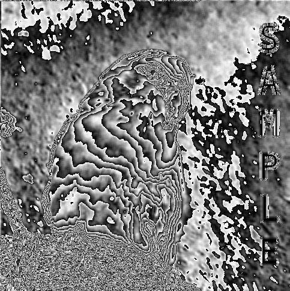

The image is completely distorted. This is because the kernel is not normalized (it's sum of elements is greater than 1). This makes it so  the resulting image values will be far outside [0, 1]. We can fix this by either normalizing the kernel or using `NORMALIZED_CONVOLUTION` instead of `CONVOLUTION`:

```cpp
filter.set_evaluation_function(filter.NORMALIZED_CONVOLUTION);

// or equivalently:
normalize(kernel);
filter.set_kernel(kernel);
filter.set_evaluation_function(filter.CONVOLUTION);
```


We can now see the actual effect of the kernel is blurring the image.

## 3.4 Applying the Filter in All Dimensions

We've previously loaded a colored image as grayscale and then filtered the grayscale image. In ``crisp`` we can filter all images, regardless of value type or dimensionality. For example we can repeat the previous operations but do so on the color image instead:

```cpp
// load image as color
auto image = load_color_image("/home/clem/Workspace/crisp/docs/spatial_filters/color_opal.png");

auto kernel = Kernel();
kernel.resize(5, 5);
kernel.setConstant(1);

auto filter = SpatialFilter();
filter.set_kernel(kernel);
filter.set_evaluation_function(filter.NORMALIZED_CONVOLUTION);

filter.apply_to(image);
```

Literally nothing else changes, all kernels are applicable to all images. The result is exactly what we expect it to be, each plane of the image was blurred individually:<br>

<br>

Internally `crisp` applies the filter to each plane individually, keep this in mind as with more complex kernels it may be less obvious what the effect on a multi-plane image will be.

# 4. Filter Kernel Types

It would of course be quite laborious to specify each kernel manually, instead ``crisp`` provides a wide selection of the most commonly used kernels. We can access them using static member functions of `crisp::SpatialFilter`. While people who are familiar with the literature will recognize most of them, for people who aren't we will be demonstrating their effect on an image by applying them using `CONVOLUTION`. We will furthermore comment on wether they are separable, in praxis one should always seperate them before computation, however for the sake of brevity this step is ommitted here.

## 4.1 Identity

(not separable)

The simplest kernel is the identity kernel, it projects and image onto itself. It takes one argument: `n`, such that the resulting kernel will be of size `n*n` where every element except the center is 0, the center is 1

```cpp
filter.set_kernel(filter.identity(3));

0 0 0
0 1 0
0 0 0
```


## 4.2 One

(is separable)

This kernel is also of size `n*n` but each element is assigned a value of 1. This filter is sometimes also called "box filter" or "box blur" because it tends to blur images (after normalization). We can intensify the blur by increasing the kernels size, for n = 3 the blur is very slight.

```cpp
filter.set_kernel(filter.one(3));

1 1 1
1 1 1
1 1 1
```

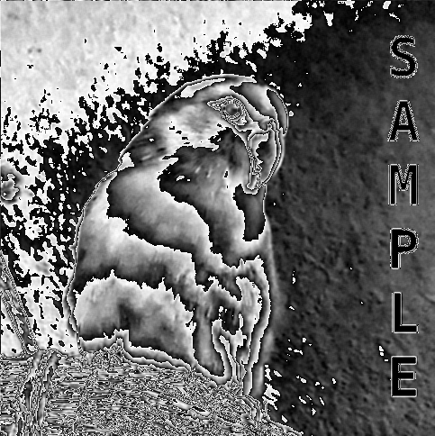<br>

And after normalization:<br>


## 4.3 Zero

(is separable)

This kernel is similar to ``one`` but instead of all elements being 1, all elements are instead set to 0. This filter is rarely applied to an image as it will simply result in an all-black result.

```cpp
filter.set_kernel(filter.zero(3));

0 0 0
0 0 0
0 0 0
``` 

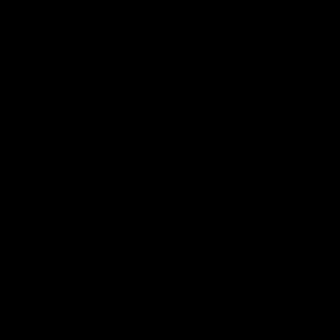

## 4.4 Box

(is separable)

Not to be confused with ``one``, ``box`` takes two arguments: it's dimensions `n` and a constant `c` such that all elements of the kernel will be set to `c`. This means ``box(n, 1)`` is equivalent to ``one(n)`` and ``box(n, 0)`` is equivalent to ``zero(n)``.

```cpp
filter.set_kernel(filter.box(3, 0.5f));

0.5 0.5 0.5
0.5 0.5 0.5
0.5 0.5 0.5
``` 

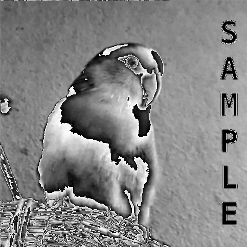<br>

And after normalization:<br>


## 4.5 Normalized box

(is separable)

Unlike the box kernel, the normalized box kernel takes only `n` as argument, all components are assigned such that the sum of components is 1

```cpp
filter.set_kernel(filter.normalized_box(3));

0.111111 0.111111 0.111111
0.111111 0.111111 0.111111
0.111111 0.111111 0.111111
```


## 4.6 Gaussian

(is separable)

The gaussian kernel is popular for smoothly blurring images, while it does incurr a performance overhead due to floating point values, the resulting blurred image is less "blocky" compared to a box filter.

The function to generate it takes only it's size `n` as argument and returns an already normalized kernel sampling a 2d gaussian distribution, with it's center at the center of the kernel.

```cpp
filter.set_kernel(filter.gaussian(5))

0.0362704 0.0384838 0.0394031 0.0384838 0.0362704
0.0384838 0.0417802 0.0435471 0.0417802 0.0384838
0.0394031 0.0435471  0.048127 0.0435471 0.0394031
0.0384838 0.0417802 0.0435471 0.0417802 0.0384838
0.0362704 0.0384838 0.0394031 0.0384838 0.0362704
```
As the number can be quite hard to parse visually, we create a 150x150 kernel and render it via ``crisp::Sprite``:<br>

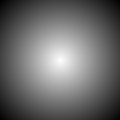<br>

We note the expected gaussian dome.
Applying the 5x5 filter above to the image we get:<br>


## 4.7.1 Laplacian First Derivative

(not separable)

Also called "laplacian", computes the first derivative of a discrete 2d function (the image). Because it purports to compute the first derivative we would expect the filters response to be zero in areas of constant intensity, non-zero at the start of an intensity ramp and non-zero along said ramps. This is indeed the case and the laplacian operator can be thought of as the image-version of first derivative from basic analysis.

```cpp
filter.set_kernel(filter.laplacian_first_derivative());

-1 -1 -1
-1  8 -1
-1 -1 -1
``` 

The resulting image is initially hard to make sense of: <br>
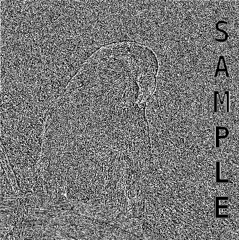<br>

But after normalization:<br>
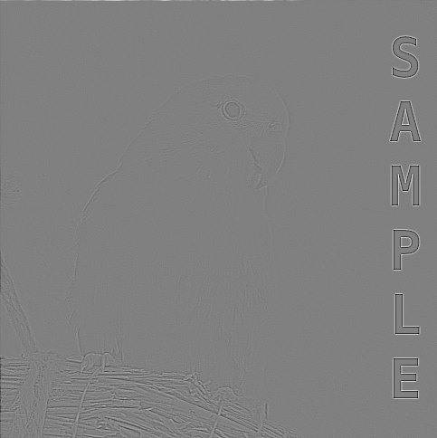<br>
We note the typical "sharp mask". Adding this image to the original result in sharpening of the original:

```cpp
auto image = load_grayscale_image(/*...*/);
auto sharp_mask = image;
filter.apply_to(sharp_mask);
image += sharp_mask;
clamp(image);   // cutoff any values above 1
```


## 4.7.2 Laplacian Second Derivative

(not separable)

The second derivative is the derivative of the first derivative. Just like in analysis we expect the second derivative to be zero in areas of constant intensity, nonzero at the onset *and* end of intensity ramps, zero along inensity ramps. These properties make it quite useful for edge detection.

```cpp
filter.set_kernel(filter.laplacian_second_derivative())

-9 -1 -9
-1 72 -1
-9 -1 -9
```

Due to the overall noisyness of the image the image is almost illegible:

<br>

But after normalization:<br>


## 4.8 Laplacian of Gaussian

(not separable)

The Laplacian of Guassian, often called "LoG" is a commonly used kernel that is the derivative of a guassian:<br>

 <br>
source: [https://homepages.inf.ed.ac.uk/rbf/HIPR2/log.htm](https://homepages.inf.ed.ac.uk/rbf/HIPR2/log.htm)

Applying it by multiplying the resulting image with original can be interpreted as first blurring, then sharpening the blurred image. It thus finds wide applicability in image enhancement. Just like the gaussian, the LoG kernel can have arbitrary size:

```cpp
filter.set_kernel(filter.laplacian_of_gaussian(5));

0.171415  0.108386    0.111149   0.108386    0.171415
0.108386  0.00697621  0.0132247  0.00697621  0.108386
0.111149  0.0132247   0.0437069  0.0132247   0.111149
0.108386  0.00697622  0.0132247  0.00697622  0.108386
0.171415  0.108386    0.111149   0.108386    0.171415
```
After normalization: <br>


## 4.9 Gradient Kernels

Gradient kernels attempt to compute the [image gradient](https://en.wikipedia.org/wiki/Image_gradient) best understood as the rate of change in intensity along a specified direction. There are multiple kernels that do this and each of them has two or more version, depending on which direction of the gradient response is measured. In `crisp`, x-direction referers to left-to-right, y-direction to top-to-bottom.

## 4.9.1 Simple Gradient

(not separable)

The simplest gradient kernels in the x and y direction respectively are:

```cpp
filter.set_kernel(filter.simple_gradient_x())

-1
 1
``` 
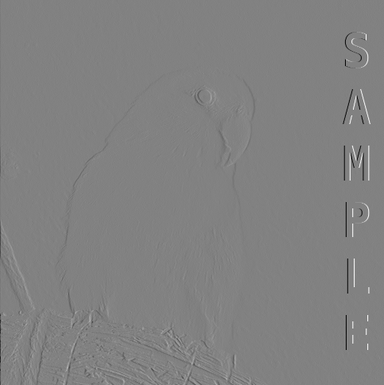

```cpp
filter.set_kernel(filter.simple_gradient_y())

-1  1
``` 
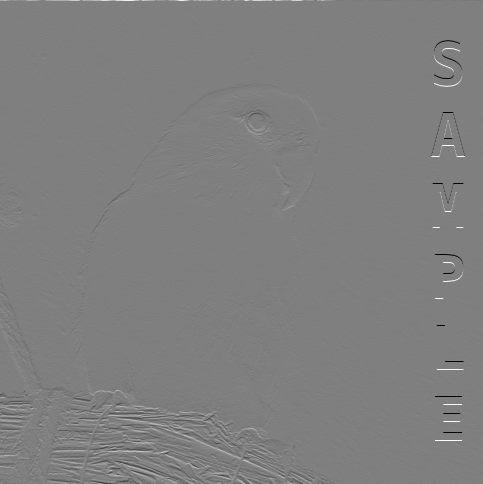

<br>
Light areas correspond to a high positive rate of change, dark areas to a high negative rate of change while gray areas correspond to very little change, as we would expect with the images background.

### 4.9.2 Roberts Gradient

(is separable)

Roberts tried to iterate on the simplest gradient by specifying two kernels that represent the gradient in 4 directions instead of two:

```cpp
filter.set_kernel(filter.roberts_x());

-1  0
 0  1
```
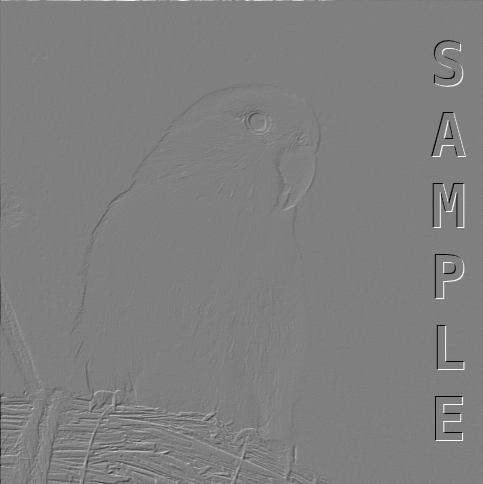

```cpp
filter.set_kernel(filter.roberts_y());

 0 -1
 1  0
```
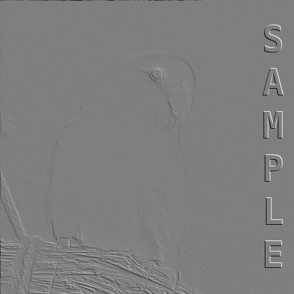

### 4.9.3 Prewitt Gradient

(is separable)

Prewitt improved on Robets with a bigger kernel in an attempt to get a more detailed gradient response:

```cpp
filter.set_kernel(filter.prewitt_x());

-1 -1 -1
 0  0  0
 1  1  1
```

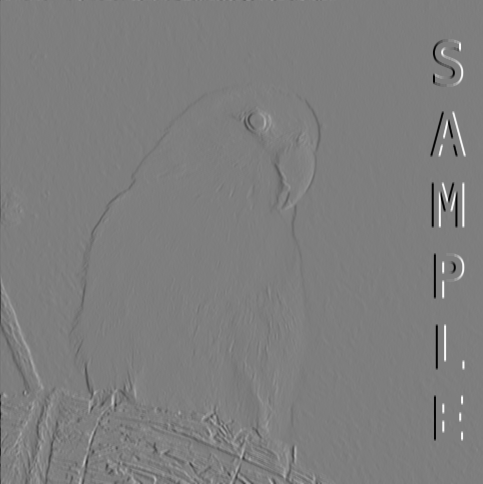

```cpp
filter.set_kernel(filter.prewitt_y());

-1  0  1
-1  0  1
-1  0  1
```

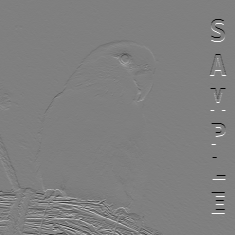

### 4.9.4 Sobel

(is separable)

Sobel combined the roberts kernel with a smoothing kernel in an attempt to get a gradient response less susceptible to noise

```cpp
filter.set_kernel(filter.sobel_x());

 1  2  1
 0  0  0
-1 -2 -1
```

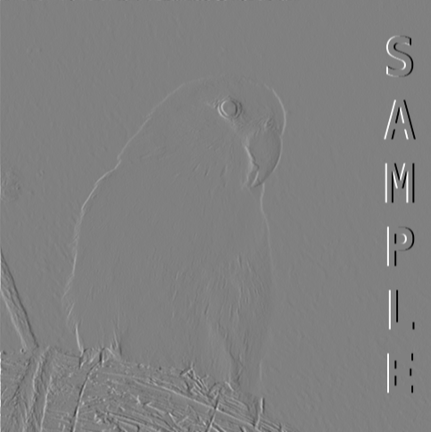

```cpp
filter.set_kernel(filter.sobel_y());

 1  0 -1
 2  0 -2
 1  0 -1
```

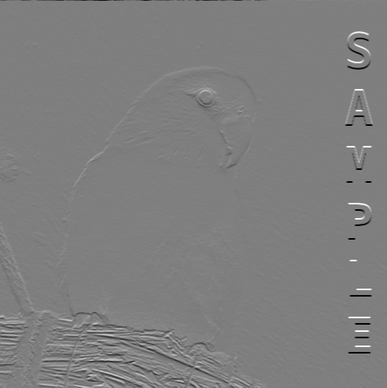<br>

While it is up to the end user to decide which of these gradient kernels is most applicable, `crisp` uses the simple gradient when performance is key and the sobel operator in all other scenarios.

### 4.9.5 Kirsch Compass

(is separable)

Kirsch designed a set of kernels that measure the gradient response in one of 8 directions. The direction is given similar to the directions on a compass: north (n), north east (ne), east (e), south east (se), south (s), south west(sw) and west (w)). This set of kernels is useful if the direction of the gradient is of importance such as during line- or edge detection.

```cpp
// north
filter.set_kernel(filter.kirsch_compass_n());

 5 -3 -3
 5  0 -3
 5 -3 -3
```

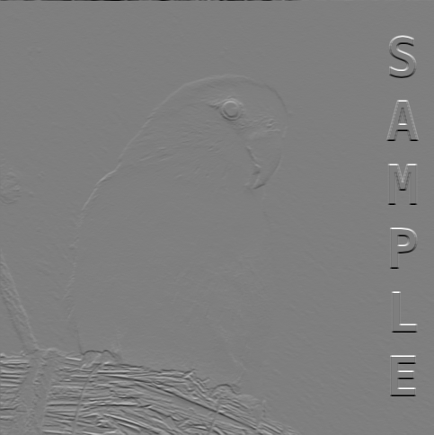

```cpp
// south
filter.set_kernel(filter.kirsch_compass_s());

-3 -3  5
-3  0  5
-3 -3  5
```

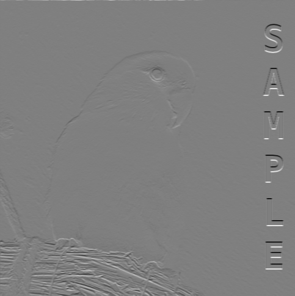

```cpp
// east
filter.set_kernel(filter.kirsch_compass_e());

-3 -3 -3
-3  0 -3
 5  5  5
```

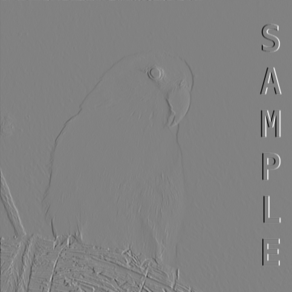

```cpp
// west
filter.set_kernel(filter.kirsch_compass_w());

 5  5  5
-3  0 -3
-3 -3 -3
```


## 4.9 In Summary

This concludes the overview of kernels available in crisp. Common operations such as image blurring, sharpening and edge detection and gradient direction are covered out of the box while optimization through seperation or combining kernels is made not only possible but easy. 

## 5. Using Other Evaluation Functions for Image Restoration

So far we have dealt with kernels that were applied via convolution or normalized convolution. This is one of the most common way to filter an image however as mentioned before, ``crisp`` supports other types of evaluation functions. Their use will be illustrated in this section. 

Consider the following image, [manually corrupted](../noise/noise.md) with noise:


We note strong, non-uniform salt-and-pepper noise. Closer examination reveals that the black and white dots are peaks of negative and positive intensitiy of up to 5 times the previous maximum sensor response. We could blur this image using a gaussian filter but the results would be poor as it does not address the noise directly. 

Instead we can use one of ``crisp``s other evaluation functions like so:

```cpp
auto image = /* corrupted image */;

auto filter = SpatialFilter();
filter.evaluation_function(filter.MEAN);
filter.set_kernel(filter.one(3));
filter.apply_to(image);

// render or save to disk
```

Here we're using a 3x3 kernel of all ones and using it to compute the mean of a all pixels in a 3x3 neighborhood. We choose ``one`` because we don't want the kernel to weight the image in any way. This is called "mean-filtering" and tends to do decently well at removing noise from an otherwise clear image:


Looking closely we still spot some noise, the most noticable spike is on the birds lower abdomen. Isolated spots like this happen because the mean tends to be quite sensitive to the strength of the signal, the higher the noisy spike is the more the mean will be affected. This is not the case when using the *median* however:

```cpp
filter.evaluation_function(filter.MEDIAN);
filter.set_kernel(filter.one(3));
filter.apply_to(image);
```


We get a much better result with minimal distortion. The resulting image is now fully noise-free.

While not used here, ``MAXIMUM`` and ``MINIMUM`` also have their applications, most notably in non-maxima surpression and for certain types pre- or post-processing steps.

---
[[<< Back to Index]](../index.md)


