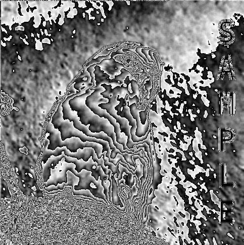
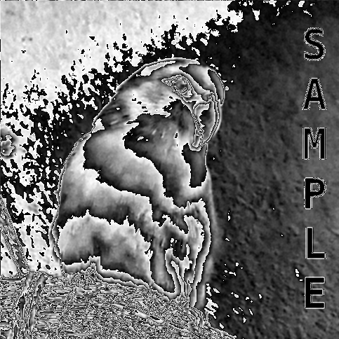
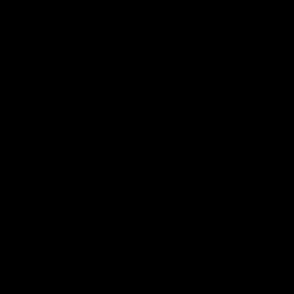
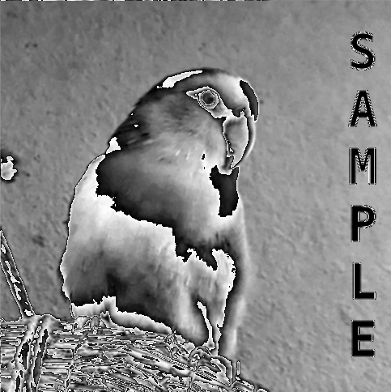

[<< Back to Index](../index.md)

---
# Filtering in the Spatial Domain

Filter Kernels & Convolution 

## Table of Contents

# 1. Introduction

Spatial filters are central to the field of image processing and features in many of the most use algorithms both in the literature and in ``crisp``. They are represented by ``crisp::SpatialFilter``. A filter in ``crisp`` has to components: it's *kernel* and *evaluation function*. 

# 2. Kernels

A kernel is a m*n matrix of floats. It behaves exactly like a matrix and unlike images operations on it are matrix operations. Indeed, looking in [spatial_filter.hpp] we find that filter kernels are just a typedef for ``Eigen::Matrix``:

```cpp
using Kernel = Eigen::Matrix<float, Eigen::Dynamic, Eigen::Dynamic>;
```

Keep this in mind, the link to Eigen is explicitely mentioned here because it opens a vast array of numerical techniques that are not obvious just through it's ``crisp`` interface. Please consult the [eigen documentation](https://eigen.tuxfamily.org/dox/group__TutorialMatrixClass.html) in the case that their matrix class is not yet familiar. Henceforth we assume that any reader is familiar with comma initialization and element-access of ``Eigen::Matrix``.

Other than functions supplied by eigen, ``crisp`` offers these external functions for operating on them:

```cpp
// make it sum of elements is 1
void normalize(Kernel&);

// rotate a kernel 90°
void rotate(Kernel&, size_t n_90_degrees);

// convolute one kernel with another
Kernel convolute(Kernel left, Kernel right);

// seperate a kernel numerically
bool seperate(const Kernel& original, Kernel* out_left, Kernel* out_right);
```

# 2.1 Normalize a Kernel

``normalize`` modifies the kernels element so it's sum-of-elements is 1. This can be useful to control a spatial filters response. To use it we first contstruct a kernel

```cpp
// in main.cpp
#include <spatial_filter.hpp>
#include <iostream>

using namespace crisp;

auto kernel = Kernel();
kernel.resize(3, 3);
kernel << 1, 1, 1,
          1, 1, 1,
          1, 1, 1;

normalize(kernel);

std::cout << kernel << std::endl;

float sum_of_elements = 0;
for (size_t x = 0; x < kernel.rows(); ++x)
for (size_t y = 0; y < kernel.cols(); ++y)
    sum_of_elements += kernel(x, y);

std::cout << "sum after normalization: " << sum_of_elements << std::endl;
```

```
0.111111 0.111111 0.111111
0.111111 0.111111 0.111111
0.111111 0.111111 0.111111

sum after normalization: 1
```

# 2.2 Rotate a Kernel

We can use ``crisp::rotate`` a kernel by 90° *counter-clockwise*. We can specify a number n such that the kernel is rotate by n * 90° degree:

```cpp
kernel << 1, 2, 3,
          4, 5, 6,
          7, 8, 9;

for (size_t i = 0; i < 4; ++i)
{
    rotate(kernel, i);
    std::cout << kernel << "\n" << std::endl;
}
```

```
3 6 9
2 5 8
1 4 7

9 8 7
6 5 4
3 2 1

7 4 1
8 5 2
9 6 3

1 2 3
4 5 6
7 8 9
```

## 2.3 Seperate a Kernel

It is often preferrable to convolute a kernel with an image after seperating it, for a 3x3 kernel M we may seperate them into kernel A (3x1) and B (1x3) such that A * B = M (this is matrix-matrix multiplication). 

```crisp::seperate``` takes three arguments:
+ ``const Kernel& original`` is the kernel we want to seperate
+ ``Kernel* out_left`` is the left side of the expression, A in our example 
+ ``Kernel* out_right`` is the right side of the expression, B in our example

The function furthermore returns ``true`` if seperation was possible in which case ``out_left`` and ``out_right`` will be assigned to, if ``false`` is returned the kernel is not seperable and both ``out_left`` and ``out_right`` will be set to ``nullptr``.

Let's consider the following kernel:

```
 1  0 -1
 2  0 -2
 1  0 -1
```
This kernel is seperable, [wikipedia lists](https://en.wikipedia.org/wiki/Sobel_operator#Formulation) it's resulting A and B as {{1}, {2}, {3}} (a 1x3 kernel, A) and {+1, 0, -1} (a 3x1 kernel, B). Multiplying them in our head we can verify that this is indeed a valid seperation. 

We now try to seperate the kernel in ``crisp``:

```cpp
kernel << 1, 0, -1,
          2, 0, -2,
          1, 0, -1;

Kernel left, right;
if (not seperate(kernel, &left, &right))
    // handle non-seperable kernels

std::cout << left << "\n" << std::endl;
std::cout << right << "\n" << std::endl;

// verify result
kernel = left * right;
std::cout << kernel << std::endl;
```

```
// left
-1.41421
-2.82843
-1.41421

// right
-0.707107 0 0.707107

// left * right
 1 -0 -1
 2 -0 -2
 1 -0 -1
```
``crisp`` happened to find a different seperation, yet validating it by computing ``left * right`` (A*B) confirms that it is also valid. *Seperations are not unique* because a) we're numerically approximating them. For this reason it is often preferrable to find an analytical seperation on that uses simpler values on paper if possible, if not then we can use ``crisp::seperate`` to automate the process.

For beginners in the field of image processing or linear algebra or for kernels that are very big or numerically assembled it is often unclear wether they are seperable or not. ``crisp::seperate`` will immediately exit once it determined that a kernel is not seperable so it can also be used to simply determine if it can be done with not performance overhead.

## 2.4 Combining two Kernels

Convolution is associative, that is for Kernels K1, K2 and Image I where ``°`` is the convolution operator:
``K1 ° (K2 ° I) = (K1 ° K2) ° I``<br>

or in plainer english: the convoluting I with kernel K1 and then convolution I with kernel K2 is the same as first convoluting the two kernels K1, K2 and then convoluting the resulting kernel with the image. 
This is important as our kernels are usually 3x3 of size while the image is much larger so we want to combine our kernels as much as possible. We can do so with ``crisp::convolute(Kernel, Kernel)``

```cpp
kernel << -1, -1, -1, 
          -1,  8, -1,
          -1, -1, -1;

kernel = convolute(kernel, kernel);
std::cout << kernel << std::endl;
```

```
-14 -12 -14
-12  72 -12
-14 -12 -14
```

## 3. ``crisp::SpatialFilter``
## 3.1 Specifying the Kernel
Now that we know how to create and modify a kernel we can assign it to a filter. First we need to create the filter, then we can assign a kernel to it via ``set_kernel``

```cpp
auto filter = SpatialFilter();
filter.set_kernel(kernel);
``` 

After binding the kernel to the filter we can modify it using:

float& operator()(size_t x, size_t y);

```cpp
// members of crisp::SpatialFilter
float& operator()(size_t x, size_t y);
float operator()(size_t x, size_t y) const;
``` 

These are simply the same access operators as those use on the kernel itself. 

### 3.2 Specifying the Evaluation Function

Before we can apply this kernel to an image we need to specify the evaluation function. By default this is the familiar convolution however ``crisp`` offers 4 other functions in addition to that. To illustrate how they work consider the following 3x3 kernel, image segment of image ``in`` and resulting image ``out``

```cpp
// Kernel
0.5  0.5  0.5 
0.5 (0.5) 0.5
0.5  0.5  0.5

// in(i, j) = 5
1  2  3 
4 (5) 6
7  8  9
```
<br>

+ ``CONVOLUTION`` computes sum of elements weighted by the kernel at a specified image position, while the kernel is centered on that position<br>
```  
0.5 * 1 + 0.5 * 2 + ... + 0.5 * 9 = 22.5
out(i, j) = 22.5
```
+ ``NORMALIZED_CONVOLUTION`` computes the convolution and then devides the weighted sum by the sum of kernel elements <br>

```
0.5 * 1 + 0.5 * 2 + ... + 0.5 * 9 = 22.5
22.5 / (0.5 + 0.5 + ... + 0.5) = 5
out(i, j) = 5
```
+ ``MINIMUM`` returns the minimum of elements, weighted by the kernel

```
min{0.5 * 1, 0.5 * 2, ..., 0.5 * 9} = 0.5 * 1 = 0.5
out(i, j) = 0.5
```

+ ``MAXIMUM`` returns the maximum of elements, weighted by the kernel

```
max{0.5 * 1, 0.5 * 2, ..., 0.5 * 9} = 0.5 * 9 = 4.5
out(i, j) = 4.5
```

+ ``MEDIAN`` returns the median of the elements, again weighted by the kernel

```
median{0.5 * 1, 0.5 * 2, ..., 0.5 * 9} = 
median{0.5, 1, 1.5, 2, 2.5, 3, 3.5, 4, 4.5} = mean(2, 2.5) = 2.25
out(i, j) = 2.25
```
<br>
We can specify the evaluation function by using:

```cpp
auto filter = SpatialFilter();
filter.set_evaluation_function(SpatialFilter::EvaluationFunction::NORMALIZED_CONVOLUTION);
``` 
For most scenarios convolution or normalized convolution will be sufficient but some tasks can be simplified by using the more specialized evaluations functions.

## 3.3 Applying the Filter
We now have all the pieces together to apply a filter. Let's consider this image of a bird:


After loading it as a grayscale immage we can apply the filter to it:

```cpp
// load image
auto image = load_grayscale_image("/home/clem/Workspace/crisp/docs/spatial_filters/color_opal.png");

// create kernel
auto kernel = Kernel();
kernel.resize(5, 5);
kernel.setConstant(1);  // 5x5 kernel where all values are 1

// set filter and specify kernel
auto filter = SpatialFilter();
filter.set_kernel(kernel);
filter.set_evaluation_function(filter.CONVOLUTION);

filter.apply_to(image);
```



The image is completely distorted, this is because the sum of elements for the filter is not 1, rather as ever element is 1 and the filter is of size 5x5, it's sum of elements is 25. This results in the resulting image values being far outside the [0, 1] required for rendering. If we instead specify the evaluation function as 

```cpp
filter.set_evaluation_function(filter.NORMALIZED_CONVOLUTION);

// or equivalently:
normalize(kernel);
filter.set_kernel(kernel);
filter.set_evaluation_function(filter.CONVOLUTION);
```


The operation results in the expected result, a blurred image

## 3.4 Applying the Filter in All Dimensions

We've previously loaded a colored image as grayscale and then filtered the grayscale image. In ``crisp`` we can filter all images, regardless of value type or dimensionality. For example we can repeat the previous operations but on the color image instead:

```cpp
// load image as color
auto image = load_color_image("/home/clem/Workspace/crisp/docs/spatial_filters/color_opal.png");

auto kernel = Kernel();
kernel.resize(5, 5);
kernel.setConstant(1);

auto filter = SpatialFilter();
filter.set_kernel(kernel);
filter.set_evaluation_function(filter.NORMALIZED_CONVOLUTION);

filter.apply_to(image);
```

Literally nothing else changes, all kernels are applicable to all images. The result is exactly what we expect it to be, each plane of the image was blurred individually:


# 4. Filter Kernel Types

It would of course be quite laborious to specify each kernel manually, instead ``crisp`` provides a breadth of kernels such that users can conveniently access the most used ones. Instead of listing them all, as the names can be quite hard to recognize for people who aren't as familiar with the literature, a demonstration of each available kernel will follow here. Each kernel is assumed to be of size n*n unless stated otherwise. We're furthermore applying ``_CONVOLUTION`` (with no normalization) in each of these examples unless stated otherwise. Furthermore we will state for each kernel wether they can be seperated and again emphasize how necessary it is to do so if performance is of importance

## 4.1 Identity

(is seperable)

The simplest kernel is the identity kernel, it projects and image onto itself. It takes one argument: n, such that the resulting kernel will be of size n*n

```cpp
filter.set_kernel(filter.identity(3));

0 0 0
0 1 0
0 0 0
```


## 4.2 One

(is seperable)

This kernel is again of size n*n and each element is assigned as 1. This filter is sometimes also called "box filter" or "box blur" because it tends to blur images it is applied to (after normalization). We can intensify the blur by increasing the kernels size, for n = 3 the blur is very slight.

```cpp
filter.set_kernel(filter.one(3));

1 1 1
1 1 1
1 1 1

normalize(image)
```



## 4.3 Zero

(is seperable)

This kernel is similar to ``one`` but instead of all elements being 1, all elements are instead set to 0. This filter is rarely applied to an image as it will simply result in an all-black result.

```cpp
filter.set_kernel(filter.zero(3));

0 0 0
0 0 0
0 0 0
``` 



## 4.4 Box

(is seperable)

Not to be confused with ``one``. ``box`` takes two arguments, it's dimensions n and a constant c such that all elements will be set to c. This means ``box(n, 1)`` is equivalent to ``one(n)`` and ``box(n, 0)`` is equivalent to ``zero(n)``.

To illustrate the difference between ``box`` and the following ``normalized_box`` the following picture was generated using ``CONVOLUTION`` with no normalization.

```cpp
filter.set_kernel(filter.box(3, 0.5f));

0.5 0.5 0.5
0.5 0.5 0.5
0.5 0.5 0.5

normalize(image)
``` 



## 4.5 Normalized box

(is seperable)

Unlike the box kernel, the normalized box kernel takes only n as the argument, all components are assigned such that the sum of components is 1

```cpp
filter.set_kernel(filter.normalized_box(3));

0.333333 0.333333 0.333333
0.333333 0.333333 0.333333
0.333333 0.333333 0.333333

normalize(image)
```


